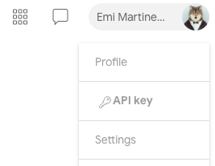

# Google Threat Intelligence

This integration analyzes suspicious hashes, URLs, domains, and IP addresses.

## Configure Google Threat Intelligence in Cortex


| **Parameter** | **Description** | **Required** |
| --- | --- | --- |
| API Key |  | True |
| Source Reliability | Reliability of the source providing the intelligence data | False |
| GTI Malicious Verdict. Check Google Threat Intelligence verdict to consider the file malicious. |  | False |
| GTI Suspicious Verdict. Check Google Threat Intelligence verdict to consider the file suspicious. |  | False |
| File Malicious Threshold. Minimum number of positive results from VT scanners to consider the file malicious. |  | False |
| File Suspicious Threshold. Minimum number of positive and suspicious results from VT scanners to consider the file suspicious. |  | False |
| IP Malicious Threshold. Minimum number of positive results from VT scanners to consider the IP malicious. |  | False |
| IP Suspicious Threshold. Minimum number of positive and suspicious results from VT scanners to consider the IP suspicious. |  | False |
| Disable reputation lookups for private IP addresses | To reduce the number of lookups made to the VT API, this option can be selected to gracefully skip enrichment of any IP addresses allocated for private networks. | False |
| URL Malicious Threshold. Minimum number of positive results from VT scanners to consider the URL malicious. |  | False |
| URL Suspicious Threshold. Minimum number of positive and suspicious results from VT scanners to consider the URL suspicious. |  | False |
| Domain Malicious Threshold. Minimum number of positive results from VT scanners to consider the Domain malicious. |  | False |
| Domain Suspicious Threshold. Minimum number of positive and suspicious results from VT scanners to consider the Domain suspicious. |  | False |
| Preferred Vendors List. CSV list of vendors who are considered more trustworthy. |  | False |
| Preferred Vendor Threshold. The minimum number of highly trusted vendors required to consider a domain, IP address, URL, or file as malicious. |  | False |
| Enable score analyzing by Crowdsourced Yara Rules, Sigma, and IDS. |  | False |
| Crowdsourced Yara Rules Threshold |  | False |
| Sigma and Intrusion Detection Rules Threshold |  | False |
| Domain Popularity Ranking Threshold |  | False |
| IP Relationships | Select the list of relationships to retrieve from the API. | False |
| Domain Relationships | Select the list of relationships to retrieve from the API. | False |
| URL Relationships | Select the list of relationships to retrieve from the API. | False |
| File Relationships | Select the list of relationships to retrieve from the API. | False |
| CVE Relationships | Select the list of relationships to retrieve from the API. | False |
| Use system proxy settings |  | False |
| Trust any certificate (not secure) |  | False |


### Acquiring your API key

Your API key can be found in your GoogleThreatIntelligence account user menu, clicking on your avatar:

Your API key carries all your privileges, so keep it secure and don't share it with anyone.

## DBot Score / Reputation scores

The following information describes DBot Score which is new for this version.

### Indicator Thresholds

Configure the default threshold for each indicator type in the instance settings.
You can also specify the threshold as an argument when running relevant commands.

- Indicators with positive results from preferred vendors equal to or higher than the threshold will be considered malicious.
- Indicators with positive results equal to or higher than the malicious threshold will be considered malicious.
- Indicators with positive results equal to or higher than the suspicious threshold value will be considered suspicious.
- Domain popularity ranks: GoogleThreatIntelligence is returning a popularity ranks for each vendor. The integration will calculate its average and will compare it to the threshold.

### Rules Threshold

If the YARA rules analysis threshold is enabled:

- Indicators with positive results, the number of found YARA rules results, Sigma analysis, or IDS equal to or higher than the threshold, will be considered suspicious.
- If both the the basic analysis and the rules analysis is suspicious, the indicator will be considered as malicious.
If the indicator was found to be suspicious only by the rules thresholds, the indicator will be considered suspicious.
- Domain popularity ranks: GoogleThreatIntelligence is returning a popularity ranks for each vendor. The integration will calculate its average and will compare it to the threshold.

The DbotScore calculation process can be seen on the "description" field in any malicious/suspicious DBot score.
You can aquire those calculation on all of the indicators also from the debug log.

Example of a GoogleThreatIntelligence DBot score log:

```log
Basic analyzing of "<domain>"
Found popularity ranks. Analyzing.
The average of the ranks is 809009.0 and the threshold is 10000
Indicator is good by popularity ranks.
Analyzing by get_domain_communicating_files
Found safe by relationship files. total_malicious=0 >= 3
Analyzing by get_url_downloaded_files
Found safe by relationship files. total_malicious=0 >= 3
Analyzing by get_url_referrer_files
Found safe by relationship files. total_malicious=0 >= 3
```

### Reputation commands (ip, url, domain, and file)

- Removed output paths: Due to changes in GoogleThreatIntelligence, the following output paths are no longer supported:
  - *IP.GoogleThreatIntelligence*
  - *Domain.GoogleThreatIntelligence*
  - *URL.GoogleThreatIntelligence*
  - *File.GoogleThreatIntelligence*

   Instead, you can use the following output paths that return concrete indicator reputations.
  - *GoogleThreatIntelligence.IP*
  - *GoogleThreatIntelligence.Domain*
  - *GoogleThreatIntelligence.File*
  - *GoogleThreatIntelligence.URL*

- The following commands will no longer analyze the file/url sent to it, but will get the information stored in GoogleThreatIntelligence.
  - *GoogleThreatIntelligence.Domain*
  - *GoogleThreatIntelligence.IP*

  To analyze (detonate) the indicator, you can use the following playbooks:
  - **Detonate File - GoogleThreatIntelligence**
  - **Detonate URL - GoogleThreatIntelligence**
- Each reputation command will use at least 1 API call. For advanced reputation commands, use the *Premium API* flag.
- For each reputation command there is the new *extended_data* argument . When set to "true", the results returned by the commands will contain
  additional information as *last_analysis_results* which contains the service name and its specific analysis.
- Reputation commands can return relationships of the indicator.
  The relationships that are supported are defined as part of the instance configuration.
  For more information regarding URL relationships, see: <https://gtidocs.virustotal.com/reference/url-info>
  For more information regarding IP relationships, see: <https://gtidocs.virustotal.com/reference/ip-info>
  For more information regarding Domain relationships, see: <https://gtidocs.virustotal.com/reference/domain-info>
  For more information regarding File relationships, see: <https://gtidocs.virustotal.com/reference/file-info>

- Starting with XSOAR version 6.9.0, You may monitor API usage via the *GoogleThreatIntelligence Execution Metrics* dashboard.

### Comments

In GoogleThreatIntelligence you can now add comments to all indicator types (IP, Domain, File and URL) so each command now has the *resource_type* argument.
If supplied, the command will use the resource type to add a comment. If not, the command will determine if the given input is a hash or a URL.
This arguments is available in the following commands:

- ***gti-comments-get***
- ***gti-comments-add***

### gti-comments-get

- Added the *resource_type* argument. If not supplied, will try to determine if the *resource* argument is a hash or a URL.
- Added the *limit* argument. Gets the latest comments within the given limit.
- New output path: *GoogleThreatIntelligence.Comments*.

### Detonation (scan) Commands

Removed the *gtiLink* output from all commands as it does no longer return from the API.
To easily use the scan commands we suggest using the following playbooks:

- **Detonate File - GoogleThreatIntelligence**
- **Detonate URL - GoogleThreatIntelligence**

Use the ***gti-analysis-get*** command to get the report from the scans.

### file

***
Checks the file reputation of the specified hash.

#### Base Command

`file`

#### Input

| **Argument Name** | **Description** | **Required** |
| --- | --- | --- |
| file | Hash of the file to query. Supports MD5, SHA1, and SHA256. | Required | 
| extended_data | Whether to return extended data (last_analysis_results). Possible values are: true, false. Default is false. | Optional | 

#### Context Output

| **Path** | **Type** | **Description** |
| --- | --- | --- |
| File.MD5 | unknown | Bad MD5 hash. | 
| File.SHA1 | unknown | Bad SHA1 hash. | 
| File.SHA256 | unknown | Bad SHA256 hash. | 
| File.Relationships.EntityA | string | The source of the relationship. | 
| File.Relationships.EntityB | string | The destination of the relationship. | 
| File.Relationships.Relationship | string | The name of the relationship. | 
| File.Relationships.EntityAType | string | The type of the source of the relationship. | 
| File.Relationships.EntityBType | string | The type of the destination of the relationship. | 
| File.Malicious.Vendor | unknown | For malicious files, the vendor that made the decision. | 
| File.Malicious.Detections | unknown | For malicious files, the total number of detections. | 
| File.Malicious.TotalEngines | unknown | For malicious files, the total number of engines that checked the file hash. | 
| DBotScore.Indicator | unknown | The indicator that was tested. | 
| DBotScore.Type | unknown | The indicator type. | 
| DBotScore.Vendor | unknown | The vendor used to calculate the score. | 
| DBotScore.Score | Number | The actual score. | 
| DBotScore.Reliability | String | Reliability of the source providing the intelligence data. | 
| GoogleThreatIntelligence.File.attributes.type_description | String | Description of the type of the file. | 
| GoogleThreatIntelligence.File.attributes.tlsh | String | The locality-sensitive hashing. | 
| GoogleThreatIntelligence.File.attributes.exiftool.MIMEType | String | MIME type of the file. | 
| GoogleThreatIntelligence.File.attributes.names | String | Names of the file. | 
| GoogleThreatIntelligence.File.attributes.javascript_info.tags | String | Tags of the JavaScript. | 
| GoogleThreatIntelligence.File.attributes.exiftool.FileType | String | The file type. | 
| GoogleThreatIntelligence.File.attributes.exiftool.WordCount | String | Total number of words in the file. | 
| GoogleThreatIntelligence.File.attributes.exiftool.LineCount | String | Total number of lines in file. | 
| GoogleThreatIntelligence.File.attributes.crowdsourced_ids_stats.info | Number | Number of IDS that marked the file as "info". | 
| GoogleThreatIntelligence.File.attributes.crowdsourced_ids_stats.high | Number | Number of IDS that marked the file as "high". | 
| GoogleThreatIntelligence.File.attributes.crowdsourced_ids_stats.medium | Number | Number of IDS that marked the file as "medium". | 
| GoogleThreatIntelligence.File.attributes.crowdsourced_ids_stats.low | Number | Number of IDS that marked the file as "low". | 
| GoogleThreatIntelligence.File.attributes.sigma_analysis_stats.critical | Number | Number of Sigma analysis that marked the file as "critical". | 
| GoogleThreatIntelligence.File.attributes.sigma_analysis_stats.high | Number | Number of Sigma analysis that marked the file as "high". | 
| GoogleThreatIntelligence.File.attributes.sigma_analysis_stats.medium | Number | Number of Sigma analysis that marked the file as "medium". | 
| GoogleThreatIntelligence.File.attributes.sigma_analysis_stats.low | Number | Number of Sigma analysis that marked the file as "low". | 
| GoogleThreatIntelligence.File.attributes.exiftool.MIMEEncoding | String | The MIME encoding. | 
| GoogleThreatIntelligence.File.attributes.exiftool.FileTypeExtension | String | The file type extension. | 
| GoogleThreatIntelligence.File.attributes.exiftool.Newlines | String | Number of newlines signs. | 
| GoogleThreatIntelligence.File.attributes.trid.file_type | String | The TrID file type. | 
| GoogleThreatIntelligence.File.attributes.trid.probability | Number | The TrID probability. | 
| GoogleThreatIntelligence.File.attributes.crowdsourced_yara_results.description | String | Description of the YARA rule. | 
| GoogleThreatIntelligence.File.attributes.crowdsourced_yara_results.source | String | Source of the YARA rule. | 
| GoogleThreatIntelligence.File.attributes.crowdsourced_yara_results.author | String | Author of the YARA rule. | 
| GoogleThreatIntelligence.File.attributes.crowdsourced_yara_results.ruleset_name | String | Rule set name of the YARA rule. | 
| GoogleThreatIntelligence.File.attributes.crowdsourced_yara_results.rule_name | String | Name of the YARA rule. | 
| GoogleThreatIntelligence.File.attributes.crowdsourced_yara_results.ruleset_id | String | ID of the YARA rule. | 
| GoogleThreatIntelligence.File.attributes.names | String | Name of the file. | 
| GoogleThreatIntelligence.File.attributes.last_modification_date | Number | The last modification date in epoch format. | 
| GoogleThreatIntelligence.File.attributes.type_tag | String | Tag of the type. | 
| GoogleThreatIntelligence.File.attributes.total_votes.harmless | Number | Total number of harmless votes. | 
| GoogleThreatIntelligence.File.attributes.total_votes.malicious | Number | Total number of malicious votes. | 
| GoogleThreatIntelligence.File.attributes.size | Number | Size of the file. | 
| GoogleThreatIntelligence.File.attributes.popular_threat_classification.suggested_threat_label | String | Suggested thread label. | 
| GoogleThreatIntelligence.File.attributes.popular_threat_classification.popular_threat_name | Number | The popular thread name. | 
| GoogleThreatIntelligence.File.attributes.times_submitted | Number | Number of times the file was submitted. | 
| GoogleThreatIntelligence.File.attributes.last_submission_date | Number | Last submission date in epoch format. | 
| GoogleThreatIntelligence.File.attributes.downloadable | Boolean | Whether the file is downloadable. | 
| GoogleThreatIntelligence.File.attributes.sha256 | String | SHA-256 hash of the file. | 
| GoogleThreatIntelligence.File.attributes.type_extension | String | Extension of the type. | 
| GoogleThreatIntelligence.File.attributes.tags | String | File tags. | 
| GoogleThreatIntelligence.File.attributes.last_analysis_date | Number | Last analysis date in epoch format. | 
| GoogleThreatIntelligence.File.attributes.unique_sources | Number | Unique sources. | 
| GoogleThreatIntelligence.File.attributes.first_submission_date | Number | First submission date in epoch format. | 
| GoogleThreatIntelligence.File.attributes.ssdeep | String | SSDeep hash of the file. | 
| GoogleThreatIntelligence.File.attributes.md5 | String | MD5 hash of the file. | 
| GoogleThreatIntelligence.File.attributes.sha1 | String | SHA-1 hash of the file. | 
| GoogleThreatIntelligence.File.attributes.magic | String | Identification of file by the magic number. | 
| GoogleThreatIntelligence.File.attributes.last_analysis_stats.harmless | Number | The number of engines that found the indicator to be harmless. | 
| GoogleThreatIntelligence.File.attributes.last_analysis_stats.type-unsupported | Number | The number of engines that found the indicator to be of type unsupported. | 
| GoogleThreatIntelligence.File.attributes.last_analysis_stats.suspicious | Number | The number of engines that found the indicator to be suspicious. | 
| GoogleThreatIntelligence.File.attributes.last_analysis_stats.confirmed-timeout | Number | The number of engines that confirmed the timeout of the indicator. | 
| GoogleThreatIntelligence.File.attributes.last_analysis_stats.timeout | Number | The number of engines that timed out for the indicator. | 
| GoogleThreatIntelligence.File.attributes.last_analysis_stats.failure | Number | The number of failed analysis engines. | 
| GoogleThreatIntelligence.File.attributes.last_analysis_stats.malicious | Number | The number of engines that found the indicator to be malicious. | 
| GoogleThreatIntelligence.File.attributes.last_analysis_stats.undetected | Number | The number of engines that could not detect the indicator. | 
| GoogleThreatIntelligence.File.attributes.meaningful_name | String | Meaningful name of the file. | 
| GoogleThreatIntelligence.File.attributes.reputation | Number | The reputation of the file. | 
| GoogleThreatIntelligence.File.attributes.gti_assessment.threat_score.value | Number | GTI threat score of the file. | 
| GoogleThreatIntelligence.File.attributes.gti_assessment.severity.value | String | GTI severity of the file. | 
| GoogleThreatIntelligence.File.attributes.gti_assessment.verdict.value | String | GTI verdict of the file. | 
| GoogleThreatIntelligence.File.type | String | Type of the indicator \(file\). | 
| GoogleThreatIntelligence.File.id | String | Type ID of the indicator. | 
| GoogleThreatIntelligence.File.links.self | String | Link to the response. | 

### url-scan

***
Scans a specified URL. Use the gti-analysis-get command to get the scan results.

#### Base Command

`url-scan`

#### Input

| **Argument Name** | **Description** | **Required** |
| --- | --- | --- |
| url | The URL to scan. | Required |

#### Context Output

| **Path** | **Type** | **Description** |
| --- | --- | --- |
| GoogleThreatIntelligence.Submission.Type | String | The type of the submission \(analysis\). |
| GoogleThreatIntelligence.Submission.id | String | The ID of the submission. |
| GoogleThreatIntelligence.Submission.hash | String | The indicator sent to rescan. |

#### Command Example

```!url-scan url=https://example.com```

#### Context Example

```json
{
    "GoogleThreatIntelligence": {
        "Submission": {
            "id": "u-0f115db062b7c0dd030b16878c99dea5c354b49dc37b38eb8846179c7783e9d7-1617088890",
            "type": "analysis",
            "url": "https://example.com"
        }
    },
    "gtiScanID": "u-0f115db062b7c0dd030b16878c99dea5c354b49dc37b38eb8846179c7783e9d7-1617088890"
}
```

#### Human Readable Output

>### New url submission
>
>|id|url|
>|---|---|
>| u-0f115db062b7c0dd030b16878c99dea5c354b49dc37b38eb8846179c7783e9d7-1617088890 | <https://example.com> |

### gti-comments-add

***
Adds comments to files and URLs.

#### Base Command

`gti-comments-add`

#### Input

| **Argument Name** | **Description** | **Required** |
| --- | --- | --- |
| resource | The file hash (MD5, SHA1, orSHA256), Domain, URL or IP on which you're commenting on. If not supplied, will try to determine if it's a hash or a url. | Required |
| resource_type | The type of the resource on which you're commenting. Possible values are: ip, url, domain, hash. | Optional |
| comment | The actual review that you can tag by using the "#" twitter-like syntax, for example, #disinfection #zbot, and reference users using the "@" syntax, for example, @GoogleThreatIntelligenceTeam. | Required |

#### Context Output

| **Path** | **Type** | **Description** |
| --- | --- | --- |
| GoogleThreatIntelligence.Comments.comments.attributes.date | Number | The date of the comment in epoch format. |
| GoogleThreatIntelligence.Comments.comments.attributes.text | String | The text of the comment. |
| GoogleThreatIntelligence.Comments.comments.attributes.votes.positive | Number | Number of positive votes. |
| GoogleThreatIntelligence.Comments.comments.attributes.votes.abuse | Number | Number of abuse votes. |
| GoogleThreatIntelligence.Comments.comments.attributes.votes.negative | Number | Number of negative votes. |
| GoogleThreatIntelligence.Comments.comments.attributes.html | String | The HTML content. |
| GoogleThreatIntelligence.Comments.comments.type | String | The type of the comment. |
| GoogleThreatIntelligence.Comments.comments.id | String | ID of the comment. |
| GoogleThreatIntelligence.Comments.comments.links.self | String | Link to the request. |

#### Command Example

```!gti-comments-add resource=paloaltonetworks.com resource_type=domain comment="this is a comment"```

#### Context Example

```json
{
    "GoogleThreatIntelligence": {
        "Comments": {
            "comments": {
                "attributes": {
                    "date": 1617088894,
                    "html": "this is a comment",
                    "tags": [],
                    "text": "this is a comment",
                    "votes": {
                        "abuse": 0,
                        "negative": 0,
                        "positive": 0
                    }
                },
                "id": "d-paloaltonetworks.com-e757b16b",
                "links": {
                    "self": "https://www.virustotal.com/api/v3/comments/d-paloaltonetworks.com-e757b16b"
                },
                "type": "comment"
            }
        }
    }
}
```

#### Human Readable Output

>### Comment has been added
>
>|Date|Text|Positive Votes|Abuse Votes|Negative Votes|
>|---|---|---|---|---|
>| 2021-03-30 07:21:34Z | this is a comment | 0 | 0 | 0 |

### gti-file-scan-upload-url

***
Premium API. Get a special URL for files larger than 32 MB.

#### Base Command

`gti-file-scan-upload-url`

#### Input

There are no input arguments for this command.

#### Context Output

| **Path** | **Type** | **Description** |
| --- | --- | --- |
| GoogleThreatIntelligence.FileUploadURL | unknown | The special upload URL for large files. |

### ip

***
Checks the reputation of an IP address.

#### Base Command

`ip`

#### Input

| **Argument Name** | **Description** | **Required** |
| --- | --- | --- |
| ip | IP address to check. | Required | 
| extended_data | Whether to return extended data (last_analysis_results). Possible values are: true, false. Default is false. | Optional | 
| override_private_lookup | When set to "true", enrichment of private IP addresses will be conducted even if it has been disabled at the integration level. Possible values are: true, false. Default is false. | Optional | 

#### Context Output

| **Path** | **Type** | **Description** |
| --- | --- | --- |
| IP.Address | unknown | Bad IP address. | 
| IP.ASN | unknown | Bad IP ASN. | 
| IP.Geo.Country | unknown | Bad IP country. | 
| IP.Relationships.EntityA | string | The source of the relationship. | 
| IP.Relationships.EntityB | string | The destination of the relationship. | 
| IP.Relationships.Relationship | string | The name of the relationship. | 
| IP.Relationships.EntityAType | string | The type of the source of the relationship. | 
| IP.Relationships.EntityBType | string | The type of the destination of the relationship. | 
| IP.Malicious.Vendor | unknown | For malicious IPs, the vendor that made the decision. | 
| IP.Malicious.Description | unknown | For malicious IPs, the reason that the vendor made the decision. | 
| IP.ASOwner | String | The autonomous system owner of the IP. | 
| DBotScore.Indicator | unknown | The indicator that was tested. | 
| DBotScore.Type | unknown | The indicator type. | 
| DBotScore.Vendor | unknown | The vendor used to calculate the score. | 
| DBotScore.Score | Number | The actual score. | 
| DBotScore.Reliability | String | Reliability of the source providing the intelligence data. | 
| GoogleThreatIntelligence.IP.attributes.regional_internet_registry | String | Regional internet registry \(RIR\). | 
| GoogleThreatIntelligence.IP.attributes.jarm | String | JARM data. | 
| GoogleThreatIntelligence.IP.attributes.network | String | Network data. | 
| GoogleThreatIntelligence.IP.attributes.country | String | The country where the IP is located. | 
| GoogleThreatIntelligence.IP.attributes.as_owner | String | IP owner. | 
| GoogleThreatIntelligence.IP.attributes.last_analysis_stats.harmless | Number | The number of engines that found the domain to be harmless. | 
| GoogleThreatIntelligence.IP.attributes.last_analysis_stats.malicious | Number | The number of engines that found the indicator to be malicious. | 
| GoogleThreatIntelligence.IP.attributes.last_analysis_stats.suspicious | Number | The number of engines that found the indicator to be suspicious. | 
| GoogleThreatIntelligence.IP.attributes.last_analysis_stats.undetected | Number | The number of engines that could not detect the indicator. | 
| GoogleThreatIntelligence.IP.attributes.last_analysis_stats.timeout | Number | The number of engines that timed out for the indicator. | 
| GoogleThreatIntelligence.IP.attributes.asn | Number | ASN data. | 
| GoogleThreatIntelligence.IP.attributes.whois_date | Number | Date of the last update of the whois record. | 
| GoogleThreatIntelligence.IP.attributes.reputation | Number | IP reputation. | 
| GoogleThreatIntelligence.IP.attributes.last_modification_date | Number | Last modification date in epoch format. | 
| GoogleThreatIntelligence.IP.attributes.total_votes.harmless | Number | Total number of harmless votes. | 
| GoogleThreatIntelligence.IP.attributes.total_votes.malicious | Number | Total number of malicious votes. | 
| GoogleThreatIntelligence.IP.attributes.continent | String | The continent where the IP is located. | 
| GoogleThreatIntelligence.IP.attributes.whois | String | whois data. | 
| GoogleThreatIntelligence.IP.attributes.gti_assessment.threat_score.value | Number | GTI threat score of the IP address. | 
| GoogleThreatIntelligence.IP.attributes.gti_assessment.severity.value | String | GTI severity of the IP address. | 
| GoogleThreatIntelligence.IP.attributes.gti_assessment.verdict.value | String | GTI verdict of the IP address. | 
| GoogleThreatIntelligence.IP.type | String | Indicator IP type. | 
| GoogleThreatIntelligence.IP.id | String | ID of the IP. | 

            }
        }
    }
}
```

#### Human Readable Output

>### Comment of ID d-paloaltonetworks.com-64591897
>
>|Date|Text|Positive Votes|Abuse Votes|Negative Votes|
>|---|---|---|---|---|
>| 2021-03-08 09:29:11Z | a new comment! | 0 | 0 | 0 |

### gti-search

***
Search for an indicator in GoogleThreatIntelligence.

#### Base Command

`gti-search`

#### Input

| **Argument Name** | **Description** | **Required** |
| --- | --- | --- |
| query | This endpoint searches any of the following: A file hash, URL, domain, IP address, tag comments. | Required |
| extended_data | Whether to return extended data (last_analysis_results). Possible values are: true, false. | Optional |
| limit | Maximum number of results to fetch. Default is 10. | Optional |

#### Context Output

| **Path** | **Type** | **Description** |
| --- | --- | --- |
| GoogleThreatIntelligence.SearchResults.attributes.last_analysis_stats.harmless | Number | Number of engines that found the indicator to be harmless. |
| GoogleThreatIntelligence.SearchResults.attributes.last_analysis_stats.malicious | Number | Number of engines that found the indicator to be malicious. |
| GoogleThreatIntelligence.SearchResults.attributes.last_analysis_stats.suspicious | Number | Number of engines that found the indicator to be suspicious. |
| GoogleThreatIntelligence.SearchResults.attributes.last_analysis_stats.undetected | Number | Number of engines that could not detect the indicator. |
| GoogleThreatIntelligence.SearchResults.attributes.last_analysis_stats.timeout | Number | Number of engines that timed out. |
| GoogleThreatIntelligence.SearchResults.attributes.reputation | Number | The indicator's reputation |
| GoogleThreatIntelligence.SearchResults.attributes.last_modification_date | Number | The last modification date in epoch format. |
| GoogleThreatIntelligence.SearchResults.attributes.total_votes.harmless | Number | Total number of harmless votes. |
| GoogleThreatIntelligence.SearchResults.attributes.total_votes.malicious | Number | Total number of malicious votes. |
| GoogleThreatIntelligence.SearchResults.type | String | The type of the indicator \(ip, domain, url, file\). |
| GoogleThreatIntelligence.SearchResults.id | String | ID of the indicator. |
| GoogleThreatIntelligence.SearchResults.links.self | String | Link to the response. |

#### Command Example

```!gti-search query=paloaltonetworks.com```

#### Context Example

```json
{
    "GoogleThreatIntelligence": {
        "SearchResults": {
            "attributes": {
                "categories": {
                    "BitDefender": "marketing",
                    "Forcepoint ThreatSeeker": "information technology",
                    "alphaMountain.ai": "Business/Economy, Information Technology",
                    "sophos": "information technology"
                },
                "creation_date": 1108953730,
                "favicon": {
                    "dhash": "02e9ecb69ac869a8",
                    "raw_md5": "920c3c89139c32d356fa4b8b61616f37"
                },
                "jarm": "29d3fd00029d29d00042d43d00041d598ac0c1012db967bb1ad0ff2491b3ae",
                "last_analysis_stats": {
                    "harmless": 75,
                    "malicious": 0,
                    "suspicious": 0,
                    "timeout": 0,
                    "undetected": 7
                },
                "last_dns_records": [
                    {
                        "ttl": 14399,
                        "type": "TXT",
                        "value": "atlassian-domain-verification=WeW32v7AwYQEviMzlNjYyXNMUngcnmIMtNZKJ69TuQUoda5T6DFFV/A6rRvOzwvs"
                    }
],
                "last_dns_records_date": 1616986415,
                "last_https_certificate": {
                    "cert_signature": {
                        "signature": "signature",
                        "signature_algorithm": "sha256RSA"
                    },
                    "extensions": {
                        "**exten**": "0482016a0168007600a4b90990b418581487bb13a2cc67700a3c359804f91bdf",
                        "CA": true,
                        "authority_key_identifier": {
                            "keyid": "40c2bd278ecc348330a233d7fb6cb3f0b42c80ce"
                        },
                        "ca_information_access": {
                            "CA Issuers": "http://certificates.example.com/repository/gdig2.crt",
                            "OCSP": "http://ocsp.example.com/"
                        },
                        "certificate_policies": [
                            "**policy**"
                        ],
                        "crl_distribution_points": [
                            "http://example.com/gdig2s1-1677.crl"
                        ],
                        "extended_key_usage": [
                            "serverAuth",
                            "clientAuth"
                        ],
                        "key_usage": [
                            "ff"
                        ],
                        "subject_alternative_name": [
                            "www.paloaltonetworks.com"
                        ],
                        "subject_key_identifier": "ed89d4b918aab2968bd1dfde421a179c51445be0",
                        "tags": []
                    },
                    "issuer": {
                        "C": "US",
                        "CN": "Go Daddy Secure Certificate Authority - G2",
                        "L": "Scottsdale",
                        "O": "example.com, Inc.",
                        "OU": "http://certs.example.com/repository/",
                        "ST": "Arizona"
                    },
                    "public_key": {
                        "algorithm": "RSA",
                        "rsa": {
                            "exponent": "010001",
                            "key_size": 2048,
                            "modulus": "modulus"
                        }
                    },
                    "serial_number": "f5fa379466d9884a",
                    "signature_algorithm": "sha256RSA",
                    "size": 1963,
                    "subject": {
                        "CN": "www.paloaltonetworks.com",
                        "OU": "Domain Control Validated"
                    },
                    "tags": [],
                    "thumbprint": "0296c20e3a4a607b8d9e2af86155cde04594535e",
                    "thumbprint_sha256": "17bb7bda507abc602bdf1b160d7f51edaccac39fd34f8dab1e793c3612cfc8c2",
                    "validity": {
                        "not_after": "2022-01-27 16:52:24",
                        "not_before": "2020-01-27 16:52:24"
                    },
                    "version": "V3"
                },
                "last_https_certificate_date": 1616986415,
                "last_modification_date": 1617084294,
                "last_update_date": 1594825871,
                "popularity_ranks": {
                    "Alexa": {
                        "rank": 32577,
                        "timestamp": 1617032161
                    }
                },
                "registrar": "MarkMonitor Inc.",
                "reputation": 0,
                "tags": [],
                "total_votes": {
                    "harmless": 0,
                    "malicious": 0
                },
                "whois": "whois string",
                "whois_date": 1615321176
            },
            "id": "paloaltonetworks.com",
            "links": {
                "self": "https://www.virustotal.com/api/v3/domains/paloaltonetworks.com"
            },
            "type": "domain"
        }
    }
}
### url

***
Checks the reputation of a URL.

#### Base Command

`url`

#### Input

| **Argument Name** | **Description** | **Required** |
| --- | --- | --- |
| url | URL to check. | Required | 
| extended_data | Whether to return extended data (last_analysis_results). Possible values are: true, false. Default is false. | Optional | 

#### Context Output

| **Path** | **Type** | **Description** |
| --- | --- | --- |
| URL.Data | unknown | Bad URLs found. | 
| URL.Malicious.Vendor | unknown | For malicious URLs, the vendor that made the decision. | 
| URL.Malicious.Description | unknown | For malicious URLs, the reason that the vendor made the decision. | 
| URL.Relationships.EntityA | string | The source of the relationship. | 
| URL.Relationships.EntityB | string | The destination of the relationship. | 
| URL.Relationships.Relationship | string | The name of the relationship. | 
| URL.Relationships.EntityAType | string | The type of the source of the relationship. | 
| URL.Relationships.EntityBType | string | The type of the destination of the relationship. | 
| DBotScore.Indicator | unknown | The indicator that was tested. | 
| DBotScore.Type | unknown | The indicator type. | 
| DBotScore.Vendor | unknown | The vendor used to calculate the score. | 
| DBotScore.Score | Number | The actual score. | 
| DBotScore.Reliability | String | Reliability of the source providing the intelligence data. | 
| GoogleThreatIntelligence.URL.attributes.favicon.raw_md5 | String | The MD5 hash of the URL. | 
| GoogleThreatIntelligence.URL.attributes.favicon.dhash | String | Difference hash. | 
| GoogleThreatIntelligence.URL.attributes.last_modification_date | Number | Last modification date in epoch format. | 
| GoogleThreatIntelligence.URL.attributes.times_submitted | Number | The number of times the url has been submitted. | 
| GoogleThreatIntelligence.URL.attributes.total_votes.harmless | Number | Total number of harmless votes. | 
| GoogleThreatIntelligence.URL.attributes.total_votes.malicious | Number | Total number of malicious votes. | 
| GoogleThreatIntelligence.URL.attributes.threat_names | String | Name of the threats found. | 
| GoogleThreatIntelligence.URL.attributes.last_submission_date | Number | The last submission date in epoch format. | 
| GoogleThreatIntelligence.URL.attributes.last_http_response_content_length | Number | The last HTTPS response length. | 
| GoogleThreatIntelligence.URL.attributes.last_http_response_headers.date | Date | The last response header date. | 
| GoogleThreatIntelligence.URL.attributes.last_http_response_headers.x-sinkhole | String | DNS sinkhole from last response. | 
| GoogleThreatIntelligence.URL.attributes.last_http_response_headers.content-length | String | The content length of the last response. | 
| GoogleThreatIntelligence.URL.attributes.last_http_response_headers.content-type | String | The content type of the last response. | 
| GoogleThreatIntelligence.URL.attributes.reputation | Number | Reputation of the indicator. | 
| GoogleThreatIntelligence.URL.attributes.last_analysis_date | Number | The date of the last analysis in epoch format. | 
| GoogleThreatIntelligence.URL.attributes.has_content | Boolean | Whether the url has content in it. | 
| GoogleThreatIntelligence.URL.attributes.first_submission_date | Number | The first submission date in epoch format. | 
| GoogleThreatIntelligence.URL.attributes.last_http_response_content_sha256 | String | The SHA-256 hash of the content of the last response. | 
| GoogleThreatIntelligence.URL.attributes.last_http_response_code | Number | Last response status code. | 
| GoogleThreatIntelligence.URL.attributes.last_final_url | String | Last final URL. | 
| GoogleThreatIntelligence.URL.attributes.url | String | The URL itself. | 
| GoogleThreatIntelligence.URL.attributes.title | String | Title of the page. | 
| GoogleThreatIntelligence.URL.attributes.last_analysis_stats.harmless | Number | The number of engines that found the domain to be harmless. | 
| GoogleThreatIntelligence.URL.attributes.last_analysis_stats.malicious | Number | The number of engines that found the indicator to be malicious. | 
| GoogleThreatIntelligence.URL.attributes.last_analysis_stats.suspicious | Number | The number of engines that found the indicator to be suspicious. | 
| GoogleThreatIntelligence.URL.attributes.last_analysis_stats.undetected | Number | The number of engines that could not detect the indicator. | 
| GoogleThreatIntelligence.URL.attributes.last_analysis_stats.timeout | Number | The number of engines that timed out for the indicator. | 
| GoogleThreatIntelligence.URL.attributes.outgoing_links | String | Outgoing links of the URL page. | 
| GoogleThreatIntelligence.URL.attributes.gti_assessment.threat_score.value | Number | GTI threat score of the URL. | 
| GoogleThreatIntelligence.URL.attributes.gti_assessment.severity.value | String | GTI severity of the URL. | 
| GoogleThreatIntelligence.URL.attributes.gti_assessment.verdict.value | String | GTI verdict of the URL. | 
| GoogleThreatIntelligence.URL.type | String | Type of the indicator \(url\). | 
| GoogleThreatIntelligence.URL.id | String | ID of the indicator. | 
| GoogleThreatIntelligence.URL.links.self | String | Link to the response. | 

                        "ShimCacheMutex"
                    ],
                    "processes_created": [
                        "C:\\DOCUME~1\\Miller\\LOCALS~1\\Temp\\Win32.AgentTesla.exe"
                    ],
                    "processes_tree": [
                        {
                            "name": "C:\\DOCUME~1\\Miller\\LOCALS~1\\Temp\\Win32.AgentTesla.exe",
                            "process_id": "272"
                        }
                    ],
                    "registry_keys_deleted": [
                        "HKU\\S-1-5-21-3712457824-2419000099-45725732-1005\\SOFTWARE\\CLASSES\\MSCFILE\\SHELL\\OPEN\\COMMAND"
                    ],
                    "registry_keys_set": [
                        {
                            "key": "HKU\\S-1-5-21-1229272821-1563985344-1801674531-1003\\SOFTWARE\\MICROSOFT\\WINDOWS\\CURRENTVERSION\\RUN",
                            "value": "xws"
                        }
                    ],
                    "sandbox_name": "Lastline",
                    "services_started": [
                        "RASMAN",
                        "WinHttpAutoProxySvc"
                    ],
                    "verdicts": [
                        "MALWARE",
                        "TROJAN"
                    ]
                },
                "id": "699ec052ecc898bdbdafea0027c4ab44c3d01ae011c17745dd2b7fbddaa077f3_Lastline",
                "links": {
                    "self": "https://www.virustotal.com/api/v3/file_behaviours/699ec052ecc898bdbdafea0027c4ab44c3d01ae011c17745dd2b7fbddaa077f3_Lastline"
                },
                "type": "file_behaviour"
            },
            {
                "attributes": {
                    "analysis_date": 1561405459,
                    "files_dropped": [
                        {
                            "path": "\\Users\\Petra\\AppData\\Local\\Temp\\xws\\xws.exe",
                            "sha256": "699ec052ecc898bdbdafea0027c4ab44c3d01ae011c17745dd2b7fbddaa077f3"
                        }
                    ],
                    "files_opened": [
                        "C:\\Windows\\Microsoft.NET\\Framework\\v4.0.30319\\config\\machine.config"
                    ],
                    "files_written": [
                        "C:\\Users\\<USER>\\AppData\\Local\\Temp\\xws\\xws.exe"
                    ],
                    "has_html_report": false,
                    "has_pcap": false,
                    "ip_traffic": [
                        {
                            "destination_ip": "**ip**",
                            "destination_port": 80,
                            "transport_layer_protocol": "TCP"
                        }
                    ],
                    "last_modification_date": 1563272815,
                    "processes_tree": [
                        {
                            "name": "1526312897-2b294b349.pe32",
                            "process_id": "2624"
                        }
                    ],
                    "registry_keys_opened": [
                        "\\REGISTRY\\MACHINE\\SOFTWARE\\Microsoft\\OLE",
                    ],
                    "registry_keys_set": [
                        {
                            "key": "\\REGISTRY\\USER\\S-1-5-21-1119815420-2032815650-2779196966-1000\\Software\\Microsoft\\Windows\\CurrentVersion\\Run",
                            "value": "xws"
                        }
                    ],
                    "sandbox_name": "SNDBOX",
                    "tags": [
                        "PERSISTENCE"
                    ]
                },
                "id": "699ec052ecc898bdbdafea0027c4ab44c3d01ae011c17745dd2b7fbddaa077f3_SNDBOX",
                "links": {
                    "self": "https://www.virustotal.com/api/v3/file_behaviours/699ec052ecc898bdbdafea0027c4ab44c3d01ae011c17745dd2b7fbddaa077f3_SNDBOX"
                },
                "type": "file_behaviour"
            },
            {
                "attributes": {
                    "analysis_date": 1601545446,
                    "behash": "7617055bb3994dea99c19877fd7ec55a",
                    "command_executions": [
### domain

***
Checks the reputation of a domain.

#### Base Command

`domain`

#### Input

| **Argument Name** | **Description** | **Required** |
| --- | --- | --- |
| domain | Domain name to check. | Required | 
| extended_data | Whether to return extended data (last_analysis_results). Possible values are: true, false. Default is false. | Optional | 

#### Context Output

| **Path** | **Type** | **Description** |
| --- | --- | --- |
| Domain.Name | unknown | Bad domain found. | 
| Domain.Malicious.Vendor | unknown | For malicious domains, the vendor that made the decision. | 
| Domain.Malicious.Description | unknown | For malicious domains, the reason that the vendor made the decision. | 
| Domain.Relationships.EntityA | string | The source of the relationship. | 
| Domain.Relationships.EntityB | string | The destination of the relationship. | 
| Domain.Relationships.Relationship | string | The name of the relationship. | 
| Domain.Relationships.EntityAType | string | The type of the source of the relationship. | 
| Domain.Relationships.EntityBType | string | The type of the destination of the relationship. | 
| DBotScore.Indicator | unknown | The indicator that was tested. | 
| DBotScore.Type | unknown | The indicator type. | 
| DBotScore.Vendor | unknown | The vendor used to calculate the score. | 
| DBotScore.Score | Number | The actual score. | 
| DBotScore.Reliability | String | Reliability of the source providing the intelligence data. | 
| GoogleThreatIntelligence.Domain.attributes.last_dns_records.type | String | The type of the last DNS records. | 
| GoogleThreatIntelligence.Domain.attributes.last_dns_records.value | String | The value of the last DNS records. | 
| GoogleThreatIntelligence.Domain.attributes.last_dns_records.ttl | Number | The time To live \(ttl\) of the last DNS records. | 
| GoogleThreatIntelligence.Domain.attributes.jarm | String | JARM data. | 
| GoogleThreatIntelligence.Domain.attributes.whois | String | whois data. | 
| GoogleThreatIntelligence.Domain.attributes.last_dns_records_date | Number | The last DNS records date in epoch format. | 
| GoogleThreatIntelligence.Domain.attributes.last_analysis_stats.harmless | Number | The number of engines that found the domain to be harmless. | 
| GoogleThreatIntelligence.Domain.attributes.last_analysis_stats.malicious | Number | The number of engines that found the indicator to be malicious. | 
| GoogleThreatIntelligence.Domain.attributes.last_analysis_stats.suspicious | Number | The number of engines that found the indicator to be suspicious. | 
| GoogleThreatIntelligence.Domain.attributes.last_analysis_stats.undetected | Number | The number of engines that could not detect the indicator. | 
| GoogleThreatIntelligence.Domain.attributes.last_analysis_stats.timeout | Number | The number of engines that timed out for the indicator. | 
| GoogleThreatIntelligence.Domain.attributes.favicon.raw_md5 | String | MD5 hash of the domain. | 
| GoogleThreatIntelligence.Domain.attributes.favicon.dhash | String | Difference hash. | 
| GoogleThreatIntelligence.Domain.attributes.reputation | Number | Reputation of the indicator. | 
| GoogleThreatIntelligence.Domain.attributes.registrar | String | Registrar information. | 
| GoogleThreatIntelligence.Domain.attributes.last_update_date | Number | Last updated date in epoch format. | 
| GoogleThreatIntelligence.Domain.attributes.last_modification_date | Number | Last modification date in epoch format. | 
| GoogleThreatIntelligence.Domain.attributes.creation_date | Number | Creation date in epoch format. | 
| GoogleThreatIntelligence.Domain.attributes.total_votes.harmless | Number | Total number of harmless votes. | 
| GoogleThreatIntelligence.Domain.attributes.total_votes.malicious | Number | Total number of malicious votes. | 
| GoogleThreatIntelligence.Domain.attributes.gti_assessment.threat_score.value | Number | GTI threat score of the domain. | 
| GoogleThreatIntelligence.Domain.attributes.gti_assessment.severity.value | String | GTI severity of the domain. | 
| GoogleThreatIntelligence.Domain.attributes.gti_assessment.verdict.value | String | GTI verdict of the domain. | 
| GoogleThreatIntelligence.Domain.type | String | Type of indicator \(domain\). | 
| GoogleThreatIntelligence.Domain.id | String | ID of the domain. | 
| GoogleThreatIntelligence.Domain.links.self | String | Link to the domain investigation. | 

    }
}
```

#### Human Readable Output

>### Analysis results
>
>|Id|Stats|Status|
>|---|---|---|
>| u-20694f234fbac92b1dcc16f424aa1c85e9dd7af75b360745df6484dcae410853-1613980758 | harmless: 69<br/>malicious: 7<br/>suspicious: 0<br/>undetected: 7<br/>timeout: 0 | completed |

### gti-file-sigma-analysis

***
Retrieves result of the last Sigma analysis.

#### Base Command

`gti-file-sigma-analysis`

#### Input

| **Argument Name** | **Description** | **Required** |
| --- | --- | --- |
| file | File hash (md5, sha1, sha256). | Required |
| only_stats | Print only Sigma analysis summary stats. | Optional |

#### Context Output

| **Path** | **Type** | **Description** |
| --- | --- | --- |
| GoogleThreatIntelligence.SigmaAnalysis.data.attributes.last_modification_date | Number | Date of the last update in epoch format. |
| GoogleThreatIntelligence.SigmaAnalysis.data.attributes.analysis_date | Number | Date of the last update in epoch format. |
| GoogleThreatIntelligence.SigmaAnalysis.data.attributes.stats.rule_matches.match_context | String | Matched strings from the log file. |
| GoogleThreatIntelligence.SigmaAnalysis.data.attributes.stats.rule_matches.rule_author | String | Rule authors separated by commas. |
| GoogleThreatIntelligence.SigmaAnalysis.data.attributes.stats.rule_matches.rule_description | String | Brief summary about what the rule detects. |
| GoogleThreatIntelligence.SigmaAnalysis.data.attributes.stats.rule_matches.rule_id | String | Rule ID in GoogleThreatIntelligence's database. |
| GoogleThreatIntelligence.SigmaAnalysis.data.attributes.stats.rule_matches.rule_level | String | Rule severity. Can be "low", "medium", "high" or "critical". |
| GoogleThreatIntelligence.SigmaAnalysis.data.attributes.stats.rule_matches.rule_source | String | Ruleset where the rule belongs. |
| GoogleThreatIntelligence.SigmaAnalysis.data.attributes.stats.rule_matches.rule_title | String | Rule title. |
| GoogleThreatIntelligence.SigmaAnalysis.data.attributes.stats.severity_stats.critical | Number | Number of matched rules having a "critical" severity. |
| GoogleThreatIntelligence.SigmaAnalysis.data.attributes.stats.severity_stats.high | Number | Number of matched rules having a "high" severity. |
| GoogleThreatIntelligence.SigmaAnalysis.data.attributes.stats.severity_stats.low | Number | Number of matched rules having a "low" severity. |
| GoogleThreatIntelligence.SigmaAnalysis.data.attributes.stats.severity_stats.medium | Number | Number of matched rules having a "medium" severity. |
| GoogleThreatIntelligence.SigmaAnalysis.data.attributes.stats.source_severity_stats | unknown | Same as severity_stats but grouping stats by ruleset. Keys are ruleset names as string and values are stats in a dictionary. |
| GoogleThreatIntelligence.SigmaAnalysis.data.id | String | ID of the analysis. |

#### Command Example

```!gti-file-sigma-analysis file=f912398cb3542ab704fe917af4a60d4feee21ac577535b10453170f10c6fd6de```

#### Context Example

```json
{
    "GoogleThreatIntelligence": {
        "SigmaAnalysis": {
            "meta": {
                "count": 1
            },
            "data": {
                "attributes": {
                    "last_modification_date": 1650970667,
                    "analysis_date": 1650968852,
                    "rule_matches": [
                        {
                            "match_context": "$EventID: '1117'",
                            "rule_level": "high",
                            "rule_description": "Detects all actions taken by Windows Defender malware detection engines",
                            "rule_source": "Sigma Integrated Rule Set (GitHub)",
                            "rule_title": "Windows Defender Threat Detected",
                            "rule_id": "cf90b923dcb2c8192e6651425886607684aac6680bf25b20c39ae3f8743aebf1",
                            "rule_author": "Ján Trenčanský"
                        },
                        {
                            "match_context": "$EventID: '2002'",
                            "rule_level": "low",
                            "rule_description": "Setting have been change in Windows Firewall",
                            "rule_source": "Sigma Integrated Rule Set (GitHub)",
                            "rule_title": "Setting Change in Windows Firewall with Advanced Security",
                            "rule_id": "693c36f61ac022fd66354b440464f490058c22b984ba1bef05ca246aba210ed1",
                            "rule_author": "frack113"
                        }
                    ],
                    "source_severity_stats": {
                        "Sigma Integrated Rule Set (GitHub)": {
                            "high": 1,
                            "medium": 0,
                            "critical": 0,
                            "low": 1
                        },
                    },
                    "severity_stats": {
                        "high": 1,
                        "medium": 0,
                        "critical": 0,
                        "low": 1
                    }
                },
                "type": "sigma_analysis",
                "id": "f912398cb3542ab704fe917af4a60d4feee21ac577535b10453170f10c6fd6de",
                "links": {
                    "self": "https://www.virustotal.com/api/v3/sigma_analyses/f912398cb3542ab704fe917af4a60d4feee21ac577535b10453170f10c6fd6de"
                }
            },
            "links": {
                "self": "https://www.virustotal.com/api/v3/files/f912398cb3542ab704fe917af4a60d4feee21ac577535b10453170f10c6fd6de/sigma_analysis"
            }
        }
    }
}
```

#### Human Readable Output

>### Last Sigma analysis results
>
>|MatchContext|RuleLevel|RuleDescription|RuleSource|RuleTitle|RuleId|RuleAuthor|
>|---|---|---|---|---|---|---|
>| $EventID: '1117' | high | Detects all actions taken by Windows Defender malware detection engines | Sigma Integrated Rule Set (GitHub) | Windows Defender Threat Detected | 693c36f61ac022fd66354b440464f490058c22b984ba1bef05ca246aba210ed1 | Ján Trenčanský |

### gti-privatescanning-file

***
Checks the file reputation of the specified private hash.

See files through the eyes of GoogleThreatIntelligence without uploading them to the main threat corpus, keeping them entirely private. Static, dynamic, network and similarity analysis included, as well as automated threat intel enrichment, but NOT multi-antivirus analysis.

#### Base Command

`gti-privatescanning-file`

#### Input

| **Argument Name** | **Description** | **Required** |
| --- | --- | --- |
| file | File hash (md5, sha1, sha256). | Required |

#### Context Output

| **Path** | **Type** | **Description** |
| --- | --- | --- |
| GoogleThreatIntelligence.File.attributes.type_description | String | Description of the type of the file. |
| GoogleThreatIntelligence.File.attributes.tlsh | String | The locality-sensitive hashing. |
| GoogleThreatIntelligence.File.attributes.exiftool.MIMEType | String | MIME type of the file. |
| GoogleThreatIntelligence.File.attributes.names | String | Names of the file. |
| GoogleThreatIntelligence.File.attributes.javascript_info.tags | String | Tags of the JavaScript. |
| GoogleThreatIntelligence.File.attributes.exiftool.FileType | String | The file type. |
| GoogleThreatIntelligence.File.attributes.exiftool.WordCount | Number | Total number of words in the file. |
| GoogleThreatIntelligence.File.attributes.exiftool.LineCount | Number | Total number of lines in file. |
| GoogleThreatIntelligence.File.attributes.exiftool.MIMEEncoding | String | The MIME encoding. |
| GoogleThreatIntelligence.File.attributes.exiftool.FileTypeExtension | String | The file type extension. |
| GoogleThreatIntelligence.File.attributes.exiftool.Newlines | Number | Number of newlines signs. |
| GoogleThreatIntelligence.File.attributes.crowdsourced_ids_stats.info | Number | Number of IDS that marked the file as "info". |
| GoogleThreatIntelligence.File.attributes.crowdsourced_ids_stats.high | Number | Number of IDS that marked the file as "high". |
| GoogleThreatIntelligence.File.attributes.crowdsourced_ids_stats.medium | Number | Number of IDS that marked the file as "medium". |
| GoogleThreatIntelligence.File.attributes.crowdsourced_ids_stats.low | Number | Number of IDS that marked the file as "low". |
| GoogleThreatIntelligence.File.attributes.trid.file_type | String | The TrID file type. |
| GoogleThreatIntelligence.File.attributes.trid.probability | Number | The TrID probability. |
| GoogleThreatIntelligence.File.attributes.crowdsourced_yara_results.description | String | Description of the YARA rule. |
| GoogleThreatIntelligence.File.attributes.crowdsourced_yara_results.source | String | Source of the YARA rule. |
| GoogleThreatIntelligence.File.attributes.crowdsourced_yara_results.author | String | Author of the YARA rule. |
| GoogleThreatIntelligence.File.attributes.crowdsourced_yara_results.ruleset_name | String | Rule set name of the YARA rule. |
| GoogleThreatIntelligence.File.attributes.crowdsourced_yara_results.rule_name | String | Name of the YARA rule. |
| GoogleThreatIntelligence.File.attributes.crowdsourced_yara_results.ruleset_id | String | ID of the YARA rule. |
| GoogleThreatIntelligence.File.attributes.names | String | Name of the file. |
| GoogleThreatIntelligence.File.attributes.type_tag | String | Tag of the type. |
| GoogleThreatIntelligence.File.attributes.size | Number | Size of the file. |
| GoogleThreatIntelligence.File.attributes.sha256 | String | SHA-256 hash of the file. |
| GoogleThreatIntelligence.File.attributes.type_extension | String | Extension of the type. |
| GoogleThreatIntelligence.File.attributes.tags | String | File tags. |
| GoogleThreatIntelligence.File.attributes.last_analysis_date | Number | Last analysis date in epoch format. |
| GoogleThreatIntelligence.File.attributes.ssdeep | String | SSDeep hash of the file. |
| GoogleThreatIntelligence.File.attributes.md5 | String | MD5 hash of the file. |
| GoogleThreatIntelligence.File.attributes.sha1 | String | SHA-1 hash of the file. |
| GoogleThreatIntelligence.File.attributes.magic | String | Identification of file by the magic number. |
| GoogleThreatIntelligence.File.attributes.meaningful_name | String | Meaningful name of the file. |
| GoogleThreatIntelligence.File.attributes.threat_severity.threat_severity_level | String | Threat severity level of the file. |
| GoogleThreatIntelligence.File.attributes.threat_severity.threat_severity_data.popular_threat_category | String | Popular threat category of the file. |
| GoogleThreatIntelligence.File.attributes.threat_verdict | String | Threat verdict of the file. |
| GoogleThreatIntelligence.File.type | String | Type of the file. |
| GoogleThreatIntelligence.File.id | String | ID of the file. |
| GoogleThreatIntelligence.File.links.self | String | Link to the response. |

#### Command Example

```!gti-privatescanning-file file=example-file-hash```

#### Context Example

```json
{
    "GoogleThreatIntelligence": {
        "File": {
            "attributes": {
                "type_description": "ELF",
                "tlsh": "Example tlsh",
                "vhash": "Example vhash",
                "exiftool": {
                    "MIMEType": "application/octet-stream",
                    "CPUByteOrder": "Little endian",
                    "ObjectFileType": "Executable file",
                    "CPUArchitecture": "32 bit",
                    "CPUType": "i386",
                    "FileType": "ELF executable"
                },
                "trid": [
                    {
                        "file_type": "ELF Executable and Linkable format (Linux)",
                        "probability": 55
                    },
                    {
                        "file_type": "ELF Executable and Linkable format (generic)",
                        "probability": 45
                    }
                ],
                "crowdsourced_yara_results": [
                    {
                        "description": "Detects a suspicious ELF binary with UPX compression",
                        "source": "https://www.example.com",
                        "author": "Author X",
                        "ruleset_name": "gen_elf_file_anomalies",
                        "rule_name": "SUSP_ELF_LNX_UPX_Compressed_File",
                        "ruleset_id": "0224a54ba7"
                    }
                ],
                "threat_severity": {
                    "threat_severity_level": "SEVERITY_HIGH",
                    "threat_severity_data": {
                        "has_dropped_files_with_detections": true,
                        "type_tag": "elf",
                        "has_execution_parents_with_detections": true,
                        "can_be_detonated": true,
                        "popular_threat_category": "trojan"
                    },
                    "last_analysis_date": "1681045097",
                    "version": 1
                },
                "names": [
                    "private",
                    "/usr/lib/sample.so",
                    "private_sample.bin",
                ],
                "owner": "virustotal",
                "type_tag": "elf",
                "elf_info": {
                    "header": {
                        "hdr_version": "1 (current)",
                        "type": "EXEC (Executable file)",
                        "obj_version": "0x1",
                        "data": "2's complement, little endian",
                        "machine": "Intel 80386",
                        "num_section_headers": 0,
                        "os_abi": "UNIX - Linux",
                        "abi_version": 0,
                        "entrypoint": 4633,
                        "num_prog_headers": 2,
                        "class": "ELF32"
                    },
                    "packers": [
                        "upx"
### gti-file-scan-upload-url

***
Get a special URL for files larger than 32 MB.

#### Base Command

`gti-file-scan-upload-url`

#### Input

| **Argument Name** | **Description** | **Required** |
| --- | --- | --- |

#### Context Output

| **Path** | **Type** | **Description** |
| --- | --- | --- |
| GoogleThreatIntelligence.FileUploadURL | unknown | The special upload URL for large files. | 

                    ],
                    "segment_list": [
                        {
                            "segment_type": "LOAD"
                        }
                    ]
                },
                "size": 255510,
                "type_extension": "so",
                "threat_verdict": "VERDICT_MALICIOUS",
                "detectiteasy": {
                    "filetype": "ELF32",
                    "values": [
                        {
                            "info": "EXEC 386-32",
                            "version": "3.05",
                            "type": "Packer",
                            "name": "UPX"
                        }
                    ]
                },
                "crowdsourced_ids_stats": {
                    "high": 0,
                    "info": 0,
                    "medium": 1,
                    "low": 1
                },
                "type_tags": [
                    "executable",
                    "linux",
                    "elf"
                ],
                "sandbox_verdicts": {
                    "Zenbox Linux": {
                        "category": "malicious",
                        "confidence": 81,
                        "sandbox_name": "Zenbox Linux",
                        "malware_classification": [
                            "MALWARE",
                            "TROJAN",
                            "EVADER"
                        ],
                        "malware_names": [
                            "MalwareName"
                        ]
                    }
                },
                "sha256": "Example_sha256",
                "tags": [
### gti-comments-get

***
Retrieves comments for a given resource.

#### Base Command

`gti-comments-get`

#### Input

| **Argument Name** | **Description** | **Required** |
| --- | --- | --- |
| resource | The file hash (MD5, SHA1, or SHA256), Domain, URL or IP on which you're commenting on. If not supplied, will try to determine if it's a hash or a url. | Required | 
| resource_type | The type of the resource on which you're commenting. If not supplied, will determine if it's a url or a file. Possible values are: ip, url, domain, file, hash. | Optional | 
| limit | Maximum comments to fetch. Default is 10. | Optional | 
| before | Fetch only comments before the given time. | Optional | 

#### Context Output

| **Path** | **Type** | **Description** |
| --- | --- | --- |
| GoogleThreatIntelligence.Comments.id | String | ID that contains the comment \(the given hash, domain, url, or ip\). | 
| GoogleThreatIntelligence.Comments.comments.attributes.date | Number | The date of the comment in epoch format. | 
| GoogleThreatIntelligence.Comments.comments.attributes.text | String | The text of the comment. | 
| GoogleThreatIntelligence.Comments.comments.attributes.votes.positive | Number | Number of positive votes. | 
| GoogleThreatIntelligence.Comments.comments.attributes.votes.abuse | Number | Number of abuse votes. | 
| GoogleThreatIntelligence.Comments.comments.attributes.votes.negative | Number | Number of negative votes. | 
| GoogleThreatIntelligence.Comments.comments.attributes.html | String | The HTML content. | 
| GoogleThreatIntelligence.Comments.comments.type | String | The type of the comment. | 
| GoogleThreatIntelligence.Comments.comments.id | String | ID of the commented. | 
| GoogleThreatIntelligence.Comments.comments.links.self | String | Link to the request. | 

                    "elf",
                    "upx"
                ],
                "crowdsourced_ids_results": [
                    {
                        "rule_category": "Misc Attack",
                        "alert_severity": "medium",
                        "rule_msg": "Known Compromised or Hostile Host Traffic",
                        "rule_raw": "alert ip [8.8.8.8] any -> $HOME_NET any"
                    },
                    {
                        "rule_category": "Misc Attack",
                        "alert_severity": "low",
                        "rule_msg": "Poor Reputation IP",
                        "rule_raw": "alert ip [1.1.1.1] any -> $HOME_NET any)"
                    },
                ],
                "last_analysis_date": 1681386314,
                "ssdeep": "Example ssdeep",
                "packers": {
                    "Gandelf": "upx"
                },
                "md5": "Example_md5",
                "sha1": "Example_sha1",
                "magic": "ELF 32-bit LSB executable, Intel 80386, version 1 (GNU/Linux), statically linked, stripped",
                "meaningful_name": "private"
            },
            "type": "private_file",
            "id": "Example_sha256",
            "links": {
                "self": "https://www.virustotal.com/api/v3/private/files/Example_sha256"
            }
        }
    }
}
```

#### Human Readable Output

>### Results of file hash Example_sha256
>
>|Sha1|Sha256|Md5|Meaningful Name|Threat Severity Level|Popular Threat Category|Threat Verdict|
>|---|---|---|---|---|---|---|
>| Example_sha1 | Example_sha256 | Example_md5 | private | HIGH | trojan | MALICIOUS |

### gti-privatescanning-file-scan

***
Submits a file for private scanning. Use the gti-privatescanning-analysis-get command to get the scan results.

#### Base Command

`gti-privatescanning-file-scan`

#### Input

| **Argument Name** | **Description** | **Required** |
| --- | --- | --- |
| entryID | The file entry ID to submit. | Required |

#### Context Output

| **Path** | **Type** | **Description** |
| --- | --- | --- |
| GoogleThreatIntelligence.Submission.type | String | The type of the submission (analysis). |
| GoogleThreatIntelligence.Submission.id | String | The ID of the submission. |
| GoogleThreatIntelligence.Submission.EntryID | String | The entry ID of the file detonated. |
| GoogleThreatIntelligence.Submission.Extension | String | File extension. |
| GoogleThreatIntelligence.Submission.Info | String | File info. |
| GoogleThreatIntelligence.Submission.MD5 | String | MD5 hash of the file. |
| GoogleThreatIntelligence.Submission.Name | String | Name of the file. |
| GoogleThreatIntelligence.Submission.SHA1 | String | SHA-1 of the file. |
| GoogleThreatIntelligence.Submission.SHA256 | String | SHA-256 of the file. |
| GoogleThreatIntelligence.Submission.SHA512 | String | SHA-512 of the file. |
| GoogleThreatIntelligence.Submission.SSDeep | String | SSDeep of the file. |
| GoogleThreatIntelligence.Submission.Size | String | Size of the file. |
| GoogleThreatIntelligence.Submission.Type | String | Type of the file. |

#### Command Example

```!gti-privatescanning-file-scan entryID=example-entry-id```

#### Context Example

```json
{
    "GoogleThreatIntelligence": {
        "Submission": {
            "type": "private_analysis",
            "id": "example-analysis-id",
            "EntryID": "example-entry-id",
            "Extension": "txt",
            "Info": "ASCII text, with no line terminators",
            "MD5": "Example_md5",
            "Name": "Testing.txt",
            "SHA1": "Example_sha1",
            "SHA256": "Example_sha256",
            "SHA512": "Example_sha512",
            "SSDeep": "Example ssdeep",
            "Size": "71 bytes",
            "Type": "text/plain; charset=utf-8"
        }
    }
}
```

#### Human Readable Output

>### The file has been submitted "Testing.txt"
>
>|id|EntryID|MD5|SHA1|SHA256|
>|---|---|---|---|---|---|---|
>| example-analysis-id | example-entry-id | Example_md5 | Example_sha1 | Example_sha256 |

### gti-privatescanning-analysis-get

***
Get analysis of a private file or URL submitted to GoogleThreatIntelligence.

#### Base Command

`gti-privatescanning-analysis-get`

#### Input

| **Argument Name** | **Description** | **Required** |
| --- | --- | --- |
| id | ID of the analysis. | Required |

#### Context Output

| **Path** | **Type** | **Description** |
| --- | --- | --- |
| GoogleThreatIntelligence.Analysis.data.attributes.date | Number | Date of the analysis in epoch format. |
| GoogleThreatIntelligence.Analysis.data.attributes.status | String | Status of the analysis. |
| GoogleThreatIntelligence.Analysis.data.attributes.sha256 | String | SHA-256 hash of the private file. |
| GoogleThreatIntelligence.Analysis.data.attributes.threat_severity_level | String | Threat severity level of the private file \(if analysis is completed\). |
| GoogleThreatIntelligence.Analysis.data.attributes.popular_threat_category | String | Popular threat category of the private file \(if analysis is completed\). |
| GoogleThreatIntelligence.Analysis.data.attributes.threat_verdict | String | Threat verdict of the private file \(if analysis is completed\). |
| GoogleThreatIntelligence.Analysis.data.attributes.url | String | URL submitted. |
| GoogleThreatIntelligence.Analysis.data.attributes.title | String | Title of the private URL \(if analysis is completed\). |
| GoogleThreatIntelligence.Analysis.data.attributes.last_http_response_content_sha256 | String | Last HTTP response content SHA-256 hash of the private URL \(if analysis is completed\). |
| GoogleThreatIntelligence.Analysis.data.attributes.positives | String | Ratio of malicious detections to the total number of engines that scanned the private URL \(if analysis is completed\). |
| GoogleThreatIntelligence.Analysis.data.id | String | ID of the analysis. |
| GoogleThreatIntelligence.Analysis.data.type | String | Type of object \(private_analysis\). |
| GoogleThreatIntelligence.Analysis.meta.file_info.sha256 | String | SHA-256 hash of the file. |
| GoogleThreatIntelligence.Analysis.meta.file_info.sha1 | String | SHA-1 hash of the file. |
| GoogleThreatIntelligence.Analysis.meta.file_info.md5 | String | MD5 hash of the file. |
| GoogleThreatIntelligence.Analysis.meta.file_info.size | Number | Size of the file. |
| GoogleThreatIntelligence.Analysis.meta.url_info.id | String | ID of the URL. |
| GoogleThreatIntelligence.Analysis.meta.url_info.url | String | URL submitted. |
| GoogleThreatIntelligence.Analysis.id | String | The analysis ID. |

### gti-curated-threat-actors-get

***
Retrieves GTI curated threat actors for a given resource.

#### Base Command

`gti-curated-threat-actors-get`

#### Input

| **Argument Name** | **Description** | **Required** |
| --- | --- | --- |
| resource | The file hash (MD5, SHA1, or SHA256), Domain, URL or IP. | Required |
| resource_type | The type of the resource. If not supplied, will determine it's a file. Possible values are: ip, url, domain, file, hash. | Optional |

#### Context Output

### gti-search

***
Search for an indicator in Google Threat Intelligence.

#### Base Command

`gti-search`

#### Input

| **Argument Name** | **Description** | **Required** |
| --- | --- | --- |
| query | This endpoint searches any of the following: A file hash, URL, domain, IP address, tag comments. | Required | 
| extended_data | Whether to return extended data (last_analysis_results). Possible values are: true, false. Default is false. | Optional | 
| limit | Maximum number of results to fetch. Default is 10. | Optional | 

#### Context Output

| **Path** | **Type** | **Description** |
| --- | --- | --- |
| GoogleThreatIntelligence.SearchResults.attributes.last_analysis_stats.harmless | Number | Number of engines that found the indicator to be harmless. | 
| GoogleThreatIntelligence.SearchResults.attributes.last_analysis_stats.malicious | Number | Number of engines that found the indicator to be malicious. | 
| GoogleThreatIntelligence.SearchResults.attributes.last_analysis_stats.suspicious | Number | Number of engines that found the indicator to be suspicious. | 
| GoogleThreatIntelligence.SearchResults.attributes.last_analysis_stats.undetected | Number | Number of engines that could not detect the indicator. | 
| GoogleThreatIntelligence.SearchResults.attributes.last_analysis_stats.timeout | Number | Number of engines that timed out. | 
| GoogleThreatIntelligence.SearchResults.attributes.reputation | Number | The indicator's reputation. | 
| GoogleThreatIntelligence.SearchResults.attributes.last_modification_date | Number | The last modification date in epoch format. | 
| GoogleThreatIntelligence.SearchResults.attributes.total_votes.harmless | Number | Total number of harmless votes. | 
| GoogleThreatIntelligence.SearchResults.attributes.total_votes.malicious | Number | Total number of malicious votes. | 
| GoogleThreatIntelligence.SearchResults.type | String | The type of the indicator \(ip, domain, url, file\). | 
| GoogleThreatIntelligence.SearchResults.id | String | ID of the indicator. | 
| GoogleThreatIntelligence.SearchResults.links.self | String | Link to the response. | 

| File.Relationships.EntityA | string | The source of the relationship. |
| File.Relationships.EntityB | string | The destination of the relationship. |
| File.Relationships.Relationship | string | The name of the relationship. |
| File.Relationships.EntityAType | string | The type of the source of the relationship. |
| File.Relationships.EntityBType | string | The type of the destination of the relationship. |
| File.Malicious.Vendor | unknown | For malicious files, the vendor that made the decision. |
| File.Malicious.Detections | unknown | For malicious files, the total number of detections. |
| File.Malicious.TotalEngines | unknown | For malicious files, the total number of engines that checked the file hash. |
| DBotScore.Indicator | unknown | The indicator that was tested. |
| DBotScore.Type | unknown | The indicator type. |
| DBotScore.Vendor | unknown | The vendor used to calculate the score. |
| DBotScore.Score | Number | The actual score. |
| DBotScore.Reliability | String | Reliability of the source providing the intelligence data. |
| GoogleThreatIntelligence.File.attributes.type_description | String | Description of the type of the file. |
| GoogleThreatIntelligence.File.attributes.tlsh | String | The locality-sensitive hashing. |
| GoogleThreatIntelligence.File.attributes.exiftool.MIMEType | String | MIME type of the file. |
| GoogleThreatIntelligence.File.attributes.names | String | Names of the file. |
| GoogleThreatIntelligence.File.attributes.javascript_info.tags | String | Tags of the JavaScript. |
| GoogleThreatIntelligence.File.attributes.exiftool.FileType | String | The file type. |
| GoogleThreatIntelligence.File.attributes.exiftool.WordCount | String | Total number of words in the file. |
| GoogleThreatIntelligence.File.attributes.exiftool.LineCount | String | Total number of lines in file. |
| GoogleThreatIntelligence.File.attributes.crowdsourced_ids_stats.info | Number | Number of IDS that marked the file as "info". |
| GoogleThreatIntelligence.File.attributes.crowdsourced_ids_stats.high | Number | Number of IDS that marked the file as "high". |
| GoogleThreatIntelligence.File.attributes.crowdsourced_ids_stats.medium | Number | Number of IDS that marked the file as "medium". |
| GoogleThreatIntelligence.File.attributes.crowdsourced_ids_stats.low | Number | Number of IDS that marked the file as "low". |
| GoogleThreatIntelligence.File.attributes.sigma_analysis_stats.critical | Number | Number of Sigma analysis that marked the file as "critical". |
| GoogleThreatIntelligence.File.attributes.sigma_analysis_stats.high | Number | Number of Sigma analysis that marked the file as "high". |
| GoogleThreatIntelligence.File.attributes.sigma_analysis_stats.medium | Number | Number of Sigma analysis that marked the file as "medium". |
| GoogleThreatIntelligence.File.attributes.sigma_analysis_stats.low | Number | Number of Sigma analysis that marked the file as "low". |
| GoogleThreatIntelligence.File.attributes.exiftool.MIMEEncoding | String | The MIME encoding. |
| GoogleThreatIntelligence.File.attributes.exiftool.FileTypeExtension | String | The file type extension. |
| GoogleThreatIntelligence.File.attributes.exiftool.Newlines | String | Number of newlines signs. |
| GoogleThreatIntelligence.File.attributes.trid.file_type | String | The TrID file type. |
| GoogleThreatIntelligence.File.attributes.trid.probability | Number | The TrID probability. |
| GoogleThreatIntelligence.File.attributes.crowdsourced_yara_results.description | String | Description of the YARA rule. |
| GoogleThreatIntelligence.File.attributes.crowdsourced_yara_results.source | String | Source of the YARA rule. |
| GoogleThreatIntelligence.File.attributes.crowdsourced_yara_results.author | String | Author of the YARA rule. |
| GoogleThreatIntelligence.File.attributes.crowdsourced_yara_results.ruleset_name | String | Rule set name of the YARA rule. |
| GoogleThreatIntelligence.File.attributes.crowdsourced_yara_results.rule_name | String | Name of the YARA rule. |
| GoogleThreatIntelligence.File.attributes.crowdsourced_yara_results.ruleset_id | String | ID of the YARA rule. |
| GoogleThreatIntelligence.File.attributes.names | String | Name of the file. |
| GoogleThreatIntelligence.File.attributes.last_modification_date | Number | The last modification date in epoch format. |
| GoogleThreatIntelligence.File.attributes.type_tag | String | Tag of the type. |
| GoogleThreatIntelligence.File.attributes.total_votes.harmless | Number | Total number of harmless votes. |
| GoogleThreatIntelligence.File.attributes.total_votes.malicious | Number | Total number of malicious votes. |
| GoogleThreatIntelligence.File.attributes.size | Number | Size of the file. |
| GoogleThreatIntelligence.File.attributes.popular_threat_classification.suggested_threat_label | String | Suggested thread label. |
| GoogleThreatIntelligence.File.attributes.popular_threat_classification.popular_threat_name | Number | The popular thread name. |
| GoogleThreatIntelligence.File.attributes.times_submitted | Number | Number of times the file was submitted. |
| GoogleThreatIntelligence.File.attributes.last_submission_date | Number | Last submission date in epoch format. |
| GoogleThreatIntelligence.File.attributes.downloadable | Boolean | Whether the file is downloadable. |
| GoogleThreatIntelligence.File.attributes.sha256 | String | SHA-256 hash of the file. |
| GoogleThreatIntelligence.File.attributes.type_extension | String | Extension of the type. |
| GoogleThreatIntelligence.File.attributes.tags | String | File tags. |
| GoogleThreatIntelligence.File.attributes.last_analysis_date | Number | Last analysis date in epoch format. |
| GoogleThreatIntelligence.File.attributes.unique_sources | Number | Unique sources. |
| GoogleThreatIntelligence.File.attributes.first_submission_date | Number | First submission date in epoch format. |
| GoogleThreatIntelligence.File.attributes.ssdeep | String | SSDeep hash of the file. |
| GoogleThreatIntelligence.File.attributes.md5 | String | MD5 hash of the file. |
| GoogleThreatIntelligence.File.attributes.sha1 | String | SHA-1 hash of the file. |
| GoogleThreatIntelligence.File.attributes.magic | String | Identification of file by the magic number. |
| GoogleThreatIntelligence.File.attributes.last_analysis_stats.harmless | Number | The number of engines that found the indicator to be harmless. |
| GoogleThreatIntelligence.File.attributes.last_analysis_stats.type-unsupported | Number | The number of engines that found the indicator to be of type unsupported. |
| GoogleThreatIntelligence.File.attributes.last_analysis_stats.suspicious | Number | The number of engines that found the indicator to be suspicious. |
| GoogleThreatIntelligence.File.attributes.last_analysis_stats.confirmed-timeout | Number | The number of engines that confirmed the timeout of the indicator. |
| GoogleThreatIntelligence.File.attributes.last_analysis_stats.timeout | Number | The number of engines that timed out for the indicator. |
| GoogleThreatIntelligence.File.attributes.last_analysis_stats.failure | Number | The number of failed analysis engines. |
| GoogleThreatIntelligence.File.attributes.last_analysis_stats.malicious | Number | The number of engines that found the indicator to be malicious. |
| GoogleThreatIntelligence.File.attributes.last_analysis_stats.undetected | Number | The number of engines that could not detect the indicator. |
| GoogleThreatIntelligence.File.attributes.meaningful_name | String | Meaningful name of the file. |
| GoogleThreatIntelligence.File.attributes.reputation | Number | The reputation of the file. |
| GoogleThreatIntelligence.File.attributes.gti_assessment.threat_score.value | Number | GTI threat score of the file. |
| GoogleThreatIntelligence.File.attributes.gti_assessment.severity.value | String | GTI severity of the file. |
| GoogleThreatIntelligence.File.attributes.gti_assessment.verdict.value | String | GTI verdict of the file. |
| GoogleThreatIntelligence.File.type | String | Type of the indicator \(file\). |
| GoogleThreatIntelligence.File.id | String | Type ID of the indicator. |
| GoogleThreatIntelligence.File.links.self | String | Link to the response. |
| GoogleThreatIntelligence.Analysis.data.attributes.date | Number | Date of the analysis in epoch format. |
| GoogleThreatIntelligence.Analysis.data.attributes.stats.harmless | Number | Number of engines that found the indicator to be harmless. |
| GoogleThreatIntelligence.Analysis.data.attributes.stats.malicious | Number | Number of engines that found the indicator to be malicious. |
| GoogleThreatIntelligence.Analysis.data.attributes.stats.suspicious | Number | Number of engines that found the indicator to be suspicious. |
| GoogleThreatIntelligence.Analysis.data.attributes.stats.timeout | Number | he number of engines that timed out for the indicator. |
| GoogleThreatIntelligence.Analysis.data.attributes.stats.undetected | Number | Number of engines the found the indicator to be undetected. |
| GoogleThreatIntelligence.Analysis.data.attributes.status | String | Status of the analysis. |
| GoogleThreatIntelligence.Analysis.data.id | String | ID of the analysis. |
| GoogleThreatIntelligence.Analysis.data.type | String | Type of object \(analysis\). |
| GoogleThreatIntelligence.Analysis.meta.file_info.sha256 | String | SHA-256 hash of the file. |
| GoogleThreatIntelligence.Analysis.meta.file_info.sha1 | String | SHA-1 hash of the file. |
| GoogleThreatIntelligence.Analysis.meta.file_info.md5 | String | MD5 hash of the file. |
| GoogleThreatIntelligence.Analysis.meta.file_info.name | unknown | Name of the file. |
| GoogleThreatIntelligence.Analysis.meta.file_info.size | Number | Size of the file. |
| GoogleThreatIntelligence.Analysis.id | String | The analysis ID. |

### gti-private-file-scan-and-analysis-get

***
Scan and get the analysis of a private file submitted to GoogleThreatIntelligence.

#### Base Command

`gti-private-file-scan-and-analysis-get`

#### Input

| **Argument Name** | **Description** | **Required** |
| --- | --- | --- |
| entryID | The file entry ID to submit. | Required |
| id | This is an internal argument used for the polling process, not to be used by the user. | Optional |
| extended_data | Whether to return extended data. Possible values are: true, false. | Optional |
| interval_in_seconds | Interval in seconds between each poll. Default is 60. | Optional |

#### Context Output

| **Path** | **Type** | **Description** |
| --- | --- | --- |
| GoogleThreatIntelligence.Analysis.data.attributes.date | Number | Date of the analysis in epoch format. |
| GoogleThreatIntelligence.Analysis.data.attributes.status | String | Status of the analysis. |
| GoogleThreatIntelligence.Analysis.data.attributes.sha256 | String | SHA-256 hash of the private file. |
| GoogleThreatIntelligence.Analysis.data.attributes.threat_severity_level | String | Threat severity level of the private file \(if analysis is completed\). |
| GoogleThreatIntelligence.Analysis.data.attributes.popular_threat_category | String | Popular threat category of the private file \(if analysis is completed\). |
| GoogleThreatIntelligence.Analysis.data.attributes.threat_verdict | String | Threat verdict of the private file \(if analysis is completed\). |
| GoogleThreatIntelligence.Analysis.data.id | String | ID of the analysis. |
| GoogleThreatIntelligence.Analysis.data.type | String | Type of object \(private_analysis\). |
| GoogleThreatIntelligence.Analysis.meta.file_info.sha256 | String | SHA-256 hash of the file. |
| GoogleThreatIntelligence.Analysis.meta.file_info.sha1 | String | SHA-1 hash of the file. |
| GoogleThreatIntelligence.Analysis.meta.file_info.md5 | String | MD5 hash of the file. |
| GoogleThreatIntelligence.Analysis.meta.file_info.size | Number | Size of the file. |
| GoogleThreatIntelligence.Analysis.id | String | The analysis ID. |

### gti-private-file-scan-and-analysis-get

***
Scan and get the analysis of a private file submitted to GoogleThreatIntelligence.

#### Base Command

`gti-private-file-scan-and-analysis-get`

#### Input

| **Argument Name** | **Description** | **Required** |
### gti-file-sandbox-report

***
Retrieves a behavioral relationship of the given file hash.

#### Base Command

`gti-file-sandbox-report`

#### Input

| **Argument Name** | **Description** | **Required** |
| --- | --- | --- |
| file | Hash of the file to query. Supports MD5, SHA1, and SHA256. | Required | 
| limit | Maximum number of results to fetch. Default is 10. | Optional | 

#### Context Output

| **Path** | **Type** | **Description** |
| --- | --- | --- |
| SandboxReport.attributes.analysis_date | Number | The date of the analysis in epoch format. | 
| SandboxReport.attributes.behash | String | Behash of the attribute. | 
| SandboxReport.attributes.command_executions | String | Which command were executed. | 
| SandboxReport.attributes.dns_lookups.hostname | String | Host names found in the lookup. | 
| SandboxReport.attributes.dns_lookups.resolved_ips | String | The IPs that were resolved. | 
| SandboxReport.attributes.files_attribute_changed | String | The file attributes that were changed. | 
| SandboxReport.attributes.has_html_report | Boolean | Whether there is an HTML report. | 
| SandboxReport.attributes.has_pcap | Boolean | Whether the IP has a PCAP file. | 
| SandboxReport.attributes.http_conversations.request_method | String | The request method of the HTTP conversation. | 
| SandboxReport.attributes.http_conversations.response_headers.Cache-Control | String | The cache-control method of the response header. | 
| SandboxReport.attributes.http_conversations.response_headers.Connection | String | The connection of the response header. | 
| SandboxReport.attributes.http_conversations.response_headers.Content-Length | String | THe Content-Length of the response header. | 
| SandboxReport.attributes.http_conversations.response_headers.Content-Type | String | The Content-Type of the response header. | 
| SandboxReport.attributes.http_conversations.response_headers.Pragma | String | The pragma of the  response header. | 
| SandboxReport.attributes.http_conversations.response_headers.Server | String | The server of the response header. | 
| SandboxReport.attributes.http_conversations.response_headers.Status-Line | String | The Status-Line of the response header. | 
| SandboxReport.attributes.http_conversations.response_status_code | Number | The response status code. | 
| SandboxReport.attributes.http_conversations.url | String | The conversation URL. | 
| SandboxReport.attributes.last_modification_date | Number | Last modified data in epoch format. | 
| SandboxReport.attributes.modules_loaded | String | Loaded modules. | 
| SandboxReport.attributes.mutexes_created | String | The mutexes that were created. | 
| SandboxReport.attributes.mutexes_opened | String | The mutexes that were opened. | 
| SandboxReport.attributes.processes_created | String | The processes that were created. | 
| SandboxReport.attributes.processes_tree.name | String | The name of the process tree. | 
| SandboxReport.attributes.processes_tree.process_id | String | The ID of the process. | 
| SandboxReport.attributes.registry_keys_deleted | String | Deleted registry keys. | 
| SandboxReport.attributes.registry_keys_set.key | String | Key of the registry key. | 
| SandboxReport.attributes.registry_keys_set.value | String | Value of the registry key. | 
| SandboxReport.attributes.sandbox_name | String | The name of the sandbox. | 
| SandboxReport.attributes.services_started | String | The services that were started. | 
| SandboxReport.attributes.verdicts | String | The verdicts. | 
| SandboxReport.id | String | The IP analyzed. | 
| SandboxReport.links.self | String | Link to the response. | 
| SandboxReport.attributes.files_dropped.path | String | Path of the file dropped. | 
| SandboxReport.attributes.files_dropped.sha256 | String | SHA-256 hash of the dropped files. | 
| SandboxReport.attributes.files_opened | String | The files that were opened. | 
| SandboxReport.attributes.files_written | String | The files that were written. | 
| SandboxReport.attributes.ip_traffic.destination_ip | String | Destination IP in the traffic. | 
| SandboxReport.attributes.ip_traffic.destination_port | Number | Destination port in the traffic. | 
| SandboxReport.attributes.ip_traffic.transport_layer_protocol | String | Transport layer protocol in the traffic. | 
| SandboxReport.attributes.registry_keys_opened | String | The registry keys that were opened. | 
| SandboxReport.attributes.tags | String | The tags of the DNS data. | 
| SandboxReport.attributes.files_copied.destination | String | Destination of the files copied. | 
| SandboxReport.attributes.files_copied.source | String | Source of the files copied. | 
| SandboxReport.attributes.permissions_requested | String | The permissions that where requested. | 
| SandboxReport.attributes.processes_injected | String | The processes that were injected. | 
| SandboxReport.attributes.processes_terminated | String | The processes that were terminated. | 
| SandboxReport.attributes.processes_tree.children.name | String | The name of the children of the process. | 
| SandboxReport.attributes.processes_tree.children.process_id | String | The ID of the children of the process. | 
| SandboxReport.attributes.services_opened | String | The services that were opened. | 
| SandboxReport.attributes.text_highlighted | String | The text that was highlighted. | 
| SandboxReport.attributes.calls_highlighted | String | The calls that were highlighted. | 
| SandboxReport.attributes.processes_tree.children.time_offset | Number | The time offset of the children in the process. | 
| SandboxReport.links.self | String | The link to the response. | 
| SandboxReport.meta.count | Number | The number of objects that were found in the attributes. | 
### gti-passive-dns-data

***
Returns passive DNS records by indicator.

#### Base Command

`gti-passive-dns-data`

#### Input

| **Argument Name** | **Description** | **Required** |
| --- | --- | --- |
| id | IP or domain for which to get its DNS data. | Optional | 
| ip | IP for which to get its DNS data. | Optional | 
| domain | Domain for which to get its DNS data. | Optional | 
| limit | Maximum number of results to fetch. Default is 10. | Optional | 

#### Context Output

| **Path** | **Type** | **Description** |
| --- | --- | --- |
| GoogleThreatIntelligence.PassiveDNS.attributes.date | Number | Date of the DNS analysis in epoch format. | 
| GoogleThreatIntelligence.PassiveDNS.attributes.host_name | String | The DNS host name. | 
| GoogleThreatIntelligence.PassiveDNS.attributes.ip_address | String | The DNS IP address. | 
| GoogleThreatIntelligence.PassiveDNS.attributes.resolver | String | The name of the resolver. | 
| GoogleThreatIntelligence.PassiveDNS.id | String | The ID of the resolution. | 
| GoogleThreatIntelligence.PassiveDNS.links.self | String | The link to the resolution. | 
| GoogleThreatIntelligence.PassiveDNS.type | String | The type of the resolution. | 
### gti-analysis-get

***
Scan and get the analysis of a file submitted to GoogleThreatIntelligence.

#### Base Command

`gti-analysis-get`

#### Input

| **Argument Name** | **Description** | **Required** |
| --- | --- | --- |
| id | ID of the analysis (from file-scan, file-rescan, or url-scan). | Required | 
| extended_data | Whether to return extended data (last_analysis_results). Default is false. | Optional | 

#### Context Output

| **Path** | **Type** | **Description** |
| --- | --- | --- |
| GoogleThreatIntelligence.Analysis.data.attributes.date | Number | Date of the analysis in epoch format. | 
| GoogleThreatIntelligence.Analysis.data.attributes.stats.harmless | Number | Number of engines that found the indicator to be harmless. | 
| GoogleThreatIntelligence.Analysis.data.attributes.stats.malicious | Number | Number of engines that found the indicator to be malicious. | 
| GoogleThreatIntelligence.Analysis.data.attributes.stats.suspicious | Number | Number of engines that found the indicator to be suspicious. | 
| GoogleThreatIntelligence.Analysis.data.attributes.stats.timeout | Number | he number of engines that timed out for the indicator. | 
| GoogleThreatIntelligence.Analysis.data.attributes.stats.undetected | Number | Number of engines the found the indicator to be undetected. | 
| GoogleThreatIntelligence.Analysis.data.attributes.status | String | Status of the analysis. | 
| GoogleThreatIntelligence.Analysis.data.id | String | ID of the analysis. | 
| GoogleThreatIntelligence.Analysis.data.type | String | Type of object \(analysis\). | 
| GoogleThreatIntelligence.Analysis.meta.file_info.sha256 | String | SHA-256 hash of the file \(if it is a file\). | 
| GoogleThreatIntelligence.Analysis.meta.file_info.sha1 | String | SHA-1 hash of the file \(if it is a file\). | 
| GoogleThreatIntelligence.Analysis.meta.file_info.md5 | String | MD5 hash of the file \(if it is a file\). | 
| GoogleThreatIntelligence.Analysis.meta.file_info.name | unknown | Name of the file \(if it is a file\). | 
| GoogleThreatIntelligence.Analysis.meta.file_info.size | Number | Size of the file \(if it is a file\). | 
| GoogleThreatIntelligence.Analysis.meta.url_info.id | String | ID of the url \(if it is a URL\). | 
| GoogleThreatIntelligence.Analysis.meta.url_info.url | String | The URL \(if it is a URL\). | 
| GoogleThreatIntelligence.Analysis.id | String | The analysis ID. | 
### gti-file-sigma-analysis

***
Result of the last Sigma analysis in markdown format.

#### Base Command

`gti-file-sigma-analysis`

#### Input

| **Argument Name** | **Description** | **Required** |
| --- | --- | --- |
| file | File hash (md5, sha1, sha256). | Required | 
| only_stats | Print only Sigma analysis summary stats. Possible values are: true, false. Default is false. | Optional | 

#### Context Output

| **Path** | **Type** | **Description** |
| --- | --- | --- |
| GoogleThreatIntelligence.SigmaAnalysis.data.attributes.last_modification_date | Number | Date of the last update in epoch format. | 
| GoogleThreatIntelligence.SigmaAnalysis.data.attributes.analysis_date | Number | Date of the last update in epoch format. | 
| GoogleThreatIntelligence.SigmaAnalysis.data.attributes.stats.rule_matches.match_context | String | Matched strings from the log file. | 
| GoogleThreatIntelligence.SigmaAnalysis.data.attributes.stats.rule_matches.rule_author | String | Rule authors separated by commas. | 
| GoogleThreatIntelligence.SigmaAnalysis.data.attributes.stats.rule_matches.rule_description | String | Brief summary about what the rule detects. | 
| GoogleThreatIntelligence.SigmaAnalysis.data.attributes.stats.rule_matches.rule_id | String | Rule ID in GoogleThreatIntelligence's database. | 
| GoogleThreatIntelligence.SigmaAnalysis.data.attributes.stats.rule_matches.rule_level | String | Rule severity. Can be "low", "medium", "high" or "critical". | 
| GoogleThreatIntelligence.SigmaAnalysis.data.attributes.stats.rule_matches.rule_source | String | Ruleset where the rule belongs. | 
| GoogleThreatIntelligence.SigmaAnalysis.data.attributes.stats.rule_matches.rule_title | String | Rule title. | 
| GoogleThreatIntelligence.SigmaAnalysis.data.attributes.stats.severity_stats.critical | Number | Number of matched rules having a "critical" severity. | 
| GoogleThreatIntelligence.SigmaAnalysis.data.attributes.stats.severity_stats.high | Number | Number of matched rules having a "high" severity. | 
| GoogleThreatIntelligence.SigmaAnalysis.data.attributes.stats.severity_stats.low | Number | Number of matched rules having a "low" severity. | 
| GoogleThreatIntelligence.SigmaAnalysis.data.attributes.stats.severity_stats.medium | Number | Number of matched rules having a "medium" severity. | 
| GoogleThreatIntelligence.SigmaAnalysis.data.attributes.stats.source_severity_stats | unknown | Same as severity_stats but grouping stats by ruleset. Keys are ruleset names as string and values are stats in a dictionary. | 
| GoogleThreatIntelligence.SigmaAnalysis.data.id | String | ID of the analysis. | 
### gti-file-scan-and-analysis-get

***
Scan and get the analysis of a file submitted to GoogleThreatIntelligence.

#### Base Command

`gti-file-scan-and-analysis-get`

#### Input

| **Argument Name** | **Description** | **Required** |
| --- | --- | --- |
| entryID | The file entry ID to submit. | Required | 
| uploadURL | Special upload URL for files larger than 32 MB. Can be acquired from the gti-file-scan-upload-url command. | Optional | 
| id | This is an internal argument used for the polling process, not to be used by the user. | Optional | 
| file | This is an internal argument used for the polling process, not to be used by the user. | Optional | 
| extended_data | Whether to return extended data. Possible values are: true, false. Default is false. | Optional | 
| interval_in_seconds | Interval in seconds between each poll. Default is 60. | Optional | 

#### Context Output

| **Path** | **Type** | **Description** |
| --- | --- | --- |
| File.MD5 | unknown | Bad MD5 hash. | 
| File.SHA1 | unknown | Bad SHA1 hash. | 
| File.SHA256 | unknown | Bad SHA256 hash. | 
| File.Relationships.EntityA | string | The source of the relationship. | 
| File.Relationships.EntityB | string | The destination of the relationship. | 
| File.Relationships.Relationship | string | The name of the relationship. | 
| File.Relationships.EntityAType | string | The type of the source of the relationship. | 
| File.Relationships.EntityBType | string | The type of the destination of the relationship. | 
| File.Malicious.Vendor | unknown | For malicious files, the vendor that made the decision. | 
| File.Malicious.Detections | unknown | For malicious files, the total number of detections. | 
| File.Malicious.TotalEngines | unknown | For malicious files, the total number of engines that checked the file hash. | 
| DBotScore.Indicator | unknown | The indicator that was tested. | 
| DBotScore.Type | unknown | The indicator type. | 
| DBotScore.Vendor | unknown | The vendor used to calculate the score. | 
| DBotScore.Score | Number | The actual score. | 
| DBotScore.Reliability | String | Reliability of the source providing the intelligence data. | 
| GoogleThreatIntelligence.File.attributes.type_description | String | Description of the type of the file. | 
| GoogleThreatIntelligence.File.attributes.tlsh | String | The locality-sensitive hashing. | 
| GoogleThreatIntelligence.File.attributes.exiftool.MIMEType | String | MIME type of the file. | 
| GoogleThreatIntelligence.File.attributes.names | String | Names of the file. | 
| GoogleThreatIntelligence.File.attributes.javascript_info.tags | String | Tags of the JavaScript. | 
| GoogleThreatIntelligence.File.attributes.exiftool.FileType | String | The file type. | 
| GoogleThreatIntelligence.File.attributes.exiftool.WordCount | String | Total number of words in the file. | 
| GoogleThreatIntelligence.File.attributes.exiftool.LineCount | String | Total number of lines in file. | 
| GoogleThreatIntelligence.File.attributes.crowdsourced_ids_stats.info | Number | Number of IDS that marked the file as "info". | 
| GoogleThreatIntelligence.File.attributes.crowdsourced_ids_stats.high | Number | Number of IDS that marked the file as "high". | 
| GoogleThreatIntelligence.File.attributes.crowdsourced_ids_stats.medium | Number | Number of IDS that marked the file as "medium". | 
| GoogleThreatIntelligence.File.attributes.crowdsourced_ids_stats.low | Number | Number of IDS that marked the file as "low". | 
| GoogleThreatIntelligence.File.attributes.sigma_analysis_stats.critical | Number | Number of Sigma analysis that marked the file as "critical". | 
| GoogleThreatIntelligence.File.attributes.sigma_analysis_stats.high | Number | Number of Sigma analysis that marked the file as "high". | 
| GoogleThreatIntelligence.File.attributes.sigma_analysis_stats.medium | Number | Number of Sigma analysis that marked the file as "medium". | 
| GoogleThreatIntelligence.File.attributes.sigma_analysis_stats.low | Number | Number of Sigma analysis that marked the file as "low". | 
| GoogleThreatIntelligence.File.attributes.exiftool.MIMEEncoding | String | The MIME encoding. | 
| GoogleThreatIntelligence.File.attributes.exiftool.FileTypeExtension | String | The file type extension. | 
| GoogleThreatIntelligence.File.attributes.exiftool.Newlines | String | Number of newlines signs. | 
| GoogleThreatIntelligence.File.attributes.trid.file_type | String | The TrID file type. | 
| GoogleThreatIntelligence.File.attributes.trid.probability | Number | The TrID probability. | 
| GoogleThreatIntelligence.File.attributes.crowdsourced_yara_results.description | String | Description of the YARA rule. | 
| GoogleThreatIntelligence.File.attributes.crowdsourced_yara_results.source | String | Source of the YARA rule. | 
| GoogleThreatIntelligence.File.attributes.crowdsourced_yara_results.author | String | Author of the YARA rule. | 
| GoogleThreatIntelligence.File.attributes.crowdsourced_yara_results.ruleset_name | String | Rule set name of the YARA rule. | 
| GoogleThreatIntelligence.File.attributes.crowdsourced_yara_results.rule_name | String | Name of the YARA rule. | 
| GoogleThreatIntelligence.File.attributes.crowdsourced_yara_results.ruleset_id | String | ID of the YARA rule. | 
| GoogleThreatIntelligence.File.attributes.names | String | Name of the file. | 
| GoogleThreatIntelligence.File.attributes.last_modification_date | Number | The last modification date in epoch format. | 
| GoogleThreatIntelligence.File.attributes.type_tag | String | Tag of the type. | 
| GoogleThreatIntelligence.File.attributes.total_votes.harmless | Number | Total number of harmless votes. | 
| GoogleThreatIntelligence.File.attributes.total_votes.malicious | Number | Total number of malicious votes. | 
| GoogleThreatIntelligence.File.attributes.size | Number | Size of the file. | 
| GoogleThreatIntelligence.File.attributes.popular_threat_classification.suggested_threat_label | String | Suggested thread label. | 
| GoogleThreatIntelligence.File.attributes.popular_threat_classification.popular_threat_name | Number | The popular thread name. | 
| GoogleThreatIntelligence.File.attributes.times_submitted | Number | Number of times the file was submitted. | 
| GoogleThreatIntelligence.File.attributes.last_submission_date | Number | Last submission date in epoch format. | 
| GoogleThreatIntelligence.File.attributes.downloadable | Boolean | Whether the file is downloadable. | 
| GoogleThreatIntelligence.File.attributes.sha256 | String | SHA-256 hash of the file. | 
| GoogleThreatIntelligence.File.attributes.type_extension | String | Extension of the type. | 
| GoogleThreatIntelligence.File.attributes.tags | String | File tags. | 
| GoogleThreatIntelligence.File.attributes.last_analysis_date | Number | Last analysis date in epoch format. | 
| GoogleThreatIntelligence.File.attributes.unique_sources | Number | Unique sources. | 
| GoogleThreatIntelligence.File.attributes.first_submission_date | Number | First submission date in epoch format. | 
| GoogleThreatIntelligence.File.attributes.ssdeep | String | SSDeep hash of the file. | 
| GoogleThreatIntelligence.File.attributes.md5 | String | MD5 hash of the file. | 
| GoogleThreatIntelligence.File.attributes.sha1 | String | SHA-1 hash of the file. | 
| GoogleThreatIntelligence.File.attributes.magic | String | Identification of file by the magic number. | 
| GoogleThreatIntelligence.File.attributes.last_analysis_stats.harmless | Number | The number of engines that found the indicator to be harmless. | 
| GoogleThreatIntelligence.File.attributes.last_analysis_stats.type-unsupported | Number | The number of engines that found the indicator to be of type unsupported. | 
| GoogleThreatIntelligence.File.attributes.last_analysis_stats.suspicious | Number | The number of engines that found the indicator to be suspicious. | 
| GoogleThreatIntelligence.File.attributes.last_analysis_stats.confirmed-timeout | Number | The number of engines that confirmed the timeout of the indicator. | 
| GoogleThreatIntelligence.File.attributes.last_analysis_stats.timeout | Number | The number of engines that timed out for the indicator. | 
| GoogleThreatIntelligence.File.attributes.last_analysis_stats.failure | Number | The number of failed analysis engines. | 
| GoogleThreatIntelligence.File.attributes.last_analysis_stats.malicious | Number | The number of engines that found the indicator to be malicious. | 
| GoogleThreatIntelligence.File.attributes.last_analysis_stats.undetected | Number | The number of engines that could not detect the indicator. | 
| GoogleThreatIntelligence.File.attributes.meaningful_name | String | Meaningful name of the file. | 
| GoogleThreatIntelligence.File.attributes.reputation | Number | The reputation of the file. | 
| GoogleThreatIntelligence.File.attributes.gti_assessment.threat_score.value | Number | GTI threat score of the file. | 
| GoogleThreatIntelligence.File.attributes.gti_assessment.severity.value | String | GTI severity of the file. | 
| GoogleThreatIntelligence.File.attributes.gti_assessment.verdict.value | String | GTI verdict of the file. | 
| GoogleThreatIntelligence.File.type | String | Type of the indicator \(file\). | 
| GoogleThreatIntelligence.File.id | String | Type ID of the indicator. | 
| GoogleThreatIntelligence.File.links.self | String | Link to the response. | 
| GoogleThreatIntelligence.Analysis.data.attributes.date | Number | Date of the analysis in epoch format. | 
| GoogleThreatIntelligence.Analysis.data.attributes.stats.harmless | Number | Number of engines that found the indicator to be harmless. | 
| GoogleThreatIntelligence.Analysis.data.attributes.stats.malicious | Number | Number of engines that found the indicator to be malicious. | 
| GoogleThreatIntelligence.Analysis.data.attributes.stats.suspicious | Number | Number of engines that found the indicator to be suspicious. | 
| GoogleThreatIntelligence.Analysis.data.attributes.stats.timeout | Number | he number of engines that timed out for the indicator. | 
| GoogleThreatIntelligence.Analysis.data.attributes.stats.undetected | Number | Number of engines the found the indicator to be undetected. | 
| GoogleThreatIntelligence.Analysis.data.attributes.status | String | Status of the analysis. | 
| GoogleThreatIntelligence.Analysis.data.id | String | ID of the analysis. | 
| GoogleThreatIntelligence.Analysis.data.type | String | Type of object \(analysis\). | 
| GoogleThreatIntelligence.Analysis.meta.file_info.sha256 | String | SHA-256 hash of the file. | 
| GoogleThreatIntelligence.Analysis.meta.file_info.sha1 | String | SHA-1 hash of the file. | 
| GoogleThreatIntelligence.Analysis.meta.file_info.md5 | String | MD5 hash of the file. | 
| GoogleThreatIntelligence.Analysis.meta.file_info.name | unknown | Name of the file. | 
| GoogleThreatIntelligence.Analysis.meta.file_info.size | Number | Size of the file. | 
| GoogleThreatIntelligence.Analysis.id | String | The analysis ID. | 
### gti-private-file-scan-and-analysis-get

***
Scan and get the analysis of a private file submitted to GoogleThreatIntelligence.

#### Base Command

`gti-private-file-scan-and-analysis-get`

#### Input

| **Argument Name** | **Description** | **Required** |
| --- | --- | --- |
| entryID | The file entry ID to submit. | Required | 
| id | This is an internal argument used for the polling process, not to be used by the user. | Optional | 
| extended_data | Whether to return extended data. Possible values are: true, false. Default is false. | Optional | 
| interval_in_seconds | Interval in seconds between each poll. Default is 60. | Optional | 

#### Context Output

| **Path** | **Type** | **Description** |
| --- | --- | --- |
| GoogleThreatIntelligence.Analysis.data.attributes.date | Number | Date of the analysis in epoch format. | 
| GoogleThreatIntelligence.Analysis.data.attributes.status | String | Status of the analysis. | 
| GoogleThreatIntelligence.Analysis.data.attributes.sha256 | String | SHA-256 hash of the private file. | 
| GoogleThreatIntelligence.Analysis.data.attributes.threat_severity_level | String | Threat severity level of the private file \(if analysis is completed\). | 
| GoogleThreatIntelligence.Analysis.data.attributes.popular_threat_category | String | Popular threat category of the private file \(if analysis is completed\). | 
| GoogleThreatIntelligence.Analysis.data.attributes.threat_verdict | String | Threat verdict of the private file \(if analysis is completed\). | 
| GoogleThreatIntelligence.Analysis.data.id | String | ID of the analysis. | 
| GoogleThreatIntelligence.Analysis.data.type | String | Type of object \(private_analysis\). | 
| GoogleThreatIntelligence.Analysis.meta.file_info.sha256 | String | SHA-256 hash of the file. | 
| GoogleThreatIntelligence.Analysis.meta.file_info.sha1 | String | SHA-1 hash of the file. | 
| GoogleThreatIntelligence.Analysis.meta.file_info.md5 | String | MD5 hash of the file. | 
| GoogleThreatIntelligence.Analysis.meta.file_info.size | Number | Size of the file. | 
| GoogleThreatIntelligence.Analysis.id | String | The analysis ID. | 
### gti-url-scan-and-analysis-get

***
Scan and get the analysis of a URL submitted to GoogleThreatIntelligence.

#### Base Command

`gti-url-scan-and-analysis-get`

#### Input

| **Argument Name** | **Description** | **Required** |
| --- | --- | --- |
| url | The URL to scan. | Required | 
| id | This is an internal argument used for the polling process, not to be used by the user. | Optional | 
| extended_data | Whether to return extended data. Possible values are: true, false. Default is false. | Optional | 
| interval_in_seconds | Interval in seconds between each poll. Default is 60. | Optional | 

#### Context Output

| **Path** | **Type** | **Description** |
| --- | --- | --- |
| URL.Data | unknown | Bad URLs found. | 
| URL.Malicious.Vendor | unknown | For malicious URLs, the vendor that made the decision. | 
| URL.Malicious.Description | unknown | For malicious URLs, the reason that the vendor made the decision. | 
| URL.Relationships.EntityA | string | The source of the relationship. | 
| URL.Relationships.EntityB | string | The destination of the relationship. | 
| URL.Relationships.Relationship | string | The name of the relationship. | 
| URL.Relationships.EntityAType | string | The type of the source of the relationship. | 
| URL.Relationships.EntityBType | string | The type of the destination of the relationship. | 
| DBotScore.Indicator | unknown | The indicator that was tested. | 
| DBotScore.Type | unknown | The indicator type. | 
| DBotScore.Vendor | unknown | The vendor used to calculate the score. | 
| DBotScore.Score | Number | The actual score. | 
| DBotScore.Reliability | String | Reliability of the source providing the intelligence data. | 
| GoogleThreatIntelligence.URL.attributes.favicon.raw_md5 | String | The MD5 hash of the URL. | 
| GoogleThreatIntelligence.URL.attributes.favicon.dhash | String | Difference hash. | 
| GoogleThreatIntelligence.URL.attributes.last_modification_date | Number | Last modification date in epoch format. | 
| GoogleThreatIntelligence.URL.attributes.times_submitted | Number | The number of times the url has been submitted. | 
| GoogleThreatIntelligence.URL.attributes.total_votes.harmless | Number | Total number of harmless votes. | 
| GoogleThreatIntelligence.URL.attributes.total_votes.malicious | Number | Total number of malicious votes. | 
| GoogleThreatIntelligence.URL.attributes.threat_names | String | Name of the threats found. | 
| GoogleThreatIntelligence.URL.attributes.last_submission_date | Number | The last submission date in epoch format. | 
| GoogleThreatIntelligence.URL.attributes.last_http_response_content_length | Number | The last HTTPS response length. | 
| GoogleThreatIntelligence.URL.attributes.last_http_response_headers.date | Date | The last response header date. | 
| GoogleThreatIntelligence.URL.attributes.last_http_response_headers.x-sinkhole | String | DNS sinkhole from last response. | 
| GoogleThreatIntelligence.URL.attributes.last_http_response_headers.content-length | String | The content length of the last response. | 
| GoogleThreatIntelligence.URL.attributes.last_http_response_headers.content-type | String | The content type of the last response. | 
| GoogleThreatIntelligence.URL.attributes.reputation | Number | Reputation of the indicator. | 
| GoogleThreatIntelligence.URL.attributes.last_analysis_date | Number | The date of the last analysis in epoch format. | 
| GoogleThreatIntelligence.URL.attributes.has_content | Boolean | Whether the url has content in it. | 
| GoogleThreatIntelligence.URL.attributes.first_submission_date | Number | The first submission date in epoch format. | 
| GoogleThreatIntelligence.URL.attributes.last_http_response_content_sha256 | String | The SHA-256 hash of the content of the last response. | 
| GoogleThreatIntelligence.URL.attributes.last_http_response_code | Number | Last response status code. | 
| GoogleThreatIntelligence.URL.attributes.last_final_url | String | Last final URL. | 
| GoogleThreatIntelligence.URL.attributes.url | String | The URL itself. | 
| GoogleThreatIntelligence.URL.attributes.title | String | Title of the page. | 
| GoogleThreatIntelligence.URL.attributes.last_analysis_stats.harmless | Number | The number of engines that found the domain to be harmless. | 
| GoogleThreatIntelligence.URL.attributes.last_analysis_stats.malicious | Number | The number of engines that found the indicator to be malicious. | 
| GoogleThreatIntelligence.URL.attributes.last_analysis_stats.suspicious | Number | The number of engines that found the indicator to be suspicious. | 
| GoogleThreatIntelligence.URL.attributes.last_analysis_stats.undetected | Number | The number of engines that could not detect the indicator. | 
| GoogleThreatIntelligence.URL.attributes.last_analysis_stats.timeout | Number | The number of engines that timed out for the indicator. | 
| GoogleThreatIntelligence.URL.attributes.outgoing_links | String | Outgoing links of the URL page. | 
| GoogleThreatIntelligence.URL.attributes.gti_assessment.threat_score.value | Number | GTI threat score of the URL. | 
| GoogleThreatIntelligence.URL.attributes.gti_assessment.severity.value | String | GTI severity of the URL. | 
| GoogleThreatIntelligence.URL.attributes.gti_assessment.verdict.value | String | GTI verdict of the URL. | 
| GoogleThreatIntelligence.URL.type | String | Type of the indicator \(url\). | 
| GoogleThreatIntelligence.URL.id | String | ID of the indicator. | 
| GoogleThreatIntelligence.URL.links.self | String | Link to the response. | 
| GoogleThreatIntelligence.Analysis.data.attributes.date | Number | Date of the analysis in epoch format. | 
| GoogleThreatIntelligence.Analysis.data.attributes.stats.harmless | Number | Number of engines that found the indicator to be harmless. | 
| GoogleThreatIntelligence.Analysis.data.attributes.stats.malicious | Number | Number of engines that found the indicator to be malicious. | 
| GoogleThreatIntelligence.Analysis.data.attributes.stats.suspicious | Number | Number of engines that found the indicator to be suspicious. | 
| GoogleThreatIntelligence.Analysis.data.attributes.stats.timeout | Number | he number of engines that timed out for the indicator. | 
| GoogleThreatIntelligence.Analysis.data.attributes.stats.undetected | Number | Number of engines the found the indicator to be undetected. | 
| GoogleThreatIntelligence.Analysis.data.attributes.status | String | Status of the analysis. | 
| GoogleThreatIntelligence.Analysis.data.id | String | ID of the analysis. | 
| GoogleThreatIntelligence.Analysis.data.type | String | Type of object \(analysis\). | 
| GoogleThreatIntelligence.Analysis.meta.url_info.id | String | ID of the URL. | 
| GoogleThreatIntelligence.Analysis.meta.url_info.url | String | The URL. | 
| GoogleThreatIntelligence.Analysis.id | String | The analysis ID. | 
### gti-private-url-scan-and-analysis-get

***
Scan and get the analysis of a private URL submitted to GoogleThreatIntelligence.

#### Base Command

`gti-private-url-scan-and-analysis-get`

#### Input

| **Argument Name** | **Description** | **Required** |
| --- | --- | --- |
| url | The URL to scan. | Required | 
| id | This is an internal argument used for the polling process, not to be used by the user. | Optional | 
| extended_data | Whether to return extended data. Possible values are: true, false. Default is false. | Optional | 
| interval_in_seconds | Interval in seconds between each poll. Default is 60. | Optional | 

#### Context Output

| **Path** | **Type** | **Description** |
| --- | --- | --- |
| GoogleThreatIntelligence.Analysis.data.attributes.date | Number | Date of the analysis in epoch format. | 
| GoogleThreatIntelligence.Analysis.data.attributes.status | String | Status of the analysis. | 
| GoogleThreatIntelligence.Analysis.data.attributes.url | String | URL submitted. | 
| GoogleThreatIntelligence.Analysis.data.attributes.title | String | Title of the private URL \(if analysis is completed\). | 
| GoogleThreatIntelligence.Analysis.data.attributes.last_http_response_content_sha256 | String | Last HTTP response content SHA-256 hash of the private URL \(if analysis is completed\). | 
| GoogleThreatIntelligence.Analysis.data.attributes.positives | String | Ratio of malicious detections to the total number of engines that scanned the private URL \(if analysis is completed\). | 
| GoogleThreatIntelligence.Analysis.data.id | String | ID of the analysis. | 
| GoogleThreatIntelligence.Analysis.data.type | String | Type of object \(private_analysis\). | 
| GoogleThreatIntelligence.Analysis.meta.url_info.id | String | ID of the URL. | 
| GoogleThreatIntelligence.Analysis.meta.url_info.url | String | URL submitted. | 
| GoogleThreatIntelligence.Analysis.id | String | The analysis ID. | 

### cve

***
Gets information about a specific CVE.

#### Base Command

`cve`

#### Input

| **Argument Name** | **Description** | **Required** |
| --- | --- | --- |
| cve | The cve to query. | Required | 

#### Context Output

| **Path** | **Type** | **Description** |
| --- | --- | --- |
| CVE.ID | String | The ID of the CVE. | 
| CVE.CVSS | number | The CVSS score of the CVE. | 
| CVE.Published | Date | The date the CVE was published. | 
| CVE.Modified | Date | The date that the CVE was last modified. | 
| CVE.Description | String | The description of the CVE. | 
| DBotScore.Indicator | String | The indicator value. | 
| DBotScore.Score | Number | The indicator score. | 
| DBotScore.Type | String | The indicator type. | 
| DBotScore.Vendor | String | The vendor reporting the score of the indicator. | 
| GoogleThreatIntelligence.CVE.attributes.vulnerable_products | String | The products that are vulnerable to the CVE. | 
| GoogleThreatIntelligence.CVE.attributes.status | String | The current status of the CVE. | 
| GoogleThreatIntelligence.CVE.attributes.capabilities | Unknown | Capabilities associated with the CVE. | 
| GoogleThreatIntelligence.CVE.attributes.predicted_risk_rating | String | Predicted risk rating for the CVE. | 
| GoogleThreatIntelligence.CVE.attributes.last_seen_details | Unknown | Details about the last time the CVE was seen. | 
| GoogleThreatIntelligence.CVE.attributes.references_count | Number | The number of references associated with the CVE. | 
| GoogleThreatIntelligence.CVE.attributes.cvss.cvssv2_0.temporal_score | Number | The temporal score of CVSS v2.0 for the CVE. | 
| GoogleThreatIntelligence.CVE.attributes.cvss.cvssv2_0.base_score | Number | The base score of CVSS v2.0 for the CVE. | 
| GoogleThreatIntelligence.CVE.attributes.cvss.cvssv2_0.vector | String | The full vector string of CVSS v2.0 for the CVE. | 
| GoogleThreatIntelligence.CVE.attributes.cvss.cvssv3_x.temporal_score | Number | The temporal score of CVSS v3.x for the CVE. | 
| GoogleThreatIntelligence.CVE.attributes.cvss.cvssv3_x.base_score | Number | The base score of CVSS v3.x for the CVE. | 
| GoogleThreatIntelligence.CVE.attributes.cvss.cvssv3_x.vector | String | The full vector string of CVSS v3.x for the CVE. | 
| GoogleThreatIntelligence.CVE.attributes.exploitation_vectors | Unknown | The exploitation vectors associated with the CVE. | 
| GoogleThreatIntelligence.CVE.attributes.threat_scape | Unknown | The threat landscape associated with the CVE. | 
| GoogleThreatIntelligence.CVE.attributes.priority | String | The priority level assigned to the CVE. | 
| GoogleThreatIntelligence.CVE.attributes.targeted_regions_hierarchy | Unknown | The hierarchy of targeted regions for the CVE. | 
| GoogleThreatIntelligence.CVE.attributes.date_of_disclosure | Date | The date of disclosure for the CVE. | 
| GoogleThreatIntelligence.CVE.attributes.merged_actors | Unknown | Actors that have been merged for this CVE. | 
| GoogleThreatIntelligence.CVE.attributes.version_history | Unknown | The history of versions and updates related to the CVE. | 
| GoogleThreatIntelligence.CVE.attributes.sources | Unknown | Sources that provide information on the CVE. | 
| GoogleThreatIntelligence.CVE.attributes.malware_roles | Unknown | Roles of malware associated with the CVE. | 
| GoogleThreatIntelligence.CVE.attributes.cve_id | String | The unique identifier for the CVE. | 
| GoogleThreatIntelligence.CVE.attributes.vendor_fix_references | Unknown | References to vendor fixes for the CVE. | 
| GoogleThreatIntelligence.CVE.attributes.cpes | Unknown | Common Platform Enumeration \(CPE\) entries for the CVE. | 
| GoogleThreatIntelligence.CVE.attributes.executive_summary | String | Executive summary regarding the CVE. | 
| GoogleThreatIntelligence.CVE.attributes.attack_techniques | Unknown | Techniques associated with the CVE exploit. | 
| GoogleThreatIntelligence.CVE.attributes.risk_rating | String | The risk rating assigned to the CVE. | 
| GoogleThreatIntelligence.CVE.attributes.exploitation | Unknown | Details about the exploitation of the CVE. | 
| GoogleThreatIntelligence.CVE.attributes.analysis | String | Analysis and insights regarding the CVE. | 
| GoogleThreatIntelligence.CVE.attributes.workarounds | Unknown | Workarounds available for the CVE. | 
| GoogleThreatIntelligence.CVE.attributes.days_to_patch | Number | The number of days to patch the CVE. | 
| GoogleThreatIntelligence.CVE.attributes.tags | Unknown | Tags associated with the CVE for classification. | 

