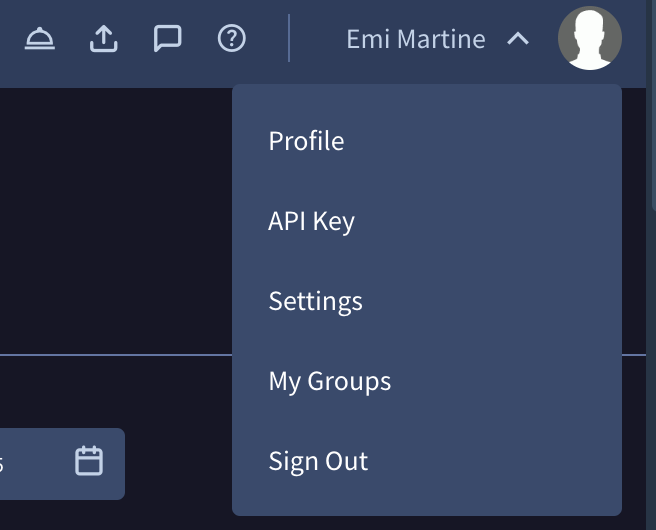

# Google Threat Intelligence - RS Alerts

This integration allows the creation of incidents based on RS Alerts from Google Threat Intelligence.

## Configure Google Threat Intelligence - RS Alerts in Cortex

| **Parameter** | **Description** | **Required** |
| --- | --- | --- |
| Server URL | URL of the GTI platform. | True |
| API Key | Provide the API key for authentication. See [Acquiring your API key](#acquiring-your-api-key) | True |
| Project ID | Specify the ID of the project. | True |
| Fetch incidents | Whether to fetch RS Alerts as XSOAR Incidents. | False |
| Incident type | Select Incident type as "Google Threat Intelligence RS Alert". | False |
| First Fetch Time | The date or relative timestamp from which to begin fetching RS Alerts. Default value is '3 days'.<br/><br/>Supported formats: 2 minutes, 2 hours, 2 days, 2 weeks, 2 months, 2 years, yyyy-mm-dd, yyyy-mm-ddTHH:MM:SSZ.<br/><br/>For example: 01 May 2026, 01 May 2026 04:45:33, 2026-05-17T14:05:44Z. | False |
| Max Fetch | The maximum number of Alerts to fetch each time. Default value is 100. The maximum is 200.<br/><br/>If the value is greater than 200, it will be considered as 200. | False |
| Relevance Level | Filter the alerts by the relevance level. | False |
| Severity Level | Filter the alerts by the severity level. | False |
| Priority Level | Filter the alerts by the priority level. | False |
| Status | Filter the alerts by the status. | False |
| Threat Scenarios | Filter the alerts by the threat scenarios. | False |
| Mirroring Direction | The mirroring direction in which to mirror the alert. You can mirror 'Incoming' \(from GTI to XSOAR\), 'Outgoing' \(from XSOAR to GTI\), or in both directions. | False |
| Reopen Incident for Open Alert Status | Incident will reopen when the Alert status is 'Read', 'Triaged', 'Escalated'.<br/><br/>Note: This parameter is only used when the mirroring direction is set to 'Incoming' or 'Incoming And Outgoing'. | False |
| Close Incident for Close Alert Status | Incident will close when the Alert status is 'False Positive' or 'Resolved' or 'Duplicate' or 'Benign' or 'Not Actionable' or 'Tracked Externally'.<br/><br/>Note: This parameter is only used when the mirroring direction is set to 'Incoming' or 'Incoming And Outgoing'. | False |
| Alert Status for Incident Reopen | Alert Status set in GTI when Reopen incidents in XSOAR. Default value is 'Escalated'.<br/><br/>Note: This parameter is only used when the mirroring direction is set to 'Outgoing' or 'Incoming And Outgoing'. | False |
| Alert Status for Incident Closure | Alert Status set in GTI when closing incidents in XSOAR. Default value is 'Resolved'.<br/><br/>Note: This parameter is only used when the mirroring direction is set to 'Outgoing' or 'Incoming And Outgoing'. | False |
| Use system proxy settings | Whether to use XSOAR's system proxy settings to connect to the API. | False |
| Trust any certificate (not secure) | Whether to allow connections without verifying SSL certificates validity. | False |

### Acquiring your API key

Your API key can be found in your GoogleThreatIntelligence account user menu, clicking on your avatar:



Your API key carries all your privileges, so keep it secure and don't share it with anyone.

## Incident Mirroring

You can enable incident mirroring between Cortex XSOAR incidents and Google Threat Intelligence - RS Alerts corresponding events (available from Cortex XSOAR version 6.0.0).
To set up the mirroring:

1. Enable *Fetching incidents* in your instance configuration.
2. In the *Mirroring Direction* integration parameter, select in which direction the incidents should be mirrored:

    | **Option** | **Description** |
    | --- | --- |
    | Incoming | Any changes in Google Threat Intelligence - RS Alerts events (mirroring incoming fields) will be reflected in Cortex XSOAR incidents. |
    | Outgoing | Any changes in Cortex XSOAR incidents will be reflected in Google Threat Intelligence - RS Alerts events (outgoing mirrored fields). |
    | Incoming And Outgoing | Changes in Cortex XSOAR incidents and Google Threat Intelligence - RS Alerts events will be reflected in both directions. |

3. *(Incoming / Incoming And Outgoing only)* Enable the *Reopen Incident for Open Alert Status* parameter if you want a closed XSOAR incident to be automatically reopened when the corresponding GTI alert transitions back to an open status. The open statuses that trigger a reopen are: **Read**, **Triaged**, and **Escalated**.

4. *(Incoming / Incoming And Outgoing only)* Enable the *Close Incident for Close Alert Status* parameter if you want a XSOAR incident to be automatically closed when the corresponding GTI alert is moved to a closed status. The closed statuses that trigger closure are: **False Positive**, **Resolved**, **Duplicate**, **Benign**, **Not Actionable**, and **Tracked Externally**.

5. *(Outgoing / Incoming And Outgoing only)* Use the *Alert Status for Incident Reopen* parameter to specify which GTI alert status is set when a XSOAR incident is reopen. The default value is **Escalated**. Available options are: Read, Triaged, and Escalated.

6. *(Outgoing / Incoming And Outgoing only)* Use the *Alert Status for Incident Closure* parameter to specify which GTI alert status is set when a XSOAR incident is closed. The default value is **Resolved**. Available options are: Resolved, Duplicate, False Positive, Benign, Not Actionable, and Tracked Externally.

Newly fetched incidents will be mirrored in the chosen direction. However, this selection does not affect existing incidents.

## Commands

You can execute these commands from the CLI, as part of an automation, or in a playbook.
After you successfully execute a command, a DBot message appears in the War Room with the command details.

### gti-rs-alert-list

***
List the RS Alerts with provided filter arguments.

#### Base Command

`gti-rs-alert-list`

#### Input

| **Argument Name** | **Description** | **Required** |
| --- | --- | --- |
| page_size | Specify the desired page size for the request. Default is 50. | Optional |
| order_by | Filter alerts by the provided sort order. Possible values are: Asc, Desc. Default is Desc. | Optional |
| sort_by | Filter alerts by the provided sort field. Possible values are: Create Time, Update Time, Relevance Level, Severity Level, Priority Level. Default is Update Time. | Optional |
| create_time | Filter the alerts by created on or after the provided time. Supported formats: 2 minutes, 2 hours, 2 days, 2 weeks, 2 months, 2 years, yyyy-mm-dd, yyyy-mm-ddTHH:MM:SSZ. | Optional |
| update_time | Filter the alerts by updated on or after the provided time. Supported formats: 2 minutes, 2 hours, 2 days, 2 weeks, 2 months, 2 years, yyyy-mm-dd, yyyy-mm-ddTHH:MM:SSZ. Default is 3 days. | Optional |
| relevance_level | Filter the alerts by the relevance level. Possible values are: Low, Medium, High. | Optional |
| severity_level | Filter the alerts by the severity level. Possible values are: Low, Medium, High. | Optional |
| priority_level | Filter the alerts by the priority level. Possible values are: Low, Medium, High, Critical. | Optional |
| status | Filter the alerts by the status. Possible values are: New, Read, Triaged, Escalated, Resolved, Duplicate, False Positive, Not Actionable, Benign, Tracked Externally. | Optional |
| threat_scenarios | Filter the alerts by the threat scenarios. Possible values are: Data Leak, Initial Access Broker, Insider Threat. | Optional |

#### Context Output

| **Path** | **Type** | **Description** |
| --- | --- | --- |
| GoogleThreatIntelligenceRSAlerts.Alert.name | String | Unique identifier for the alert. |
| GoogleThreatIntelligenceRSAlerts.Alert.findings | Array | List of findings associated with the alert. |
| GoogleThreatIntelligenceRSAlerts.Alert.state | String | Current state of the alert. |
| GoogleThreatIntelligenceRSAlerts.Alert.audit.updateTime | Date | Timestamp of last update to the alert. |
| GoogleThreatIntelligenceRSAlerts.Alert.audit.createTime | Date | Timestamp when the alert was created. |
| GoogleThreatIntelligenceRSAlerts.Alert.audit.creator | String | User or system that created the alert. |
| GoogleThreatIntelligenceRSAlerts.Alert.audit.updater | String | User or system that last updated the alert. |
| GoogleThreatIntelligenceRSAlerts.Alert.displayName | String | Display name of the alert. |
| GoogleThreatIntelligenceRSAlerts.Alert.detail.detailType | String | Type of detail analysis. |
| GoogleThreatIntelligenceRSAlerts.Alert.detail.initialAccessBroker.severity | String | Severity level for initial access broker threat. |
| GoogleThreatIntelligenceRSAlerts.Alert.detail.initialAccessBroker.discoveryDocumentIds | Array | Document IDs related to initial access broker discovery. |
| GoogleThreatIntelligenceRSAlerts.Alert.detail.dataLeak.severity | String | Severity level for data leak threat. |
| GoogleThreatIntelligenceRSAlerts.Alert.detail.dataLeak.discoveryDocumentIds | Array | Document IDs related to data leak discovery. |
| GoogleThreatIntelligenceRSAlerts.Alert.detail.insiderThreat.severity | String | Severity level for insider threat. |
| GoogleThreatIntelligenceRSAlerts.Alert.detail.insiderThreat.discoveryDocumentIds | Array | Document IDs related to insider threat discovery. |
| GoogleThreatIntelligenceRSAlerts.Alert.duplicateOf | String | Identifier of the alert this is a duplicate of, if applicable. |
| GoogleThreatIntelligenceRSAlerts.Alert.duplicatedBy | Array | List of alert identifiers that are duplicates of this alert. |
| GoogleThreatIntelligenceRSAlerts.Alert.etag | String | Entity tag for optimistic concurrency control. |
| GoogleThreatIntelligenceRSAlerts.Alert.externalId | String | External identifier for the alert. |
| GoogleThreatIntelligenceRSAlerts.Alert.aiSummary | String | AI-generated summary of the alert. |
| GoogleThreatIntelligenceRSAlerts.Alert.relevanceAnalysis.relevant | Boolean | Whether the alert is relevant. |
| GoogleThreatIntelligenceRSAlerts.Alert.relevanceAnalysis.confidence | String | Confidence level of relevance assessment. |
| GoogleThreatIntelligenceRSAlerts.Alert.relevanceAnalysis.reasoning | String | Reasoning for relevance assessment. |
| GoogleThreatIntelligenceRSAlerts.Alert.relevanceAnalysis.evidence.commonThemes | Array | Common themes found in the alert. |
| GoogleThreatIntelligenceRSAlerts.Alert.relevanceAnalysis.evidence.distinctThemes | Array | Distinct themes found in the alert. |
| GoogleThreatIntelligenceRSAlerts.Alert.relevanceAnalysis.relevanceLevel | String | Overall relevance level. |
| GoogleThreatIntelligenceRSAlerts.Alert.severityAnalysis.severityLevel | String | Assessed severity level. |
| GoogleThreatIntelligenceRSAlerts.Alert.severityAnalysis.confidence | String | Confidence level of severity assessment. |
| GoogleThreatIntelligenceRSAlerts.Alert.severityAnalysis.reasoning | String | Reasoning for severity assessment. |
| GoogleThreatIntelligenceRSAlerts.Alert.priorityAnalysis.priorityLevel | String | Assessed priority level. |
| GoogleThreatIntelligenceRSAlerts.Alert.priorityAnalysis.confidence | String | Confidence level of priority assessment. |
| GoogleThreatIntelligenceRSAlerts.Alert.priorityAnalysis.reasoning | String | Reasoning for priority assessment. |
| GoogleThreatIntelligenceRSAlerts.Alert.findingCount | Number | Number of findings associated with the alert. |
| GoogleThreatIntelligenceRSAlerts.Alert.configurations | Array | List of configurations related to the alert. |

#### Command example

```!gti-rs-alert-list page_size=2```

#### Context Example

```json
{
  "GoogleThreatIntelligenceRSAlerts": {
    "Alert": [
      {
        "name": "projects/test-project/alerts/alert-1",
        "findings": ["finding-1"],
        "state": "STATE_UNSPECIFIED",
        "audit": {
          "updateTime": "2026-04-22T06:43:07.513Z",
          "createTime": "2026-04-22T06:43:07.513Z",
          "creator": "creator-1",
          "updater": "updater-1"
        },
        "displayName": "Test Alert 1",
        "aiSummary": "Test AI summary for alert 1",
        "etag": "test-etag-1",
        "detail": {
          "detailType": "data_leak",
          "dataLeak": {
            "severity": "MEDIUM",
            "discoveryDocumentIds": [
              "projects/test-project/alerts/alert-1/documents/doc-1"
            ]
          }
        },
        "relevanceAnalysis": {
          "relevant": true,
          "confidence": "CONFIDENCE_LEVEL_HIGH",
          "reasoning": "Test relevance reasoning",
          "relevanceLevel": "RELEVANCE_LEVEL_HIGH",
          "evidence": {
            "commonThemes": ["Test common theme"],
            "distinctThemes": ["Test distinct theme"]
          }
        },
        "severityAnalysis": {
          "severityLevel": "SEVERITY_LEVEL_HIGH",
          "confidence": "CONFIDENCE_LEVEL_HIGH",
          "reasoning": "Test severity reasoning"
        },
        "priorityAnalysis": {
          "priorityLevel": "PRIORITY_LEVEL_HIGH",
          "confidence": "CONFIDENCE_LEVEL_HIGH",
          "reasoning": "Test priority reasoning"
        },
        "findingCount": "1"
      },
      {
        "name": "projects/test-project/alerts/alert-2",
        "findings": ["finding-2", "finding-3"],
        "state": "TRIAGED",
        "audit": {
          "updateTime": "2026-05-01T09:15:22.841Z",
          "createTime": "2026-04-30T14:27:55.102Z",
          "creator": "creator-2",
          "updater": "updater-2"
        },
        "displayName": "Test Alert 2",
        "aiSummary": "Test AI summary for alert 2 indicating initial access broker activity targeting corporate credentials.",
        "etag": "test-etag-2",
        "detail": {
          "detailType": "initial_access_broker",
          "initialAccessBroker": {
            "severity": "HIGH",
            "discoveryDocumentIds": [
              "projects/test-project/alerts/alert-2/documents/doc-2",
              "projects/test-project/alerts/alert-2/documents/doc-3"
            ]
          }
        },
        "relevanceAnalysis": {
          "relevant": true,
          "confidence": "CONFIDENCE_LEVEL_MEDIUM",
          "reasoning": "Test relevance reasoning for alert 2",
          "relevanceLevel": "RELEVANCE_LEVEL_MEDIUM",
          "evidence": {
            "commonThemes": ["Test common theme 2"],
            "distinctThemes": ["Test distinct theme 2"]
          }
        },
        "severityAnalysis": {
          "severityLevel": "SEVERITY_LEVEL_CRITICAL",
          "confidence": "CONFIDENCE_LEVEL_HIGH",
          "reasoning": "Test severity reasoning for alert 2"
        },
        "priorityAnalysis": {
          "priorityLevel": "PRIORITY_LEVEL_CRITICAL",
          "confidence": "CONFIDENCE_LEVEL_MEDIUM",
          "reasoning": "Test priority reasoning for alert 2"
        },
        "findingCount": "2"
      }
    ]
  }
}
```

#### Human Readable Output

>### GTI RS Alert List
>
>|Alert Name|Status|Priority|Severity|Relevance|Threat Scenario|AI Summary|Created Time|Updated Time|Etag|Finding Count|Findings|
>|---|---|---|---|---|---|---|---|---|---|---|---|
>| [Test Alert 1](https://test.test_gti.com/alerts/alert-1?project=projects/test-project) | State unspecified | High | High | High | Data leak | Test AI summary for alert 1 | 2026-04-22T06:43:07.513Z | 2026-04-22T06:43:07.513Z | test-etag-1 | 1 | finding-1 |
>| [Test Alert 2](https://test.test_gti.com/alerts/alert-2?project=projects/test-project) | Triaged | Critical | Critical | Medium | Initial access broker | Test AI summary for alert 2 indicating initial access broker activity targeting corporate credentials. | 2026-04-30T14:27:55.102Z | 2026-05-01T09:15:22.841Z | test-etag-2 | 2 | finding-2, finding-3 |

### gti-rs-alert-get

***
Get a particular RS Alert by ID.

#### Base Command

`gti-rs-alert-get`

#### Input

| **Argument Name** | **Description** | **Required** |
| --- | --- | --- |
| alert_id | Specify the ID of the alert.<br/><br/>Note: Use 'gti-rs-alert-list' to retrieve the Alert ID. | Required |

#### Context Output

| **Path** | **Type** | **Description** |
| --- | --- | --- |
| GoogleThreatIntelligenceRSAlerts.Alert.name | String | Unique identifier for the alert. |
| GoogleThreatIntelligenceRSAlerts.Alert.findings | Array | List of findings associated with the alert. |
| GoogleThreatIntelligenceRSAlerts.Alert.state | String | Current state of the alert. |
| GoogleThreatIntelligenceRSAlerts.Alert.audit.updateTime | Date | Timestamp of last update to the alert. |
| GoogleThreatIntelligenceRSAlerts.Alert.audit.createTime | Date | Timestamp when the alert was created. |
| GoogleThreatIntelligenceRSAlerts.Alert.audit.creator | String | User or system that created the alert. |
| GoogleThreatIntelligenceRSAlerts.Alert.audit.updater | String | User or system that last updated the alert. |
| GoogleThreatIntelligenceRSAlerts.Alert.displayName | String | Display name of the alert. |
| GoogleThreatIntelligenceRSAlerts.Alert.detail.detailType | String | Type of detail analysis. |
| GoogleThreatIntelligenceRSAlerts.Alert.detail.initialAccessBroker.severity | String | Severity level for initial access broker threat. |
| GoogleThreatIntelligenceRSAlerts.Alert.detail.initialAccessBroker.discoveryDocumentIds | Array | Document IDs related to initial access broker discovery. |
| GoogleThreatIntelligenceRSAlerts.Alert.detail.dataLeak.severity | String | Severity level for data leak threat. |
| GoogleThreatIntelligenceRSAlerts.Alert.detail.dataLeak.discoveryDocumentIds | Array | Document IDs related to data leak discovery. |
| GoogleThreatIntelligenceRSAlerts.Alert.detail.insiderThreat.severity | String | Severity level for insider threat. |
| GoogleThreatIntelligenceRSAlerts.Alert.detail.insiderThreat.discoveryDocumentIds | Array | Document IDs related to insider threat discovery. |
| GoogleThreatIntelligenceRSAlerts.Alert.duplicateOf | String | Identifier of the alert this is a duplicate of, if applicable. |
| GoogleThreatIntelligenceRSAlerts.Alert.duplicatedBy | Array | List of alert identifiers that are duplicates of this alert. |
| GoogleThreatIntelligenceRSAlerts.Alert.etag | String | Entity tag for optimistic concurrency control. |
| GoogleThreatIntelligenceRSAlerts.Alert.externalId | String | External identifier for the alert. |
| GoogleThreatIntelligenceRSAlerts.Alert.aiSummary | String | AI-generated summary of the alert. |
| GoogleThreatIntelligenceRSAlerts.Alert.relevanceAnalysis.relevant | Boolean | Whether the alert is relevant. |
| GoogleThreatIntelligenceRSAlerts.Alert.relevanceAnalysis.confidence | String | Confidence level of relevance assessment. |
| GoogleThreatIntelligenceRSAlerts.Alert.relevanceAnalysis.reasoning | String | Reasoning for relevance assessment. |
| GoogleThreatIntelligenceRSAlerts.Alert.relevanceAnalysis.evidence.commonThemes | Array | Common themes found in the alert. |
| GoogleThreatIntelligenceRSAlerts.Alert.relevanceAnalysis.evidence.distinctThemes | Array | Distinct themes found in the alert. |
| GoogleThreatIntelligenceRSAlerts.Alert.relevanceAnalysis.relevanceLevel | String | Overall relevance level. |
| GoogleThreatIntelligenceRSAlerts.Alert.severityAnalysis.severityLevel | String | Assessed severity level. |
| GoogleThreatIntelligenceRSAlerts.Alert.severityAnalysis.confidence | String | Confidence level of severity assessment. |
| GoogleThreatIntelligenceRSAlerts.Alert.severityAnalysis.reasoning | String | Reasoning for severity assessment. |
| GoogleThreatIntelligenceRSAlerts.Alert.priorityAnalysis.priorityLevel | String | Assessed priority level. |
| GoogleThreatIntelligenceRSAlerts.Alert.priorityAnalysis.confidence | String | Confidence level of priority assessment. |
| GoogleThreatIntelligenceRSAlerts.Alert.priorityAnalysis.reasoning | String | Reasoning for priority assessment. |
| GoogleThreatIntelligenceRSAlerts.Alert.findingCount | Number | Number of findings associated with the alert. |
| GoogleThreatIntelligenceRSAlerts.Alert.configurations | Array | List of configurations related to the alert. |

#### Command example

```!gti-rs-alert-get alert_id="92f32cdc-064e-443e-8ec5-f92dc555fb7d"```

#### Context Example

```json
{
 "GoogleThreatIntelligenceRSAlerts": {
    "Alert": [
      {
        "name": "projects/test-project/alerts/alert-1",
        "findings": ["finding-1"],
        "state": "STATE_UNSPECIFIED",
        "audit": {
          "updateTime": "2026-04-22T06:43:07.513Z",
          "createTime": "2026-04-22T06:43:07.513Z",
          "creator": "creator-1",
          "updater": "updater-1"
        },
        "displayName": "Test Alert 1",
        "aiSummary": "Test AI summary for alert 1",
        "etag": "test-etag-1",
        "detail": {
          "detailType": "data_leak",
          "dataLeak": {
            "severity": "MEDIUM",
            "discoveryDocumentIds": [
              "projects/test-project/alerts/alert-1/documents/doc-1"
            ]
          }
        },
        "relevanceAnalysis": {
          "relevant": true,
          "confidence": "CONFIDENCE_LEVEL_HIGH",
          "reasoning": "Test relevance reasoning",
          "relevanceLevel": "RELEVANCE_LEVEL_HIGH",
          "evidence": {
            "commonThemes": ["Test common theme"],
            "distinctThemes": ["Test distinct theme"]
          }
        },
        "severityAnalysis": {
          "severityLevel": "SEVERITY_LEVEL_HIGH",
          "confidence": "CONFIDENCE_LEVEL_HIGH",
          "reasoning": "Test severity reasoning"
        },
        "priorityAnalysis": {
          "priorityLevel": "PRIORITY_LEVEL_HIGH",
          "confidence": "CONFIDENCE_LEVEL_HIGH",
          "reasoning": "Test priority reasoning"
        },
        "findingCount": "1"
      }
    ]
  }
}
```

#### Human Readable Output

>### GTI RS Alert List
>
>|Alert Name|Alert ID|Status|Priority|Severity|Relevance|Threat Scenario|AI Summary|Created Time|Updated Time|Etag|Finding Count|Findings|
>|---|---|---|---|---|---|---|---|---|---|---|---|
>| [Test Alert 1](https://test.test_gti.com/alerts/alert-1?project=projects/test-project) | State unspecified | High | High | High | Data leak | Test AI summary for alert 1 | 2026-04-22T06:43:07.513Z | 2026-04-22T06:43:07.513Z | test-etag-1 | 1 | finding-1 |

### gti-rs-alert-status-update

***
Update the status of an RS Alert.

#### Base Command

`gti-rs-alert-status-update`

#### Input

| **Argument Name** | **Description** | **Required** |
| --- | --- | --- |
| alert_id | Specify the ID of the alert.<br/><br/>Note: Use 'gti-rs-alert-list' to retrieve the Alert ID. | Required |
| status | Specify the status of the alert. Possible values are: Read, Triaged, Escalated, Resolved, Duplicate, False Positive, Not Actionable, Benign, Tracked Externally. | Required |

#### Context Output

| **Path** | **Type** | **Description** |
| --- | --- | --- |
| GoogleThreatIntelligenceRSAlerts.Alert.name | String | Unique identifier for the alert. |
| GoogleThreatIntelligenceRSAlerts.Alert.findings | Array | List of findings associated with the alert. |
| GoogleThreatIntelligenceRSAlerts.Alert.state | String | Current state of the alert. |
| GoogleThreatIntelligenceRSAlerts.Alert.audit.updateTime | Date | Timestamp of last update to the alert. |
| GoogleThreatIntelligenceRSAlerts.Alert.audit.createTime | Date | Timestamp when the alert was created. |
| GoogleThreatIntelligenceRSAlerts.Alert.audit.creator | String | User or system that created the alert. |
| GoogleThreatIntelligenceRSAlerts.Alert.audit.updater | String | User or system that last updated the alert. |
| GoogleThreatIntelligenceRSAlerts.Alert.displayName | String | Display name of the alert. |
| GoogleThreatIntelligenceRSAlerts.Alert.detail.detailType | String | Type of detail analysis. |
| GoogleThreatIntelligenceRSAlerts.Alert.detail.initialAccessBroker.severity | String | Severity level for initial access broker threat. |
| GoogleThreatIntelligenceRSAlerts.Alert.detail.initialAccessBroker.discoveryDocumentIds | Array | Document IDs related to initial access broker discovery. |
| GoogleThreatIntelligenceRSAlerts.Alert.detail.dataLeak.severity | String | Severity level for data leak threat. |
| GoogleThreatIntelligenceRSAlerts.Alert.detail.dataLeak.discoveryDocumentIds | Array | Document IDs related to data leak discovery. |
| GoogleThreatIntelligenceRSAlerts.Alert.detail.insiderThreat.severity | String | Severity level for insider threat. |
| GoogleThreatIntelligenceRSAlerts.Alert.detail.insiderThreat.discoveryDocumentIds | Array | Document IDs related to insider threat discovery. |
| GoogleThreatIntelligenceRSAlerts.Alert.duplicateOf | String | Identifier of the alert this is a duplicate of, if applicable. |
| GoogleThreatIntelligenceRSAlerts.Alert.duplicatedBy | Array | List of alert identifiers that are duplicates of this alert. |
| GoogleThreatIntelligenceRSAlerts.Alert.etag | String | Entity tag for optimistic concurrency control. |
| GoogleThreatIntelligenceRSAlerts.Alert.externalId | String | External identifier for the alert. |
| GoogleThreatIntelligenceRSAlerts.Alert.aiSummary | String | AI-generated summary of the alert. |
| GoogleThreatIntelligenceRSAlerts.Alert.relevanceAnalysis.relevant | Boolean | Whether the alert is relevant. |
| GoogleThreatIntelligenceRSAlerts.Alert.relevanceAnalysis.confidence | String | Confidence level of relevance assessment. |
| GoogleThreatIntelligenceRSAlerts.Alert.relevanceAnalysis.reasoning | String | Reasoning for relevance assessment. |
| GoogleThreatIntelligenceRSAlerts.Alert.relevanceAnalysis.evidence.commonThemes | Array | Common themes found in the alert. |
| GoogleThreatIntelligenceRSAlerts.Alert.relevanceAnalysis.evidence.distinctThemes | Array | Distinct themes found in the alert. |
| GoogleThreatIntelligenceRSAlerts.Alert.relevanceAnalysis.relevanceLevel | String | Overall relevance level. |
| GoogleThreatIntelligenceRSAlerts.Alert.severityAnalysis.severityLevel | String | Assessed severity level. |
| GoogleThreatIntelligenceRSAlerts.Alert.severityAnalysis.confidence | String | Confidence level of severity assessment. |
| GoogleThreatIntelligenceRSAlerts.Alert.severityAnalysis.reasoning | String | Reasoning for severity assessment. |
| GoogleThreatIntelligenceRSAlerts.Alert.priorityAnalysis.priorityLevel | String | Assessed priority level. |
| GoogleThreatIntelligenceRSAlerts.Alert.priorityAnalysis.confidence | String | Confidence level of priority assessment. |
| GoogleThreatIntelligenceRSAlerts.Alert.priorityAnalysis.reasoning | String | Reasoning for priority assessment. |
| GoogleThreatIntelligenceRSAlerts.Alert.findingCount | Number | Number of findings associated with the alert. |
| GoogleThreatIntelligenceRSAlerts.Alert.configurations | Array | List of configurations related to the alert. |

#### Command example

```!gti-rs-alert-status-update alert_id="alert-status-1" status="Read"```

#### Context Example

```json
{
  "GoogleThreatIntelligenceRSAlerts": {
    "Alert": [
      {
        "name": "projects/test-project/alerts/alert-status-1",
        "findings": ["finding-1"],
        "state": "READ",
        "audit": {
          "updateTime": "2026-04-22T08:00:00.000Z",
          "createTime": "2026-04-22T06:43:07.513Z",
          "creator": "creator-1",
          "updater": "updater-1"
        },
        "displayName": "Test Alert Status Update",
        "aiSummary": "Test AI summary for status update.",
        "etag": "etag-value-update",
        "externalId": "external-id-1",
        "detail": {
          "detailType": "data_leak",
          "dataLeak": {
            "severity": "SEVERITY_LEVEL_MEDIUM",
            "discoveryDocumentIds": ["doc-1"]
          }
        },
        "relevanceAnalysis": {
          "relevant": true,
          "confidence": "CONFIDENCE_LEVEL_HIGH",
          "reasoning": "Test relevance reasoning",
          "relevanceLevel": "RELEVANCE_LEVEL_LOW",
          "evidence": {
            "commonThemes": ["theme-1"],
            "distinctThemes": ["distinct-1"]
          }
        },
        "severityAnalysis": {
          "severityLevel": "SEVERITY_LEVEL_MEDIUM",
          "confidence": "CONFIDENCE_LEVEL_MEDIUM",
          "reasoning": "Test severity reasoning"
        },
        "priorityAnalysis": {
          "priorityLevel": "PRIORITY_LEVEL_LOW",
          "confidence": "CONFIDENCE_LEVEL_LOW",
          "reasoning": "Test priority reasoning"
        },
        "findingCount": "1",
        "configurations": ["config-1"]
      }
    ]
  }
}
```

#### Human Readable Output

>### Alert Status Updated Successfully
>
>|Alert Name|Status|
>|---|---|
>| [Test Alert Status Update](https://test.test_gti.com/alerts/alert-status-1?project=projects/test-project) | Read |
