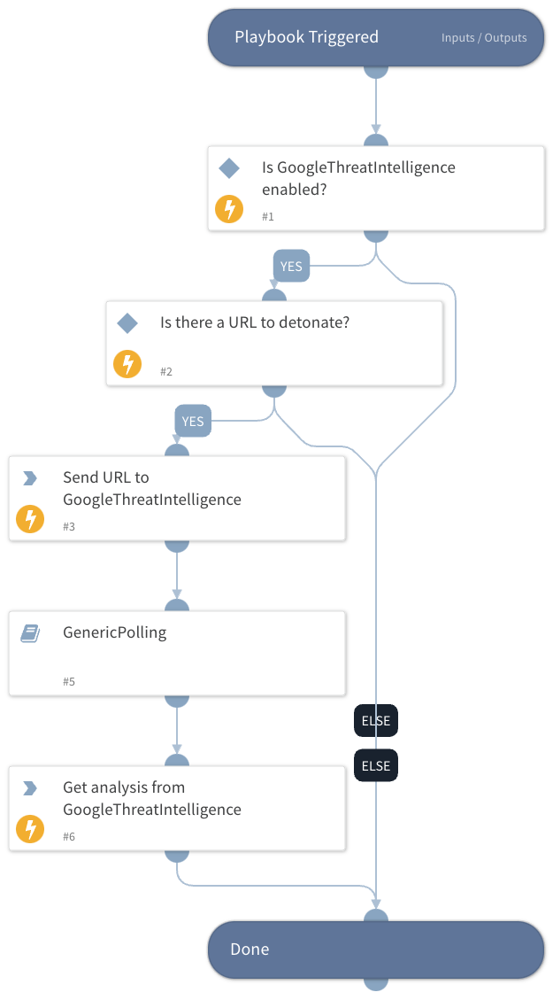

Detonate URL through GoogleThreatIntelligence integration.

## Dependencies
This playbook uses the following sub-playbooks, integrations, and scripts.

### Sub-playbooks
* GenericPolling

### Integrations
* GoogleThreatIntelligence

### Scripts
This playbook does not use any scripts.

### Commands
* url-scan
* gti-analysis-get

## Playbook Inputs
---

| **Name** | **Description** | **Default Value** | **Required** |
| --- | --- | --- | --- |
| URL | Entry ID of the URL to detonate | URL.Data | Optional |

## Playbook Outputs
---

| **Path** | **Description** | **Type** |
| --- | --- | --- |
| GoogleThreatIntelligence.Analysis.data.attributes.stats.harmless | Number of engines found the indicator harmless. | number |
| GoogleThreatIntelligence.Analysis.data.attributes.stats.malicious | Number of engines found the indicator malicious. | number |
| GoogleThreatIntelligence.Analysis.data.attributes.stats.suspicious | Number of engines found the indicator suspicious. | number |
| GoogleThreatIntelligence.Analysis.data.attributes.stats.timeout | Number of engines found the indicator timeout. | number |
| GoogleThreatIntelligence.Analysis.data.attributes.stats.undetected | Number of engines found the indicator undetected. | number |
| GoogleThreatIntelligence.Analysis.data.attributes.date | Date of the analysis in epoch | number |
| GoogleThreatIntelligence.Analysis.data.attributes.status | Status of the analysis | string |
| GoogleThreatIntelligence.Analysis.data.id | ID of the analysis. | string |
| GoogleThreatIntelligence.Analysis.data.type | Type of object \(analysis\) | string |
| GoogleThreatIntelligence.Analysis.meta.url_info.id | ID of the url | string |
| GoogleThreatIntelligence.Analysis.meta.url_info.url | The URL | string |
| GoogleThreatIntelligence.Analysis.id | The analysis ID. | string |

## Playbook Image
---
