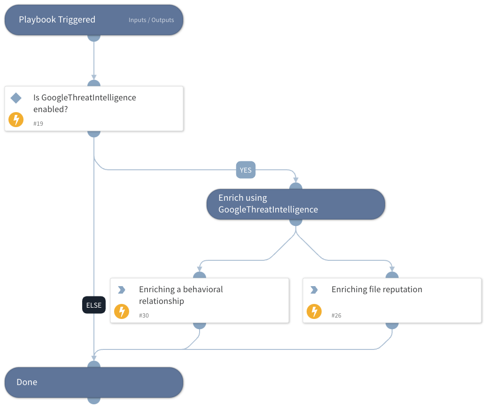

Get file information using the GoogleThreatIntelligence integration.

## Dependencies
This playbook uses the following sub-playbooks, integrations, and scripts.

### Sub-playbooks
This playbook does not use any sub-playbooks.

### Integrations
* GoogleThreatIntelligence

### Scripts
This playbook does not use any scripts.

### Commands
* gti-file-sandbox-report
* file

## Playbook Inputs
---

| **Name** | **Description** | **Default Value** | **Required** |
| --- | --- | --- | --- |
| FileHash | File Hash to enrich | File.SHA256 | Optional |

## Playbook Outputs
---

| **Path** | **Description** | **Type** |
| --- | --- | --- |
| File.MD5 | Bad MD5 hash. | Unknown |
| File.SHA1 | Bad SHA1 hash. | Unknown |
| File.SHA256 | Bad SHA256 hash. | Unknown |
| File.Relationships.EntityA | The source of the relationship. | String |
| File.Relationships.EntityB | The destination of the relationship. | String |
| File.Relationships.Relationship | The name of the relationship. | String |
| File.Relationships.EntityAtype | The type of the source of the relationship. | String |
| File.Relationships.EntityBtype | The type of the destination of the relationship. | String |
| File.Malicious.Vendor | For malicious files, the vendor that made the decision. | Unknown |
| File.Malicious.Detections | For malicious files, the total number of detections. | Unknown |
| File.Malicious.TotalEngines | For malicious files, the total number of engines that checked the file hash. | Unknown |
| DBotScore.Indicator | The indicator that was tested. | Unknown |
| DBotScore.type | The indicator type. | Unknown |
| DBotScore.Vendor | The vendor used to calculate the DBot score. | Unknown |
| DBotScore.Score | The actual score. | Number |
| DBotScore.Reliability | Reliability of the source providing the intelligence data. | String |
| GoogleThreatIntelligence.File.attributes.type_description | description of the type of the file. | String |
| GoogleThreatIntelligence.File.attributes.tlsh | The locality-sensitive hashing. | String |
| GoogleThreatIntelligence.File.attributes.exiftool.MIMEtype | MIME type of the file. | String |
| GoogleThreatIntelligence.File.attributes.names | Names of the file. | String |
| GoogleThreatIntelligence.File.attributes.javascript_info.tags | Tags of the JavaScript. | String |
| GoogleThreatIntelligence.File.attributes.exiftool.Filetype | The file type. | String |
| GoogleThreatIntelligence.File.attributes.exiftool.WordCount | Total number of words in the file. | String |
| GoogleThreatIntelligence.File.attributes.exiftool.LineCount | Total number of lines in file. | String |
| GoogleThreatIntelligence.File.attributes.crowdsourced_ids_stats.info | Number of IDS that marked the file as "info". | Number |
| GoogleThreatIntelligence.File.attributes.crowdsourced_ids_stats.high | Number of IDS that marked the file as "high". | Number |
| GoogleThreatIntelligence.File.attributes.crowdsourced_ids_stats.medium | Number of IDS that marked the file as "medium". | Number |
| GoogleThreatIntelligence.File.attributes.crowdsourced_ids_stats.low | Number of IDS that marked the file as "low". | Number |
| GoogleThreatIntelligence.File.attributes.sigma_analysis_stats.critical | Number of Sigma analysis that marked the file as "critical". | Number |
| GoogleThreatIntelligence.File.attributes.sigma_analysis_stats.high | Number of Sigma analysis that marked the file as "high". | Number |
| GoogleThreatIntelligence.File.attributes.sigma_analysis_stats.medium | Number of Sigma analysis that marked the file as "medium". | Number |
| GoogleThreatIntelligence.File.attributes.sigma_analysis_stats.low | Number of Sigma analysis that marked the file as "low". | Number |
| GoogleThreatIntelligence.File.attributes.exiftool.MIMEEncoding | The MIME encoding. | String |
| GoogleThreatIntelligence.File.attributes.exiftool.FiletypeExtension | The file type extension. | String |
| GoogleThreatIntelligence.File.attributes.exiftool.Newlines | Number of newlines signs. | String |
| GoogleThreatIntelligence.File.attributes.trid.file_type | The TrID file type. | String |
| GoogleThreatIntelligence.File.attributes.trid.probability | The TrID probability. | Number |
| GoogleThreatIntelligence.File.attributes.crowdsourced_yara_results.description | description of the YARA rule. | String |
| GoogleThreatIntelligence.File.attributes.crowdsourced_yara_results.source | Source of the YARA rule. | String |
| GoogleThreatIntelligence.File.attributes.crowdsourced_yara_results.author | Author of the YARA rule. | String |
| GoogleThreatIntelligence.File.attributes.crowdsourced_yara_results.ruleset_name | Rule set name of the YARA rule. | String |
| GoogleThreatIntelligence.File.attributes.crowdsourced_yara_results.rule_name | Name of the YARA rule. | String |
| GoogleThreatIntelligence.File.attributes.crowdsourced_yara_results.ruleset_id | ID of the YARA rule. | String |
| GoogleThreatIntelligence.File.attributes.names | Name of the file. | String |
| GoogleThreatIntelligence.File.attributes.last_modification_date | The last modification date in epoch format. | Number |
| GoogleThreatIntelligence.File.attributes.type_tag | Tag of the type. | String |
| GoogleThreatIntelligence.File.attributes.total_votes.harmless | Total number of harmless votes. | Number |
| GoogleThreatIntelligence.File.attributes.total_votes.malicious | Total number of malicious votes. | Number |
| GoogleThreatIntelligence.File.attributes.size | Size of the file. | Number |
| GoogleThreatIntelligence.File.attributes.popular_threat_classification.suggested_threat_label | Suggested thread label. | String |
| GoogleThreatIntelligence.File.attributes.popular_threat_classification.popular_threat_name | The popular thread name. | Number |
| GoogleThreatIntelligence.File.attributes.times_submitted | Number of times the file was submitted. | Number |
| GoogleThreatIntelligence.File.attributes.last_submission_date | Last submission date in epoch format. | Number |
| GoogleThreatIntelligence.File.attributes.downloadable | Whether the file is downloadable. | Boolean |
| GoogleThreatIntelligence.File.attributes.sha256 | SHA-256 hash of the file. | String |
| GoogleThreatIntelligence.File.attributes.type_extension | Extension of the type. | String |
| GoogleThreatIntelligence.File.attributes.tags | File tags. | String |
| GoogleThreatIntelligence.File.attributes.last_analysis_date | Last analysis date in epoch format. | Number |
| GoogleThreatIntelligence.File.attributes.unique_sources | Unique sources. | Number |
| GoogleThreatIntelligence.File.attributes.first_submission_date | First submission date in epoch format. | Number |
| GoogleThreatIntelligence.File.attributes.ssdeep | SSDeep hash of the file. | String |
| GoogleThreatIntelligence.File.attributes.md5 | MD5 hash of the file. | String |
| GoogleThreatIntelligence.File.attributes.sha1 | SHA-1 hash of the file. | String |
| GoogleThreatIntelligence.File.attributes.magic | Identification of file by the magic number. | String |
| GoogleThreatIntelligence.File.attributes.last_analysis_stats.harmless | The number of engines that found the indicator to be harmless. | Number |
| GoogleThreatIntelligence.File.attributes.last_analysis_stats.type-unsupported | The number of engines that found the indicator to be of type unsupported. | Number |
| GoogleThreatIntelligence.File.attributes.last_analysis_stats.suspicious | The number of engines that found the indicator to be suspicious. | Number |
| GoogleThreatIntelligence.File.attributes.last_analysis_stats.confirmed-timeout | The number of engines that confirmed the timeout of the indicator. | Number |
| GoogleThreatIntelligence.File.attributes.last_analysis_stats.timeout | The number of engines that timed out for the indicator. | Number |
| GoogleThreatIntelligence.File.attributes.last_analysis_stats.failure | The number of failed analysis engines. | Number |
| GoogleThreatIntelligence.File.attributes.last_analysis_stats.malicious | The number of engines that found the indicator to be malicious. | Number |
| GoogleThreatIntelligence.File.attributes.last_analysis_stats.undetected | The number of engines that could not detect the indicator. | Number |
| GoogleThreatIntelligence.File.attributes.meaningful_name | Meaningful name of the file. | String |
| GoogleThreatIntelligence.File.attributes.reputation | The reputation of the file. | Number |
| GoogleThreatIntelligence.File.type | type of the indicator \(file\). | String |
| GoogleThreatIntelligence.File.id | type ID of the indicator. | String |
| GoogleThreatIntelligence.File.links.self | Link to the response. | Unknown |

## Playbook Image
---
