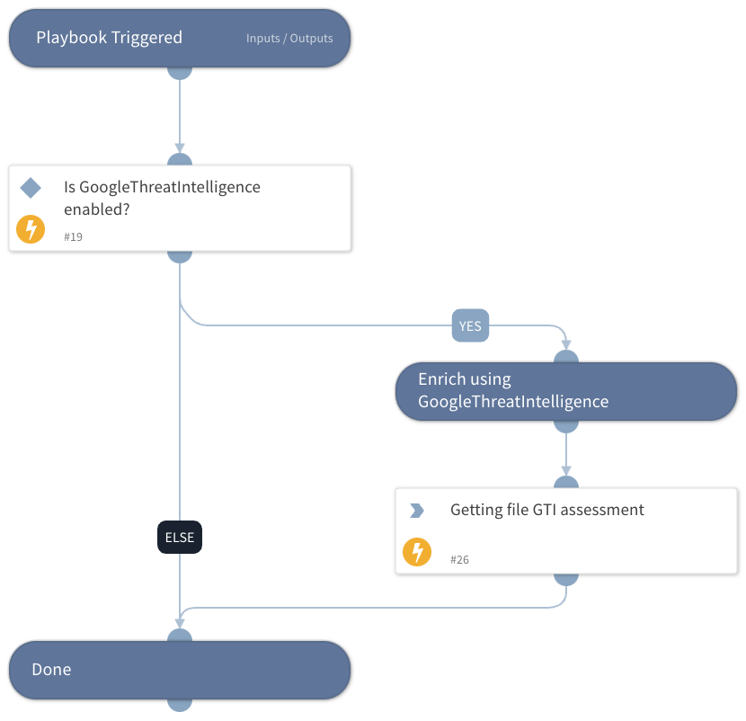

Get file GTI assessment using the GoogleThreatIntelligence integration.

## Dependencies

This playbook uses the following sub-playbooks, integrations, and scripts.

### Sub-playbooks

This playbook does not use any sub-playbooks.

### Integrations

* GoogleThreatIntelligence

### Scripts

This playbook does not use any scripts.

### Commands

* file

## Playbook Inputs

---

| **Name** | **Description** | **Default Value** | **Required** |
| --- | --- | --- | --- |
| FileHash | File Hash from which to get GTI assessment | File.SHA256 | Optional |

## Playbook Outputs

---

| **Path** | **Description** | **Type** |
| --- | --- | --- |
| File.MD5 | Bad MD5 hash. | Unknown |
| File.SHA1 | Bad SHA1 hash. | Unknown |
| File.SHA256 | Bad SHA256 hash. | Unknown |
| File.Relationships.EntityA | The source of the relationship. | String |
| File.Relationships.EntityB | The destination of the relationship. | String |
| File.Relationships.Relationship | The name of the relationship. | String |
| File.Relationships.EntityAtype | The type of the source of the relationship. | String |
| File.Relationships.EntityBtype | The type of the destination of the relationship. | String |
| File.Malicious.Vendor | For malicious files, the vendor that made the decision. | Unknown |
| File.Malicious.Detections | For malicious files, the total number of detections. | Unknown |
| File.Malicious.TotalEngines | For malicious files, the total number of engines that checked the file hash. | Unknown |
| DBotScore.Indicator | The indicator that was tested. | Unknown |
| DBotScore.type | The indicator type. | Unknown |
| DBotScore.Vendor | The vendor used to calculate the DBot score. | Unknown |
| DBotScore.Score | The actual score. | Number |
| DBotScore.Reliability | Reliability of the source providing the intelligence data. | String |
| GoogleThreatIntelligence.Assessment.attributes.gti_assessment.threat_score.value | The threat score of the assessment. | Number |
| GoogleThreatIntelligence.Assessment.attributes.gti_assessment.severity.value | The severity of the assessment. | string |
| GoogleThreatIntelligence.Assessment.attributes.gti_assessment.verdict.value | The verdict of the assessment. | String |
| GoogleThreatIntelligence.Assessment.type | type of the indicator \(file\). | String |
| GoogleThreatIntelligence.Assessment.id | type ID of the indicator. | String |
| GoogleThreatIntelligence.Assessment.links.self | Link to the response. | Unknown |

## Playbook Image

---

