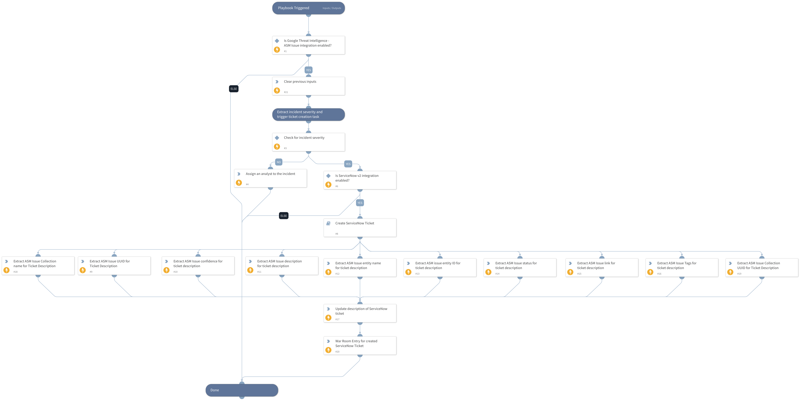

This playbook initiates the response for ASM Issues in XSOAR when an incident is investigated. For medium, high, or critical severity, it creates a ServiceNow ticket; otherwise, the incident is assigned to an analyst. The ticket is enriched with GTI ASM Issue details, including entity name, status, confidence, tags, UUID, collection info, and other relevant incident information.

## Dependencies

This playbook uses the following sub-playbooks, integrations, and scripts.

### Sub-playbooks

* Create ServiceNow Ticket

### Integrations

This playbook does not use any integrations.

### Scripts

* AssignAnalystToIncident
* DeleteContext
* Print
* SetAndHandleEmpty

### Commands

* servicenow-update-ticket

## Playbook Inputs

---

| **Name** | **Description** | **Default Value** | **Required** |
| --- | --- | --- | --- |
| issue_uid | Collection ASM issue UID from incident. | incident.gtiasmissueuid | Optional |
| incident_severity | Collect incident severity from incident. | incident.severity | Optional |
| onCall | Set to true to assign only the user that is currently on shift. Default is False. | false | Optional |
| severity_mapping | Set the ASM Issue severity as per GTI platform. | incident.severity | Optional |

## Playbook Outputs

---
There are no outputs for this playbook.

## Playbook Image

---

