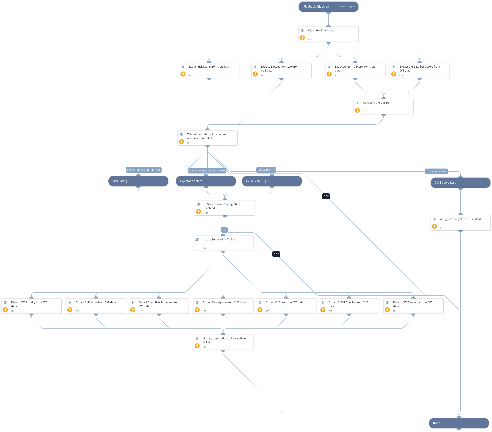

This playbook is used to create a ServiceNow ticket based on enriched CVE data, using the CVE exploitation state, risk rating, and CVSS score.

## Dependencies

This playbook uses the following sub-playbooks, integrations, and scripts.

### Sub-playbooks

* Create ServiceNow Ticket

### Integrations

This playbook does not use any integrations.

### Scripts

* AssignAnalystToIncident
* DeleteContext
* Set
* SetAndHandleEmpty

### Commands

* servicenow-update-ticket

## Playbook Inputs

---

| **Name** | **Description** | **Default Value** | **Required** |
| --- | --- | --- | --- |
| cve_data | Enriched CVE information from the main playbook. |  | Optional |
| onCall | Set to true to assign only the user that is currently on shift. Default is False. | false | Optional |

## Playbook Outputs

---
There are no outputs for this playbook.

## Playbook Image

---

