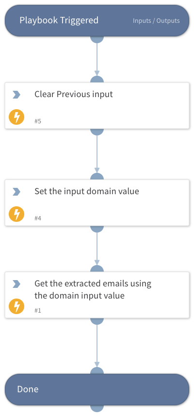

This playbook accepts a domain as input, filters the email list to identify addresses containing the specified domain, and outputs the extracted email addresses for further processing.

## Dependencies

This playbook uses the following sub-playbooks, integrations, and scripts.

### Sub-playbooks

This playbook does not use any sub-playbooks.

### Integrations

This playbook does not use any integrations.

### Scripts

* DeleteContext
* Set
* SetAndHandleEmpty

### Commands

This playbook does not use any commands.

## Playbook Inputs

---

| **Name** | **Description** | **Default Value** | **Required** |
| --- | --- | --- | --- |
| domain | Provide the enriched domain using the domain reputation command. |  | Optional |

## Playbook Outputs

---

| **Path** | **Description** | **Type** |
| --- | --- | --- |
| email_output_list | Extracted email output list from the provided domain. | string |

## Playbook Image

---

