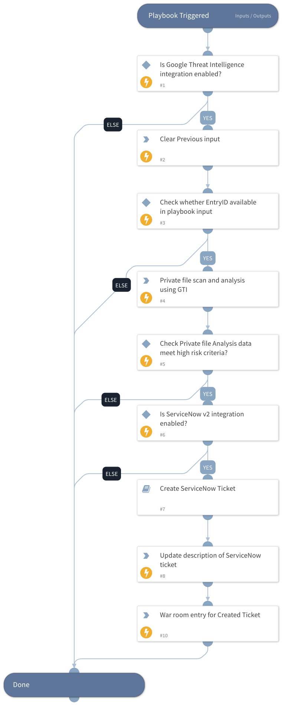

This playbook submits a file for private scanning, retrieves and evaluates the analysis verdict, and automatically creates a ServiceNow ticket when the file is determined to be malicious.

## Dependencies

This playbook uses the following sub-playbooks, integrations, and scripts.

### Sub-playbooks

* Create ServiceNow Ticket

### Integrations

This playbook does not use any integrations.

### Scripts

* DeleteContext
* Print

### Commands

* gti-private-file-scan-and-analysis-get
* servicenow-update-ticket

## Playbook Inputs

---

| **Name** | **Description** | **Default Value** | **Required** |
| --- | --- | --- | --- |
| file_id | Fetch the Entry ID of the last submitted file from the incident. | ${.=(val.File instanceof Array ? val.File[val.File.length-1].EntryID : val.File.EntryID)} | Optional |

## Playbook Outputs

---
There are no outputs for this playbook.

## Playbook Image

---

