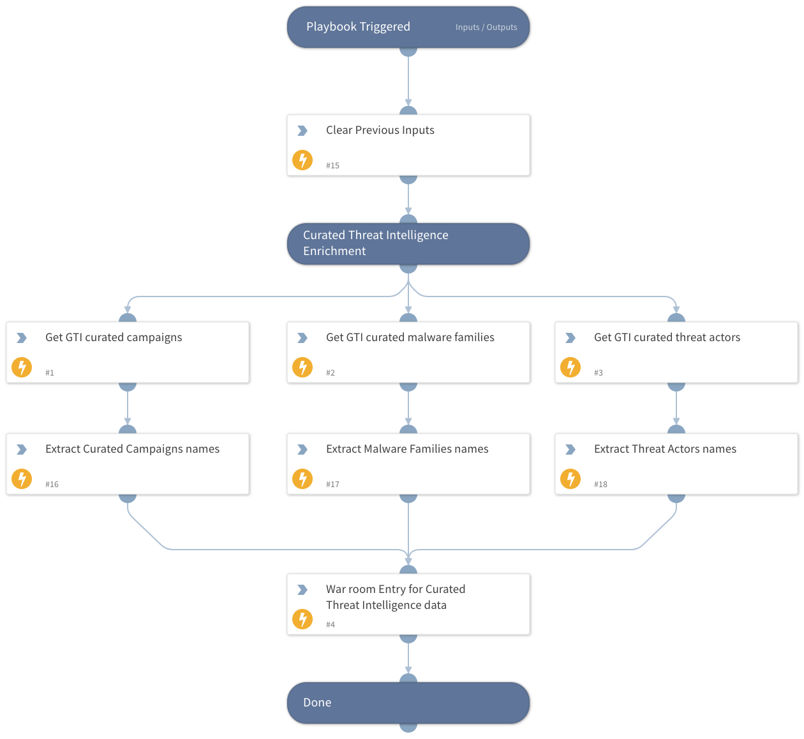

This playbook provides IOC curated enrichment using Google Threat Intelligence data, including malware families, campaigns, and threat actors, and displays the results in the War Room for investigation.

## Dependencies

This playbook uses the following sub-playbooks, integrations, and scripts.

### Sub-playbooks

This playbook does not use any sub-playbooks.

### Integrations

This playbook does not use any integrations.

### Scripts

* DeleteContext
* Print
* SetAndHandleEmpty

### Commands

* gti-curated-campaigns-get
* gti-curated-malware-families-get
* gti-curated-threat-actors-get

## Playbook Inputs

---

| **Name** | **Description** | **Default Value** | **Required** |
| --- | --- | --- | --- |
| resource | The file hash \(MD5, SHA1, or SHA256\), Domain, URL or IP. |  | Optional |
| resource_type | The type of the resource \(IP, domain, URL, or file hash\). |  | Optional |

## Playbook Outputs

---
There are no outputs for this playbook.

## Playbook Image

---

