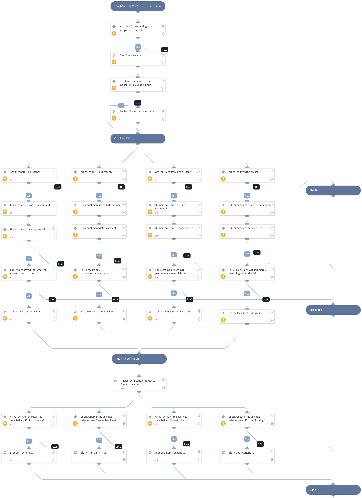

This playbook enriches IOCs using the GTI enrichment commands (IP, Domain, URL, and File) and blocks the IOCs based on GTI assessment parameters such as Threat Score, Severity, and Verdict.

## Dependencies

This playbook uses the following sub-playbooks, integrations, and scripts.

### Sub-playbooks

* Block Domain - Generic v2
* Block File - Generic v2
* Block IP - Generic v3
* Block URL - Generic v2

### Integrations

* GoogleThreatIntelligence

### Scripts

* DeleteContext

### Commands

* domain
* file
* findIndicators
* ip
* url

## Playbook Inputs

---

| **Name** | **Description** | **Default Value** | **Required** |
| --- | --- | --- | --- |
| ip_addresses | Provide a comma-separated list of IPs. |  | Optional |
| domains | Provide a comma-separated list of Domains. |  | Optional |
| files | Provide a comma-separated list of Files. |  | Optional |
| urls | Provide a comma-separated list of URLs. |  | Optional |

## Playbook Outputs

---
There are no outputs for this playbook.

## Playbook Image

---

