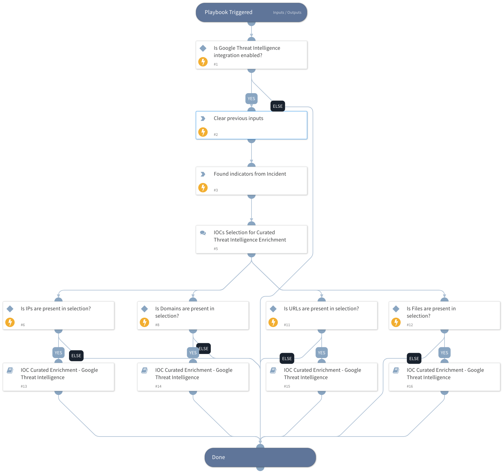

This playbook extracts IOCs from incident details and enriches the selected IOCs with curated Google Threat Intelligence data, including malware families, campaigns, and threat actors.

## Dependencies

This playbook uses the following sub-playbooks, integrations, and scripts.

### Sub-playbooks

* IOC Curated Enrichment - Google Threat Intelligence

### Integrations

This playbook does not use any integrations.

### Scripts

* DeleteContext

### Commands

* findIndicators

## Playbook Inputs

---
There are no inputs for this playbook.

## Playbook Outputs

---
There are no outputs for this playbook.

## Playbook Image

---

