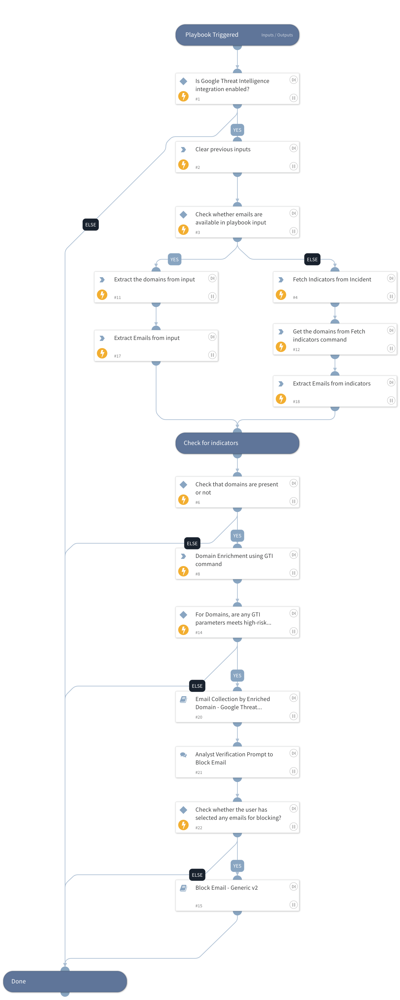

This playbook extracts email addresses from phishing alerts, enriches their associated domains using the GTI domain enrichment command, and evaluates the GTI Threat Score, severity, and verdict. Based on these enrichment results, the playbook automatically blocks the malicious or high-risk email addresses to prevent further compromise.

## Dependencies

This playbook uses the following sub-playbooks, integrations, and scripts.

### Sub-playbooks

* Block Email - Generic v2
* Email Collection by Enriched Domain - Google Threat Intelligence

### Integrations

* GoogleThreatIntelligence

### Scripts

* DeleteContext
* Set
* SetAndHandleEmpty

### Commands

* domain
* findIndicators

## Playbook Inputs

---

| **Name** | **Description** | **Default Value** | **Required** |
| --- | --- | --- | --- |
| email_addresses | Provide a comma-separated list of email addresses. |  | Optional |

## Playbook Outputs

---
There are no outputs for this playbook.

## Playbook Image

---

