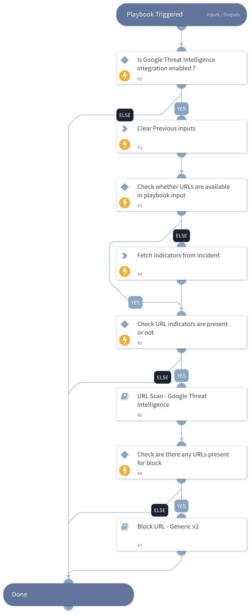

This playbook performs private URL scanning and analyses the URL based on GTI assessment parameters such as Threat Score, Verdict, and Severity. Based on these parameters, the playbook blocks the URL.

## Dependencies

This playbook uses the following sub-playbooks, integrations, and scripts.

### Sub-playbooks

* Block URL - Generic v2
* URL Scan - Google Threat Intelligence

### Integrations

This playbook does not use any integrations.

### Scripts

* DeleteContext

### Commands

* findIndicators

## Playbook Inputs

---

| **Name** | **Description** | **Default Value** | **Required** |
| --- | --- | --- | --- |
| url | Provide a comma-separated list of URLs. |  | Optional |

## Playbook Outputs

---
There are no outputs for this playbook.

## Playbook Image

---

