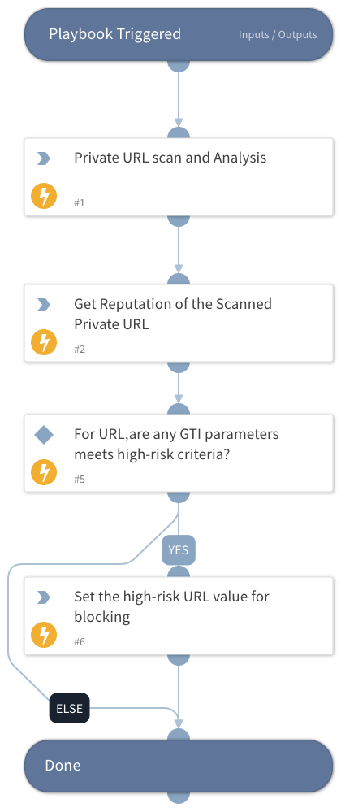

This playbook scans URLs using GTI private scanning and evaluates the results against GTI assessment parameters, including Threat Score, Severity, and Verdict. URLs that meet the defined high-risk criteria are returned for further action.

## Dependencies

This playbook uses the following sub-playbooks, integrations, and scripts.

### Sub-playbooks

This playbook does not use any sub-playbooks.

### Integrations

This playbook does not use any integrations.

### Scripts

* Set

### Commands

* gti-private-url-scan-and-analysis-get
* gti-privatescanning-url

## Playbook Inputs

---

| **Name** | **Description** | **Default Value** | **Required** |
| --- | --- | --- | --- |
| url | Provide url for Private Scanning. |  | Optional |

## Playbook Outputs

---

| **Path** | **Description** | **Type** |
| --- | --- | --- |
| url_output_list | Return the list of high-risk URLs. | unknown |

## Playbook Image

---

