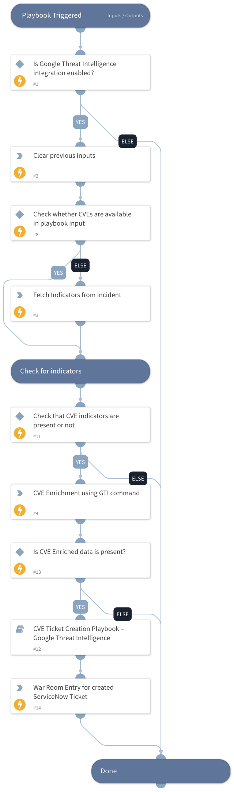

This playbook enriches CVE information using the Google Threat Intelligence enrichment command and determines the appropriate action for each CVE based on key risk factors. For every extracted CVE, the playbook evaluates the Exploitation State, Risk Rating, and CVSS scores to decide whether to create a ServiceNow ticket using the "ServiceNow v2" integration or route the incident for analyst review.

## Dependencies

This playbook uses the following sub-playbooks, integrations, and scripts.

### Sub-playbooks

* CVE Ticket Creation - Google Threat Intelligence

### Integrations

This playbook does not use any integrations.

### Scripts

* DeleteContext
* Print

### Commands

* cve
* findIndicators

## Playbook Inputs

---

| **Name** | **Description** | **Default Value** | **Required** |
| --- | --- | --- | --- |
| cve_input | Optional Provide a comma-separated list of CVEs. |  | Optional |
| onCall | Set to true to assign only the user that is currently on shift. Default is False. | false | Optional |

## Playbook Outputs

---
There are no outputs for this playbook.

## Playbook Image

---

