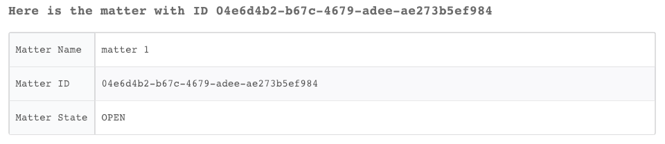

<!-- HTML_DOC -->

Use the Google Vault integration to support your archiving and eDiscovery needs for G Suite.

<h2>Playbooks</h2>
<ul>
<li>Google Vault Generic Playbook</li>
<li>Google Vault - Search Mail</li>
<li>Google Vault - Search Drive</li>
<li>Google Vault - Search Groups</li>
<li>Google Vault - Display Results </li>
</ul>
<h2>Use cases</h2>
<ul>
<li>Create Google Vault matters, holds, and exports.</li>
<li>Preserve-in-place (Add a user to a hold)</li>
<li>Search for information within emails, drives, groups and Hangouts chats.</li>
</ul>
<h2>Configure Google Vault on Cortex XSOAR</h2>
<ol>
<li>Navigate to <strong>Settings</strong> &gt; <strong>Integrations</strong> &gt; <strong>Servers &amp; Services</strong>.</li>
<li>Search for Google Vault.</li>
<li>Click <strong>Add instance</strong> to create and configure a new integration instance. 
<ul>
<li>
<strong>Name</strong>: a textual name for the integration instance.</li>
<li><strong>Username</strong></li>
<li>
<strong>Authentication file contents</strong>: Service Account Authentication json contents.</li>
<li><strong>Trust any certificate (not secure)</strong></li>
<li><strong>Use system proxy settings</strong></li>
</ul>
</li>
<li>Click <strong>Test</strong> to validate the URLs, token, and connection.</li>
</ol>
<h2>Create Authentication File Contents</h2>

You need to create an authentication file to authenticate Google Vault.

<ol>
<li>Set up a new project in the Google APIs Console and activate Vault API service.  <a href="https://code.google.com/apis/console" rel="nofollow">https://code.google.com/apis/console</a>  
</li>
<li>Set up authentication and authorization. For more information, see the <a href="https://developers.google.com/vault/guides/auth" target="_blank" rel="noopener">Google documentation</a>.</li>
</ol>
<ul>
<li>Select <strong>ENABLE APIS AND SERVICES </strong>&gt; <strong>G Suite Vault API</strong> &gt; <strong>ENABLE</strong>.
</li>
</ul>
<ol start="3">
<li>On the right side, click <strong>CREATE CREDENTIALS</strong>.  Credentials are required to access and use the API.</li>
<li>Select <strong>Which API are you using?</strong> &gt; <strong>G Suite Vault API</strong>.</li>
<li>From the 2nd drop-down list, under "Where will you be calling the API from?", choose "Other UI (e.g. Windows, CLI tool)</li>
<li>Under "What data will you be accessing?", choose "Application Data".</li>
<li>Click "What credentials do I need?"  
</li>
<li>Click <strong>Create credentials</strong> &gt; <strong>Service account key</strong>.</li>
<li>Under Service account, click <strong>Select</strong> &gt; <strong>New service account</strong>.  Make sure you select JSON for the key type.</li>
<li>Make the account role "Owner" and click "Continue"  
</li>
<li>Download the JSON file that is given to you. Open it using Notepad and copy its contents.</li>
<li>Under "Username" and "Password" in the integration settings panel, enter your Google username and password.  Place the contents of the JSON file the way they are, under the "Authentication file contents" field.</li>
<li>Delegate domain-wide authority to the service account, following these instructions:  Go to your G Suite domain’s Admin console: <a href="http://admin.google.com/" rel="nofollow">http://admin.google.com/</a>  Select Security from the list of controls. If you don't see Security listed, select More controls from the gray bar at the bottom of the page, then select Security from the list of controls. If you can't see the controls, make sure you're signed in as an administrator for the domain.  Select Show more and then Advanced settings from the list of options.  Select Manage API client access in the Authentication section.  In the Client Name field enter the service account's Client ID. You can find your service account's client ID in the Service accounts page: <a href="https://console.developers.google.com/iam-admin/serviceaccounts" rel="nofollow">https://console.developers.google.com/iam-admin/serviceaccounts</a>  Click on the service account name. You may need to click "Edit" and enable the delegation on that screen, and click save.    In the <strong>One or More API Scopes</strong> field, enter the list of scopes that your application should be granted access to.</li>
<li>Enter your client ID and these scopes.
<ul>
<li>eDiscovery: https://www.googleapis.com/auth/ediscovery</li>
<li>Dev Storage Full Control: https://www.googleapis.com/auth/devstorage.full_control</li>
</ul>
</li>
<li>Click <strong>Authorize</strong>.  
</li>
</ol>
<h2>Commands</h2>

You can execute these commands from the Cortex XSOAR CLI, as part of an automation, or in a playbook. After you successfully execute a command, a DBot message appears in the War Room with the command details.

<ol>
<li><a href="#h_9121489991301545907201415">Create a Google Vault export: gvault-create-export-mail</a></li>
<li><a href="#h_1868381182601545907210355">Create a matter: gvault-create-matter</a></li>
<li><a href="#h_2482890373891545907301018">Create a Google Vault export for Drives: gvault-create-export-drive</a></li>
<li><a href="#h_5763294105171545907307288">Update a matter state: gvault-matter-update-state</a></li>
<li><a href="#h_9600651416441545907314818">Create a Google Vault export for Groups: gvault-create-export-groups</a></li>
<li><a href="#h_7453507337701545907321209">Create a hold for a matter: gvault-create-hold</a></li>
<li><a href="#h_5476435598951545907328664">Add a Held Account to a hold: gvault-add-heldAccount</a></li>
<li><a href="#h_52929827810191545907335820">Remove a Held Account from a hold: gvault-remove-heldAccount</a></li>
<li><a href="#h_30403909011421545907342136">Delete a hold: gvault-delete-hold</a></li>
<li><a href="#h_70147904212641545907348990">Get a list of matters: gvault-list-matters</a></li>
<li><a href="#h_74487790714991545907356221">Search for matters: gvault-get-matter</a></li>
<li><a href="#h_66963208316191545907362146">List all holds for a matter: gvault-list-holds</a></li>
<li><a href="#h_8953483417381545908636751">Get the status of exports: gvault-export-status</a></li>
<li><a href="#h_62277721619671545908642542">Download an export: gvault-download-results</a></li>
<li><a href="#h_30992264220841545908650117">Get the status of a Drives export: gvault-get-drive-results</a></li>
<li><a href="#h_52108488822001545908655788">Get the results of a Mail export: gvault-get-mail-results</a></li>
<li><a href="#h_42814557524231545908661668">Get the results of a Groups export: gvault-get-groups-results</a></li>
</ol>
<h3 id="h_9121489991301545907201415">1. Create a Google Vault export</h3>

Creates a Google Vault export in order to perform search actions on emails.

<h5>Base Command</h5>

<code>gvault-create-export-mail</code>

<h5>Input</h5>
<table style="width: 745px;">
<thead>
<tr>
<th style="width: 140px;"><strong>Argument Name</strong></th>
<th style="width: 546px;"><strong>Description</strong></th>
<th style="width: 54px;"><strong>Required</strong></th>
</tr>
</thead>
<tbody>
<tr>
<td style="width: 140px;">matterID</td>
<td style="width: 546px;">The matter ID</td>
<td style="width: 54px;">Require</td>
</tr>
<tr>
<td style="width: 140px;">exportName</td>
<td style="width: 546px;">Export Name</td>
<td style="width: 54px;">Required</td>
</tr>
<tr>
<td style="width: 140px;">dataScope</td>
<td style="width: 546px;">Search scope, default is "All Data"; "All Data", "Held Data", "Unprocessed Data"</td>
<td style="width: 54px;">Optional</td>
</tr>
<tr>
<td style="width: 140px;">searchMethod</td>
<td style="width: 546px;">Search method, default is "All Accounts"; "All Accounts", "Specific Accounts" (requires the "email" argument), "Organizational Unit" (requires the "ou" argument)</td>
<td style="width: 54px;">Optional</td>
</tr>
<tr>
<td style="width: 140px;">emails</td>
<td style="width: 546px;">CSV list of emails to search in. Use this argument if the "searchMethod" argument is set to "Specific Accounts"</td>
<td style="width: 54px;">Optional</td>
</tr>
<tr>
<td style="width: 140px;">ou</td>
<td style="width: 546px;">The organizational unit. Only use this argument if the "searchMethod" argument is set to "Organizational Unit"</td>
<td style="width: 54px;">Optional</td>
</tr>
<tr>
<td style="width: 140px;">includeDrafts</td>
<td style="width: 546px;">Whether to include drafts in the search, default is "true"; "true" or "false"</td>
<td style="width: 54px;">Optional</td>
</tr>
<tr>
<td style="width: 140px;">timeFrame</td>
<td style="width: 546px;">Search time frame, e.g., "1 min ago","2 weeks ago","3 months ago"</td>
<td style="width: 54px;">Optional</td>
</tr>
<tr>
<td style="width: 140px;">startTime</td>
<td style="width: 546px;">Search start time in UTC (2018-10-16T12:59:02.584000Z)</td>
<td style="width: 54px;">Optional</td>
</tr>
<tr>
<td style="width: 140px;">endTime</td>
<td style="width: 546px;">Search end time in UTC (2018-10-16T12:59:02.584000Z)</td>
<td style="width: 54px;">Optional</td>
</tr>
<tr>
<td style="width: 140px;">terms</td>
<td style="width: 546px;">Apply specific terms to the search, e.g., (subject:example)</td>
<td style="width: 54px;">Optional</td>
</tr>
<tr>
<td style="width: 140px;">exportPST</td>
<td style="width: 546px;">Export in PST format, default is "true"; "true" or "false"</td>
<td style="width: 54px;">Optional</td>
</tr>
<tr>
<td style="width: 140px;">exportMBOX</td>
<td style="width: 546px;">Export in MBOX format, default is "false"; "true" or "false"</td>
<td style="width: 54px;">Optional</td>
</tr>
</tbody>
</table>

 

<h5>Context Output</h5>
<table style="width: 743px;">
<thead>
<tr>
<th style="width: 312px;"><strong>Path</strong></th>
<th style="width: 17px;"><strong>Type</strong></th>
<th style="width: 411px;"><strong>Description</strong></th>
</tr>
</thead>
<tbody>
<tr>
<td style="width: 312px;">GoogleVault.Matter.Export.MatterID</td>
<td style="width: 17px;">string</td>
<td style="width: 411px;">Matter ID</td>
</tr>
<tr>
<td style="width: 312px;">GoogleVault.Matter.Export.ExportID</td>
<td style="width: 17px;">string</td>
<td style="width: 411px;">Export ID</td>
</tr>
<tr>
<td style="width: 312px;">GoogleVault.Matter.Export.Name</td>
<td style="width: 17px;">string</td>
<td style="width: 411px;">Export's name</td>
</tr>
<tr>
<td style="width: 312px;">GoogleVault.Matter.Export.CreateTime</td>
<td style="width: 17px;">string</td>
<td style="width: 411px;">Export's creation time</td>
</tr>
</tbody>
</table>

 

<h5>Command Example</h5>
<pre>!gvault-create-export-mail matterID="0bebe0ec-ee41-4955-96b3-20d9408409c8" exportName="mail_test_export412Z85Fs5q" dataScope="All Data" searchMethod="Specific Accounts(requires emails argument)" emails="test@gmail.com" includeDrafts="true" timeFrame="7 days ago" terms="subject:test" exportPST="true"</pre>
<h5>Context Example</h5>

<h5>Human Readable Output</h5>

<h3 id="h_1868381182601545907210355">2. Create a matter</h3>

Creates a new matter with the specified name and description. The initial state is open, and the owner is the method caller. First, checks if a matter with the same name already exists.

<h5>Base Command</h5>

<code>gvault-create-matter</code>

<h5>Input</h5>
<table style="width: 747px;">
<thead>
<tr>
<th style="width: 192px;"><strong>Argument Name</strong></th>
<th style="width: 499px;"><strong>Description</strong></th>
<th style="width: 49px;"><strong>Required</strong></th>
</tr>
</thead>
<tbody>
<tr>
<td style="width: 192px;">name</td>
<td style="width: 499px;">A name for the new matter</td>
<td style="width: 49px;">Required</td>
</tr>
<tr>
<td style="width: 192px;">description</td>
<td style="width: 499px;">A description for the matter</td>
<td style="width: 49px;">Optional</td>
</tr>
</tbody>
</table>

 

<h5>Context Output</h5>
<table style="width: 743px;">
<thead>
<tr>
<th style="width: 312px;"><strong>Path</strong></th>
<th style="width: 26px;"><strong>Type</strong></th>
<th style="width: 402px;"><strong>Description</strong></th>
</tr>
</thead>
<tbody>
<tr>
<td style="width: 312px;">GoogleVault.Matter.Name</td>
<td style="width: 26px;">string</td>
<td style="width: 402px;">Matter name</td>
</tr>
<tr>
<td style="width: 312px;">GoogleVault.Matter.ID</td>
<td style="width: 26px;">string</td>
<td style="width: 402px;">Matter ID</td>
</tr>
<tr>
<td style="width: 312px;">GoogleVault.Matter.State</td>
<td style="width: 26px;">string</td>
<td style="width: 402px;">Matter's state</td>
</tr>
</tbody>
</table>

 

<h5>Command Example</h5>
<pre>!gvault-create-matter name=test description=test
</pre>
<h5>Context Example</h5>

<h5>Human Readable Output</h5>

<h3 id="h_2482890373891545907301018">3. Create a Google Vault export for Drives</h3>

Creates a Google Vault export in order to perform search actions on drives.

<h5>Base Command</h5>

<code>gvault-create-export-drive</code>

<h5>Input</h5>
<table style="width: 748px;">
<thead>
<tr>
<th style="width: 147px;"><strong>Argument Name</strong></th>
<th style="width: 530px;"><strong>Description</strong></th>
<th style="width: 63px;"><strong>Required</strong></th>
</tr>
</thead>
<tbody>
<tr>
<td style="width: 147px;">matterID</td>
<td style="width: 530px;">Matter ID</td>
<td style="width: 63px;">Required</td>
</tr>
<tr>
<td style="width: 147px;">exportName</td>
<td style="width: 530px;">Export Name</td>
<td style="width: 63px;">Required</td>
</tr>
<tr>
<td style="width: 147px;">dataScope</td>
<td style="width: 530px;">Search scope, default is "All Data"; "All Data", "Held Data", "Unprocessed Data"</td>
<td style="width: 63px;">Optional</td>
</tr>
<tr>
<td style="width: 147px;">searchMethod</td>
<td style="width: 530px;">Search method, default is "Specific Accounts"; "Specific Accounts" (requires the "email" argument), "Organizational Unit" (requires the "ou" argument), "Team Drive"</td>
<td style="width: 63px;">Optional</td>
</tr>
<tr>
<td style="width: 147px;">emails</td>
<td style="width: 530px;">CSV list of emails to search in. Use this argument if the "searchMethod" argument is set to "Specific Accounts"</td>
<td style="width: 63px;">Optional</td>
</tr>
<tr>
<td style="width: 147px;">ou</td>
<td style="width: 530px;">The organizational unit. Only use this argument if the "searchMethod" argument is set to "Organizational Unit"</td>
<td style="width: 63px;">Optional</td>
</tr>
<tr>
<td style="width: 147px;">teamDrive</td>
<td style="width: 530px;">If the searchMethod is set to Team Drives</td>
<td style="width: 63px;">Optional</td>
</tr>
<tr>
<td style="width: 147px;">includeTeamDrives</td>
<td style="width: 530px;">Whether to include team drives, default is "true"; "true" or "false"</td>
<td style="width: 63px;">Optional</td>
</tr>
<tr>
<td style="width: 147px;">timeFrame</td>
<td style="width: 530px;">Search time frame</td>
<td style="width: 63px;">Optional</td>
</tr>
<tr>
<td style="width: 147px;">startTime</td>
<td style="width: 530px;">Search start time in UTC (2018-10-16T12:59:02.584000Z)</td>
<td style="width: 63px;">Optional</td>
</tr>
<tr>
<td style="width: 147px;">endTime</td>
<td style="width: 530px;">Search end time in UTC (2018-10-16T12:59:02.584000Z)</td>
<td style="width: 63px;">Optional</td>
</tr>
<tr>
<td style="width: 147px;">terms</td>
<td style="width: 530px;">Apply specific terms to the search</td>
<td style="width: 63px;">Optional</td>
</tr>
</tbody>
</table>

 

<h5>Context Output</h5>
<table style="width: 743px;">
<thead>
<tr>
<th style="width: 335px;"><strong>Path</strong></th>
<th style="width: 10px;"><strong>Type</strong></th>
<th style="width: 404px;"><strong>Description</strong></th>
</tr>
</thead>
<tbody>
<tr>
<td style="width: 335px;">GoogleVault.Matter.Export.MatterID</td>
<td style="width: 10px;">string</td>
<td style="width: 404px;">Matter ID</td>
</tr>
<tr>
<td style="width: 335px;">GoogleVault.Matter.Export.ExportID</td>
<td style="width: 10px;">string</td>
<td style="width: 404px;">Export ID</td>
</tr>
<tr>
<td style="width: 335px;">GoogleVault.Matter.Export.Name</td>
<td style="width: 10px;">string</td>
<td style="width: 404px;">Export's name</td>
</tr>
<tr>
<td style="width: 335px;">GoogleVault.Matter.Export.CreateTime</td>
<td style="width: 10px;">string</td>
<td style="width: 404px;">Export's creation time</td>
</tr>
</tbody>
</table>

 

<h5>Command Example</h5>
<pre>!gvault-create-export-drive matterID="0124e0ec-ee41-4955-96b3-20d9408409c8" exportName="drive_test_export" dataScope="All Data" searchMethod="Team Drive" emails="test@google.com,test2@google.com" teamDrive="sdDbMMsaWJNw2Uk9PVA,WCSM4L2G2JU4NUk9PVA" includeTeamDrives="false" terms="subject:quarters income"
</pre>
<h5>Context Example</h5>

<h5>Human Readable Output</h5>

<h3 id="h_5763294105171545907307288">4. Update a matter state</h3>

Updates a matter's state.

<h5>Base Command</h5>

<code>gvault-matter-update-state</code>

<h5>Input</h5>
<table style="width: 748px;">
<thead>
<tr>
<th style="width: 155px;"><strong>Argument Name</strong></th>
<th style="width: 526px;"><strong>Description</strong></th>
<th style="width: 59px;"><strong>Required</strong></th>
</tr>
</thead>
<tbody>
<tr>
<td style="width: 155px;">matterID</td>
<td style="width: 526px;">The matter ID</td>
<td style="width: 59px;">Required</td>
</tr>
<tr>
<td style="width: 155px;">state</td>
<td style="width: 526px;">New matter state; "CLOSE", "DELETE", "REOPEN", "UNDELETE"</td>
<td style="width: 59px;">Required</td>
</tr>
</tbody>
</table>

 

<h5>Context Output</h5>
<table style="width: 745px;">
<thead>
<tr>
<th style="width: 324px;"><strong>Path</strong></th>
<th style="width: 21px;"><strong>Type</strong></th>
<th style="width: 395px;"><strong>Description</strong></th>
</tr>
</thead>
<tbody>
<tr>
<td style="width: 324px;">GoogleVault.Matter.Name</td>
<td style="width: 21px;">string</td>
<td style="width: 395px;">Matter name</td>
</tr>
<tr>
<td style="width: 324px;">GoogleVault.Matter.MatterID</td>
<td style="width: 21px;">string</td>
<td style="width: 395px;">Matter ID</td>
</tr>
<tr>
<td style="width: 324px;">GoogleVault.Matter.State</td>
<td style="width: 21px;">string</td>
<td style="width: 395px;">Matter's state</td>
</tr>
</tbody>
</table>

 

<h3 id="h_9600651416441545907314818">5. Create a Google Vault export for Groups</h3>

Creates a Google Vault Export in order to perform search actions on Google groups.

<h5>Base Command</h5>

<code>gvault-create-export-groups</code>

<h5>Input</h5>
<table style="width: 749px;">
<thead>
<tr>
<th style="width: 143px;"><strong>Argument Name</strong></th>
<th style="width: 526px;"><strong>Description</strong></th>
<th style="width: 71px;"><strong>Required</strong></th>
</tr>
</thead>
<tbody>
<tr>
<td style="width: 143px;">matterID</td>
<td style="width: 526px;">The matter ID</td>
<td style="width: 71px;">Required</td>
</tr>
<tr>
<td style="width: 143px;">exportName</td>
<td style="width: 526px;">Export name</td>
<td style="width: 71px;">Required</td>
</tr>
<tr>
<td style="width: 143px;">dataScope</td>
<td style="width: 526px;">Search scope, default is "All Data"; "All Data", "Held Data", "Unprocessed Data"</td>
<td style="width: 71px;">Optional</td>
</tr>
<tr>
<td style="width: 143px;">groups</td>
<td style="width: 526px;">CSV list of groups, maximum of 50 groups</td>
<td style="width: 71px;">Required</td>
</tr>
<tr>
<td style="width: 143px;">timeFrame</td>
<td style="width: 526px;">Search time frame</td>
<td style="width: 71px;">Optional</td>
</tr>
<tr>
<td style="width: 143px;">startTime</td>
<td style="width: 526px;">Search start time in UTC (2018-10-16T12:59:02.584000Z)</td>
<td style="width: 71px;">Optional</td>
</tr>
<tr>
<td style="width: 143px;">endTime</td>
<td style="width: 526px;">Search end time in UTC (2018-10-16T12:59:02.584000Z)</td>
<td style="width: 71px;">Optional</td>
</tr>
<tr>
<td style="width: 143px;">terms</td>
<td style="width: 526px;">Apply specific terms to the search</td>
<td style="width: 71px;">Optional</td>
</tr>
<tr>
<td style="width: 143px;">exportPST</td>
<td style="width: 526px;">Export in PST format, default is "true"; "true" or "false"</td>
<td style="width: 71px;">Optional</td>
</tr>
<tr>
<td style="width: 143px;">exportMBOX</td>
<td style="width: 526px;">Export in MBOX format, default is "false"; "true" or "false"</td>
<td style="width: 71px;">Optional</td>
</tr>
</tbody>
</table>

 

<h5>Context Output</h5>
<table style="width: 746px;">
<thead>
<tr>
<th style="width: 315px;"><strong>Path</strong></th>
<th style="width: 38px;"><strong>Type</strong></th>
<th style="width: 387px;"><strong>Description</strong></th>
</tr>
</thead>
<tbody>
<tr>
<td style="width: 315px;">GoogleVault.Matter.Export.MatterID</td>
<td style="width: 38px;">string</td>
<td style="width: 387px;">Matter ID</td>
</tr>
<tr>
<td style="width: 315px;">GoogleVault.Matter.Export.ExportID</td>
<td style="width: 38px;">string</td>
<td style="width: 387px;">Export ID</td>
</tr>
<tr>
<td style="width: 315px;">GoogleVault.Matter.Export.Name</td>
<td style="width: 38px;">string</td>
<td style="width: 387px;">Export's name</td>
</tr>
<tr>
<td style="width: 315px;">GoogleVault.Matter.Export.CreateTime</td>
<td style="width: 38px;">string</td>
<td style="width: 387px;">Export's creation time</td>
</tr>
</tbody>
</table>

 

<h5>Command Example</h5>
<pre>!gvault-create-export-groups matterID="0b8d30ec-ee41-4955-96b3-20d9408409c8" exportName="groups_test_export1" dataScope="All Data" groups="group@dgmail.com,test@gmail.com" exportPST="true"
</pre>
<h5>Context Example</h5>

<h5>Human Readable Output</h5>

<h3 id="h_7453507337701545907321209">6. Create a hold for a matter</h3>

Creates a hold in the given matter. Holds are used to preserve data in the organization.

<h5>Base Command</h5>

<code>gvault-create-hold</code>

<h5>Input</h5>
<table style="width: 748px;">
<thead>
<tr>
<th style="width: 150px;"><strong>Argument Name</strong></th>
<th style="width: 519px;"><strong>Description</strong></th>
<th style="width: 71px;"><strong>Required</strong></th>
</tr>
</thead>
<tbody>
<tr>
<td style="width: 150px;">matterID</td>
<td style="width: 519px;">The matter ID</td>
<td style="width: 71px;">Required</td>
</tr>
<tr>
<td style="width: 150px;">holdName</td>
<td style="width: 519px;">Name of the new hold</td>
<td style="width: 71px;">Required</td>
</tr>
<tr>
<td style="width: 150px;">corpus</td>
<td style="width: 519px;">New hold's corpus type; "Mail", "Drive", "Groups"</td>
<td style="width: 71px;">Required</td>
</tr>
<tr>
<td style="width: 150px;">accountID</td>
<td style="width: 519px;">CSV list of accounts/group IDs to place in the hold, requires at least one account/group ID</td>
<td style="width: 71px;">Required</td>
</tr>
<tr>
<td style="width: 150px;">timeFrame</td>
<td style="width: 519px;">Search timeframe</td>
<td style="width: 71px;">Optional</td>
</tr>
<tr>
<td style="width: 150px;">startTime</td>
<td style="width: 519px;">Search start time in UTC (1994-11-05T13:15:30Z )</td>
<td style="width: 71px;">Optional</td>
</tr>
<tr>
<td style="width: 150px;">endTime</td>
<td style="width: 519px;">Search end time in UTC (1994-11-05T13:15:30Z )</td>
<td style="width: 71px;">Optional</td>
</tr>
<tr>
<td style="width: 150px;">terms</td>
<td style="width: 519px;">The terms that must be matched for a message to be covered by this hold.</td>
<td style="width: 71px;">Optional</td>
</tr>
</tbody>
</table>

 

<h5>Context Output</h5>
<table style="width: 746px;">
<thead>
<tr>
<th style="width: 314px;"><strong>Path</strong></th>
<th style="width: 33px;"><strong>Type</strong></th>
<th style="width: 393px;"><strong>Description</strong></th>
</tr>
</thead>
<tbody>
<tr>
<td style="width: 314px;">GoogleVaulty.Hold.Name</td>
<td style="width: 33px;">string</td>
<td style="width: 393px;">Hold name</td>
</tr>
<tr>
<td style="width: 314px;">GoogleVault.Hold.ID</td>
<td style="width: 33px;">string</td>
<td style="width: 393px;">Hold ID</td>
</tr>
<tr>
<td style="width: 314px;">GoogleVault.Hold.Account.ID</td>
<td style="width: 33px;">string</td>
<td style="width: 393px;">Held account ID</td>
</tr>
</tbody>
</table>

 

<h5>Command Example</h5>
<pre>!gvault-create-hold matterID=ffcd6bfc-2530-413e-9d54-2d0801f91765 accountID=116238185592796178843 corpus=Mail holdName=test
</pre>
<h5>Context Example</h5>

<h5>Human Readable Output</h5>

<h3 id="h_5476435598951545907328664">7. Add a Held Account to a hold</h3>

Adds a Held Account to a hold. This structure is immutable.

<h5>Base Command</h5>

<code>gvault-add-heldAccount</code>

<h5>Input</h5>
<table style="width: 746px;">
<thead>
<tr>
<th style="width: 216px;"><strong>Argument Name</strong></th>
<th style="width: 467px;"><strong>Description</strong></th>
<th style="width: 57px;"><strong>Required</strong></th>
</tr>
</thead>
<tbody>
<tr>
<td style="width: 216px;">matterID</td>
<td style="width: 467px;">The matter ID</td>
<td style="width: 57px;">Required</td>
</tr>
<tr>
<td style="width: 216px;">holdID</td>
<td style="width: 467px;">The hold ID</td>
<td style="width: 57px;">Required</td>
</tr>
<tr>
<td style="width: 216px;">accountID</td>
<td style="width: 467px;">The account/group ID to place in hold</td>
<td style="width: 57px;">Required</td>
</tr>
</tbody>
</table>

 

<h5>Context Output</h5>
<table style="width: 747px;">
<thead>
<tr>
<th style="width: 326px;"><strong>Path</strong></th>
<th style="width: 80px;"><strong>Type</strong></th>
<th style="width: 334px;"><strong>Description</strong></th>
</tr>
</thead>
<tbody>
<tr>
<td style="width: 326px;">GoogleVault.Matter.Hold.Account.ID</td>
<td style="width: 80px;">unknown</td>
<td style="width: 334px;">The held account ID</td>
</tr>
</tbody>
</table>

 

<h5>Command Example</h5>
<pre>  !gvault-add-heldAccount matterID="6e067f34-7fac-4ab2-bd9f-eede4f32dd32" holdID="41l9c2w2oqtmjc"
  accountID="101966995162112532972"
</pre>
<h5>Context Example</h5>

<h5>Human Readable Output</h5>

<h3 id="h_52929827810191545907335820">8. Remove a Held Account from a hold</h3>

Removes a Held Account from a hold.

<h5>Base Command</h5>

<code>gvault-remove-heldAccount</code>

<h5>Input</h5>
<table style="width: 747px;">
<thead>
<tr>
<th style="width: 218px;"><strong>Argument Name</strong></th>
<th style="width: 459px;"><strong>Description</strong></th>
<th style="width: 63px;"><strong>Required</strong></th>
</tr>
</thead>
<tbody>
<tr>
<td style="width: 218px;">matterID</td>
<td style="width: 459px;">The matter ID</td>
<td style="width: 63px;">Required</td>
</tr>
<tr>
<td style="width: 218px;">holdID</td>
<td style="width: 459px;">The hold ID</td>
<td style="width: 63px;">Required</td>
</tr>
<tr>
<td style="width: 218px;">accountID</td>
<td style="width: 459px;">Account ID to remove from hold</td>
<td style="width: 63px;">Required</td>
</tr>
</tbody>
</table>

 

<h5>Context Output</h5>

There is no context output for this command.

<h5>Command Example</h5>
<pre>  !gvault-remove-heldAccount matterID=6e067f1d-7fac-4ab2-bd9f-eede4f32dd32 holdID=41l9c2w2oqtmjc
  accountID=101966936162112532972
</pre>
<h5>Context Example</h5>

<h5>Human Readable Output</h5>

<h3>9. Delete a hold</h3>

Removes a hold by ID. This will release any Held Accounts on this Hold.

<h5>Base Command</h5>

<code>gvault-delete-hold</code>

<h5>Input</h5>
<table style="width: 744px;">
<thead>
<tr>
<th style="width: 217px;"><strong>Argument Name</strong></th>
<th style="width: 511px;"><strong>Description</strong></th>
<th style="width: 12px;"><strong>Required</strong></th>
</tr>
</thead>
<tbody>
<tr>
<td style="width: 217px;">matterID</td>
<td style="width: 511px;">The matter ID</td>
<td style="width: 12px;">Required</td>
</tr>
<tr>
<td style="width: 217px;">holdID</td>
<td style="width: 511px;">The hold ID</td>
<td style="width: 12px;">Required</td>
</tr>
</tbody>
</table>

 

<h5>Context Output</h5>

There is no context output for this command.

<h5>Command Example</h5>
<pre>  !gvault-delete-hold matterID=6e067f1d-7fac-4ab2-bd9f-eede4f32dd32 holdID=41l9c2w2oqtmjc
</pre>
<h5>Human Readable Output</h5>

<h3 id="h_70147904212641545907348990">10. Get a list of matters</h3>

Lists matters the user has access to.

<h5>Base Command</h5>

<code>gvault-list-matters</code>

<h5>Input</h5>
<table style="width: 748px;">
<thead>
<tr>
<th style="width: 147px;"><strong>Argument Name</strong></th>
<th style="width: 522px;"><strong>Description</strong></th>
<th style="width: 71px;"><strong>Required</strong></th>
</tr>
</thead>
<tbody>
<tr>
<td style="width: 147px;">state</td>
<td style="width: 522px;">If set, list only matters with that specific state, default is "ALL"; "ALL", "OPEN", "CLOSED", "DELETED"</td>
<td style="width: 71px;">Optional</td>
</tr>
</tbody>
</table>

 

<h5>Context Output</h5>
<table style="width: 746px;">
<thead>
<tr>
<th style="width: 275px;"><strong>Path</strong></th>
<th style="width: 33px;"><strong>Type</strong></th>
<th style="width: 432px;"><strong>Description</strong></th>
</tr>
</thead>
<tbody>
<tr>
<td style="width: 275px;">GoogleVault.Matter.Name</td>
<td style="width: 33px;">string</td>
<td style="width: 432px;">The matter name</td>
</tr>
<tr>
<td style="width: 275px;">GoogleVault.Matter.MatterID</td>
<td style="width: 33px;">string</td>
<td style="width: 432px;">Matter ID</td>
</tr>
<tr>
<td style="width: 275px;">GoogleVault.Matter.State</td>
<td style="width: 33px;">string</td>
<td style="width: 432px;">Matter's state</td>
</tr>
</tbody>
</table>

 

<h5>Command Example</h5>
<pre>!gvault-list-matters
</pre>
<h5>Context Example</h5>

<h5>Human Readable Output</h5>

<h5>11. Search for matters</h5>

Search for a matter by name or by ID.

<h5>Base Command</h5>

<code>gvault-get-matter</code>

<h5>Input</h5>
<table style="width: 749px;">
<thead>
<tr>
<th style="width: 140px;"><strong>Argument Name</strong></th>
<th style="width: 526px;"><strong>Description</strong></th>
<th style="width: 74px;"><strong>Required</strong></th>
</tr>
</thead>
<tbody>
<tr>
<td style="width: 140px;">matterName</td>
<td style="width: 526px;">Search by matter name (multiple matters with the same name can exist)</td>
<td style="width: 74px;">Optional</td>
</tr>
<tr>
<td style="width: 140px;">matterID</td>
<td style="width: 526px;">Search by matter ID</td>
<td style="width: 74px;">Optional</td>
</tr>
</tbody>
</table>

 

<h5>Context Output</h5>
<table style="width: 746px;">
<thead>
<tr>
<th style="width: 280px;"><strong>Path</strong></th>
<th style="width: 28px;"><strong>Type</strong></th>
<th style="width: 432px;"><strong>Description</strong></th>
</tr>
</thead>
<tbody>
<tr>
<td style="width: 280px;">GoogleVault.Matter.Name</td>
<td style="width: 28px;">unknown</td>
<td style="width: 432px;">Matter name</td>
</tr>
<tr>
<td style="width: 280px;">GoogleVault.Matter.ID</td>
<td style="width: 28px;">unknown</td>
<td style="width: 432px;">Matter ID</td>
</tr>
<tr>
<td style="width: 280px;">GoogleVault.Matter.State</td>
<td style="width: 28px;">unknown</td>
<td style="width: 432px;">Matter's state</td>
</tr>
</tbody>
</table>

 

<h5>Command Example</h5>
<pre>!gvault-get-matter matterID=04e6d4b2-b67c-4679-adee-ae273b5ef984
</pre>
<h5>Context Example</h5>

<h5>Human Readable Output</h5>

<h3 id="h_66963208316191545907362146">12. List all holds for a matter</h3>

Lists all holds for a specified matter.

<h5>Base Command</h5>

<code>gvault-list-holds</code>

<h5>Input</h5>
<table style="width: 747px;">
<thead>
<tr>
<th style="width: 180px;"><strong>Argument Name</strong></th>
<th style="width: 423px;"><strong>Description</strong></th>
<th style="width: 137px;"><strong>Required</strong></th>
</tr>
</thead>
<tbody>
<tr>
<td style="width: 180px;">matterID</td>
<td style="width: 423px;">Matter ID</td>
<td style="width: 137px;">Optional</td>
</tr>
</tbody>
</table>

 

<h5>Context Output</h5>
<table style="width: 743px;">
<thead>
<tr>
<th style="width: 202px;"><strong>Path</strong></th>
<th style="width: 40px;"><strong>Type</strong></th>
<th style="width: 498px;"><strong>Description</strong></th>
</tr>
</thead>
<tbody>
<tr>
<td style="width: 202px;">GoogleVault.Matter.ID</td>
<td style="width: 40px;">string</td>
<td style="width: 498px;">Matter ID</td>
</tr>
<tr>
<td style="width: 202px;">GoogleVault.Matter.Hold.name</td>
<td style="width: 40px;">string</td>
<td style="width: 498px;">Hold name</td>
</tr>
<tr>
<td style="width: 202px;">GoogleVault.Matter.Hold.ID</td>
<td style="width: 40px;">string</td>
<td style="width: 498px;">Hold ID</td>
</tr>
</tbody>
</table>

 

<h5>Command Example</h5>
<pre>!gvault-list-holds matterID=0bebe0ec-ee41-4955-96b3-20d9408409c8
</pre>
<h5>Context Example</h5>

<h5>Human Readable Output</h5>

<h3>13. Get the status of exports</h3>

Gets the status of one or more specified exports.

<h5>Base Command</h5>

<code>gvault-export-status</code>

<h5>Input</h5>
<table style="width: 747px;">
<thead>
<tr>
<th style="width: 149px;"><strong>Argument Name</strong></th>
<th style="width: 520px;"><strong>Description</strong></th>
<th style="width: 71px;"><strong>Required</strong></th>
</tr>
</thead>
<tbody>
<tr>
<td style="width: 149px;">matterId</td>
<td style="width: 520px;">The matter ID</td>
<td style="width: 71px;">Optional</td>
</tr>
<tr>
<td style="width: 149px;">exportIDS</td>
<td style="width: 520px;">CSV list of one or more export IDs</td>
<td style="width: 71px;">Optional</td>
</tr>
<tr>
<td style="width: 149px;">queryIDS</td>
<td style="width: 520px;">MatterID and ExportID concatenation separated by '#' (used only for playbook) such: &lt;Matter_ID&gt;#</td>
<td style="width: 71px;">Optional</td>
</tr>
</tbody>
</table>

 

<h5>Context Output</h5>
<table style="width: 736px;">
<thead>
<tr>
<th style="width: 294px;"><strong>Path</strong></th>
<th style="width: 31px;"><strong>Type</strong></th>
<th style="width: 416px;"><strong>Description</strong></th>
</tr>
</thead>
<tbody>
<tr>
<td style="width: 294px;">GoogleVault.Matter.Export.MatterID</td>
<td style="width: 31px;">string</td>
<td style="width: 416px;">Matter ID</td>
</tr>
<tr>
<td style="width: 294px;">GoogleVault.Matter.Export.ExportID</td>
<td style="width: 31px;">string</td>
<td style="width: 416px;">Export ID</td>
</tr>
<tr>
<td style="width: 294px;">GoogleVault.Matter.Export.Name</td>
<td style="width: 31px;">string</td>
<td style="width: 416px;">Export name</td>
</tr>
<tr>
<td style="width: 294px;">GoogleVault.Matter.Export.Status</td>
<td style="width: 31px;">string</td>
<td style="width: 416px;">Export status</td>
</tr>
<tr>
<td style="width: 294px;">GoogleVault.Matter.Export.BucketName</td>
<td style="width: 31px;">string</td>
<td style="width: 416px;">Bucket holder name for this export</td>
</tr>
<tr>
<td style="width: 294px;">GoogleVault.Matter.Export.DownloadID</td>
<td style="width: 31px;">string</td>
<td style="width: 416px;">ID to be used by the "download-export" command</td>
</tr>
<tr>
<td style="width: 294px;">GoogleVault.Matter.Export.ViewID</td>
<td style="width: 31px;">string</td>
<td style="width: 416px;">ID to be used by the "get-X-results" command (X=drive/mail/groups)</td>
</tr>
</tbody>
</table>

 

<h5>Command Example</h5>
<pre>!gvault-export-status exportIDS=exportly-7b8ae442-bee7-4bc9-89fa-a65c6c24d50c matterId=0bebe0ec-ee41-4955-96b3-20d9408409c8
</pre>
<h5>Context Example</h5>

<h5>Human Readable Output</h5>

<h3 id="h_62277721619671545908642542">14. Download an export</h3>

Downloads an export by bucket name and download ID.

<h5>Base Command</h5>

<code>gvault-download-results</code>

<h5>Input</h5>
<table style="width: 747px;">
<thead>
<tr>
<th style="width: 201px;"><strong>Argument Name</strong></th>
<th style="width: 487px;"><strong>Description</strong></th>
<th style="width: 52px;"><strong>Required</strong></th>
</tr>
</thead>
<tbody>
<tr>
<td style="width: 201px;">bucketName</td>
<td style="width: 487px;">Name of the bucket that holds the export</td>
<td style="width: 52px;">Required</td>
</tr>
<tr>
<td style="width: 201px;">downloadID</td>
<td style="width: 487px;">The export download ID</td>
<td style="width: 52px;">Required</td>
</tr>
</tbody>
</table>

 

<h5>Context Output</h5>

There is no context output for this command.

<h5>Command Example</h5>
<pre>!gvault-download-results bucketName=85d7cacf-5d93-44e5-8d37-4ba6da342d02 downloadID=0bebe0ec-ee41-4955-96b3-20d9408409c8/exportly-7b8ae442-bee7-4bc9-89fa-a65c6c24d50c/drive_test_exportcK29253Af6_0.zip
</pre>
<h5>Human Readable Output</h5>

<h3>15. Get the results of a Drive export</h3>

Get the results of a specified drive export.

<h5>Base Command</h5>

<code>gvault-get-drive-results</code>

<h5>Input</h5>
<table style="width: 749px;">
<thead>
<tr>
<th style="width: 145px;"><strong>Argument Name</strong></th>
<th style="width: 524px;"><strong>Description</strong></th>
<th style="width: 71px;"><strong>Required</strong></th>
</tr>
</thead>
<tbody>
<tr>
<td style="width: 145px;">bucketName</td>
<td style="width: 524px;">Name of the bucket that holds the export</td>
<td style="width: 71px;">Required</td>
</tr>
<tr>
<td style="width: 145px;">viewID</td>
<td style="width: 524px;">The export view ID</td>
<td style="width: 71px;">Required</td>
</tr>
<tr>
<td style="width: 145px;">maxResult</td>
<td style="width: 524px;">Maximum number of results to return (a high threshold can slow down your browser), default is "30"</td>
<td style="width: 71px;">Optional</td>
</tr>
</tbody>
</table>

 

<h5>Context Output</h5>
<table style="width: 738px;">
<thead>
<tr>
<th style="width: 249px;"><strong>Path</strong></th>
<th style="width: 10px;"><strong>Type</strong></th>
<th style="width: 481px;"><strong>Description</strong></th>
</tr>
</thead>
<tbody>
<tr>
<td style="width: 249px;">GoogleVault.Matter.Export.Results.Title</td>
<td style="width: 10px;">string</td>
<td style="width: 481px;">Title of the file</td>
</tr>
<tr>
<td style="width: 249px;">GoogleVault.Matter.Export.Results.Author</td>
<td style="width: 10px;">string</td>
<td style="width: 481px;">Author of the file</td>
</tr>
<tr>
<td style="width: 249px;">GoogleVault.Matter.Export.Results.Others</td>
<td style="width: 10px;">string</td>
<td style="width: 481px;">Other users related to the file</td>
</tr>
<tr>
<td style="width: 249px;">GoogleVault.Matter.Export.Results.Viewers</td>
<td style="width: 10px;">string</td>
<td style="width: 481px;">Viewers of the file</td>
</tr>
<tr>
<td style="width: 249px;">GoogleVault.Matter.Export.Results.DateModified</td>
<td style="width: 10px;">string</td>
<td style="width: 481px;">The date the file was last modified</td>
</tr>
<tr>
<td style="width: 249px;">GoogleVault.Matter.Export.Results.DateCreated</td>
<td style="width: 10px;">string</td>
<td style="width: 481px;">The date the file was created</td>
</tr>
<tr>
<td style="width: 249px;">GoogleVault.Matter.Export.Results.DocType</td>
<td style="width: 10px;">string</td>
<td style="width: 481px;">File type (extension)</td>
</tr>
<tr>
<td style="width: 249px;">GoogleVault.Matter.Export.Results.MD5</td>
<td style="width: 10px;">string</td>
<td style="width: 481px;">The MD5 of the file (SHA-1)</td>
</tr>
</tbody>
</table>

 

<h5>Command Example</h5>
<pre>!gvault-get-drive-results bucketName="85d7cacf-5d93-44e5-8d37-4ba6da342d02" viewID=0bebe0ec-ee41-4955-96b3-20d9408409c8/exportly-ce3e380b-88dd-4057-b8e9-3a53e6f24e6a/drive_test_export412Z85Fs5q-metadata.xml
</pre>
<h5>Context Example</h5>

<h5>Human Readable Output</h5>

<h3 id="h_52108488822001545908655788">16. Get the results of a Mail export</h3>

Get the results of a specified Mail export.

<h5>Base Command</h5>

<code>gvault-get-mail-results</code>

<h5>Input</h5>
<table style="width: 742px;">
<thead>
<tr>
<th style="width: 148px;"><strong>Argument Name</strong></th>
<th style="width: 521px;"><strong>Description</strong></th>
<th style="width: 71px;"><strong>Required</strong></th>
</tr>
</thead>
<tbody>
<tr>
<td style="width: 148px;">bucketName</td>
<td style="width: 521px;">Name of the bucket that holds the export</td>
<td style="width: 71px;">Required</td>
</tr>
<tr>
<td style="width: 148px;">viewID</td>
<td style="width: 521px;">The export view ID</td>
<td style="width: 71px;">Required</td>
</tr>
<tr>
<td style="width: 148px;">maxResult</td>
<td style="width: 521px;">Maximum number of results to return (a high threshold can slow down your browser), default is "30"</td>
<td style="width: 71px;">Optional</td>
</tr>
</tbody>
</table>

 

<h5>Context Output</h5>
<table style="width: 743px;">
<thead>
<tr>
<th style="width: 273px;"><strong>Path</strong></th>
<th style="width: 19px;"><strong>Type</strong></th>
<th style="width: 448px;"><strong>Description</strong></th>
</tr>
</thead>
<tbody>
<tr>
<td style="width: 273px;">GoogleVault.Matter.Export.Results.CC</td>
<td style="width: 19px;">string</td>
<td style="width: 448px;">Email addresses CCed on the mail</td>
</tr>
<tr>
<td style="width: 273px;">GoogleVault.Matter.Export.Results.BCC</td>
<td style="width: 19px;">string</td>
<td style="width: 448px;">Email addresses BCCed on the mail</td>
</tr>
<tr>
<td style="width: 273px;">GoogleVault.Matter.Export.Results.DateSent</td>
<td style="width: 19px;">string</td>
<td style="width: 448px;">The date the email was sent</td>
</tr>
<tr>
<td style="width: 273px;">GoogleVault.Matter.Export.Results.From</td>
<td style="width: 19px;">string</td>
<td style="width: 448px;">The sender of the email</td>
</tr>
<tr>
<td style="width: 273px;">GoogleVault.Matter.Export.Results.Subject</td>
<td style="width: 19px;">string</td>
<td style="width: 448px;">The subject of the email</td>
</tr>
<tr>
<td style="width: 273px;">GoogleVault.Matter.Export.Results.DateReceived</td>
<td style="width: 19px;">string</td>
<td style="width: 448px;">The date the email was received</td>
</tr>
<tr>
<td style="width: 273px;">GoogleVault.Matter.Export.Results.To</td>
<td style="width: 19px;">string</td>
<td style="width: 448px;">The address the email was sent to</td>
</tr>
</tbody>
</table>

 

<h5>Command Example</h5>
<pre>!gvault-get-mail-results bucketName="85d7cacf-5d93-44e5-8d37-4ba6da342d02" viewID=0bebe0ec-ee41-4955-96b3-20d9408409c8/exportly-66079c37-0b33-4858-9239-7feead2199ae/mail_test_export412Z85Fs5q-metadata.xml
</pre>
<h5>Context Example</h5>

<h5>Human Readable Output</h5>

<h3 id="h_42814557524231545908661668">17. Get the results of a Groups export</h3>

Get the results of a specified Groups export.

<h5>Base Command</h5>

<code>gvault-get-groups-results</code>

<h5>Input</h5>
<table style="width: 749px;">
<thead>
<tr>
<th style="width: 140px;"><strong>Argument Name</strong></th>
<th style="width: 529px;"><strong>Description</strong></th>
<th style="width: 71px;"><strong>Required</strong></th>
</tr>
</thead>
<tbody>
<tr>
<td style="width: 140px;">bucketName</td>
<td style="width: 529px;">Name of the bucket that holds the export</td>
<td style="width: 71px;">Required</td>
</tr>
<tr>
<td style="width: 140px;">viewID</td>
<td style="width: 529px;">The export view ID</td>
<td style="width: 71px;">Required</td>
</tr>
<tr>
<td style="width: 140px;">maxResult</td>
<td style="width: 529px;">Maximum number of results to return (a high threshold can slow down your browser), default is "30"</td>
<td style="width: 71px;">Optional</td>
</tr>
</tbody>
</table>

 

<h5>Context Output</h5>
<table style="width: 745px;">
<thead>
<tr>
<th style="width: 346px;"><strong>Path</strong></th>
<th style="width: 52px;"><strong>Type</strong></th>
<th style="width: 342px;"><strong>Description</strong></th>
</tr>
</thead>
<tbody>
<tr>
<td style="width: 346px;">GoogleVault.Matter.Export.Results.CC</td>
<td style="width: 52px;">string</td>
<td style="width: 342px;">Email addresses CCed on the message</td>
</tr>
<tr>
<td style="width: 346px;">GoogleVault.Matter.Export.Results.BCC</td>
<td style="width: 52px;">string</td>
<td style="width: 342px;">Email addresses BCCed on the message</td>
</tr>
<tr>
<td style="width: 346px;">GoogleVault.Matter.Export.Results.DateSent</td>
<td style="width: 52px;">string</td>
<td style="width: 342px;">The date the message was sent</td>
</tr>
<tr>
<td style="width: 346px;">GoogleVault.Matter.Export.Results.From</td>
<td style="width: 52px;">string</td>
<td style="width: 342px;">The sender of the message</td>
</tr>
<tr>
<td style="width: 346px;">GoogleVault.Matter.Export.Results.Subject</td>
<td style="width: 52px;">string</td>
<td style="width: 342px;">The subject of the message</td>
</tr>
<tr>
<td style="width: 346px;">GoogleVault.Matter.Export.Results.DateReceived</td>
<td style="width: 52px;">string</td>
<td style="width: 342px;">The date the message was received</td>
</tr>
<tr>
<td style="width: 346px;">GoogleVault.Matter.Export.Results.To</td>
<td style="width: 52px;">string</td>
<td style="width: 342px;">The address the message was sent to</td>
</tr>
</tbody>
</table>

 

<h5>Command Example</h5>
<pre>!gvault-get-groups-results bucketName="85d7cacf-5d93-44e5-8d37-4ba6da342d02" viewID="6e067f1d-7fac-4ab2-bd9f-eede4f32dd32/exportly-069b7a7b-0a3d-4fbf-b65d-fe54561e6eb2/Groups_Export_qQ3Ih4531388-metadata.xml" maxResult="30"
</pre>
<h5>Context Example</h5>

<h5>Human Readable Output</h5>

