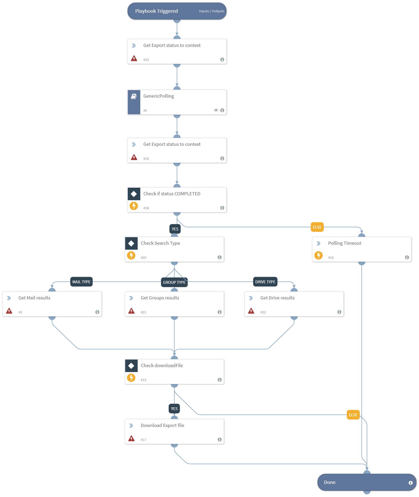

Ques and displays vault search result.

## Dependencies
This playbook uses the following sub-playbooks, integrations, and scripts.

### Sub-playbooks
* GenericPolling

### Integrations
This playbook does not use any integrations.

### Scripts
* PrintErrorEntry

### Commands
* gvault-get-groups-results
* gvault-download-results
* gvault-export-status
* gvault-get-mail-results
* gvault-get-drive-results

## Playbook Inputs
---

| **Name** | **Description** | **Default Value** | **Required** |
| --- | --- | --- | --- |
| pollInterval | The interval in which to check the export status (in minutes). | 2 |Optional |
| pollTimeout | The timeout to terminate the poll (in minutes). | 30 | Optional |
| maxResultForDisplay | The maximum number of result to be displayed. | 30 |Optional |
| downloadFile | Whether the export file created will be downloaded into the War Room. "True" means it will. | false |Optional |
| ExportID | The export ID. | - | Required |
| MatterID | The matter ID. | - | Required |
| SearchtType | The type of Search. Can be, "Drive", "Groups" or "Mail". | - | Required |

## Playbook Outputs
---

| **Path** | **Description** | **Type** |
| --- | --- | --- |
| GoogleVault.Matter.Export.MatterID | The matter ID. | string |
| GoogleVault.Matter.Export.ExportID | The export ID. | string |
| GoogleVault.Matter.Export.Name | The export's name. | string |
| GoogleVault.Matter.Export.CreateTime | The export's creation time. | string |
| GoogleVault.Matter.Export.Results.CC | The CC of the mail. | string |
| GoogleVault.Matter.Export.Results.BCC | The BCC of the mail.  | string |
| GoogleVault.Matter.Export.Results.DateSent | The date the email was sent. | string |
| GoogleVault.Matter.Export.Results.From | The sender of the email. | string |
| GoogleVault.Matter.Export.Results.Subject | The subject of the email. | string |
| GoogleVault.Matter.Export.Results.DateReceived | The date the email was received. | string |
| GoogleVault.Matter.Export.Results.To | The address the email was sent to. | string |
| GoogleVault.Matter.Export.Status | The export Status. Can be, "COMPLETED", "FAILED", or "IN_PROGRESS". | string |
| GoogleVault.Matter.Export.BucketName | The bucket holder name for this export. | string |
| GoogleVault.Matter.Export.DownloadID | The ID to be used by the `download-export` command. | string |
| GoogleVault.Matter.Export.ViewID | The ID to be used by the `get-X-results` command (X=drive/mail/groups). | string |
| GoogleVault.Matter.Export | The export object. | unknown |

## Playbook Image
---

