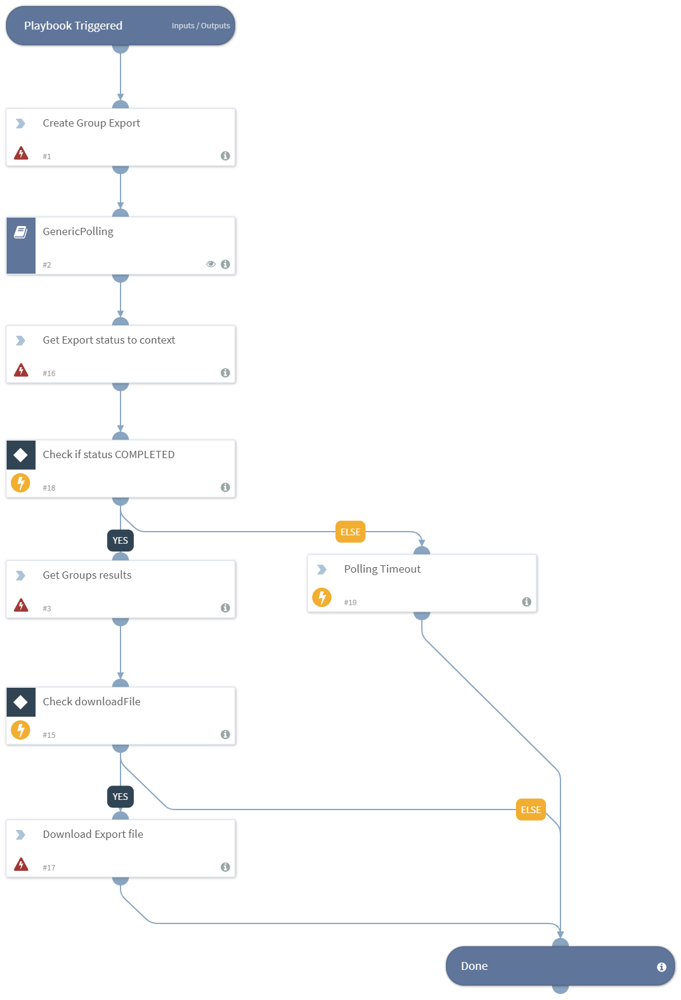

Performs a Google Vault search in Drive accounts and display the results.

## Dependencies
This playbook uses the following sub-playbooks, integrations, and scripts.

### Sub-playbooks
* GenericPolling

### Integrations
This playbook does not use any integrations.

### Scripts
* PrintErrorEntry

### Commands
* gvault-download-results
* gvault-get-drive-results
* gvault-export-status
* gvault-create-export-drive

## Playbook Inputs
---

| **Name** | **Description** | **Default Value** | **Required** |
| --- | --- | --- | --- | 
| matterID | The ID of the matter. | - | Required |
| exportName | The name of the exported file. | - | Required |
| dataScope | The choice of the search scope. | All Data | Optional |
| searchMethod | The choice of Search method. The default is, "Specific Accounts", this requires emails argument. "Organizational Unit" this requires ou argument. 'Team Drive' | Specific Accounts | Optional |
| emails | Whether the search method is set to Specific Accounts (separated by comma). | - | Optional |
| ou | Whether the search method is set to Specific Accounts (separated by comma). | - | Optional |
| teamDrive | Whether the search method is set to team drives. | - | Optional |
| includeTeamDrives | Include/Exclude team drives. | true | Optional |
| timeFrame | The search time frame. For example, "1 min ago","2 weeks ago","3 months ago". | - |  Optional |
| startTime | The UTC start time. For example, 2018-10-16T12:59:02.584000Z. | - | Optional |
| endTime | The UTC end time. For example, 2018-10-16T12:59:02.584000Z. | - | Optional |
| terms | Add specific terms for the search (subject:example). | - | Optional |
| exportPST | The export format. | true | Optional |
| exportMBOX | The export format. | false | Optional |
| pollInterval | The interval to check export status (in minutes). For big data inquires increase both `pollInterval` and `pollTimeout` | 2 | Optional |
| pollTimeout | The timeout to terminate the poll (in minutes). For big data inquires increase both `pollTimeout` and `pollInterval` | 30 | Optional |
| maxResultForDisplay | The maximal number of result to be displayed. | 30 | Optional |
| downloadFile | Whether the created file will be downloaded into the War Room. If set to "True" this will occur. | false | Optional |

## Playbook Outputs
---

| **Path** | **Description** | **Type** |
| --- | --- | --- |
| GoogleVault.Matter.Export.MatterID | The matter ID. | string |
| GoogleVault.Matter.Export.ExportID | The export ID. | string |
| GoogleVault.Matter.Export.Name | The export's name. | string |
| GoogleVault.Matter.Export.CreateTime | The export's creation time. | string |
| GoogleVault.Matter.Export.Results.Title | The title of the file. | string |
| GoogleVault.Matter.Export.Results.Author | The author of the file. | string |
| GoogleVault.Matter.Export.Results.Others | The other users related to the file. | string |
| GoogleVault.Matter.Export.Results.Viewers | The viewers of the file. | string |
| GoogleVault.Matter.Export.Results.DateModified | The date the file was modified. | string |
| GoogleVault.Matter.Export.Results.DateCreated | The date the file was created. | string |
| GoogleVault.Matter.Export.Results.DocType | The type of the file (extension). | string |
| GoogleVault.Matter.Export.Results.MD5 | The MD5 hash of the file (SHA1). | string |
| GoogleVault.Matter.Export.Status | The export status. Can be, "COMPLETED", "FAILED", "IN_PROGRESS". | string |
| GoogleVault.Matter.Export.BucketName | The bucket holder name for the export. | string |
| GoogleVault.Matter.Export.DownloadID | The ID to be used by the `download-export` command. | string |
| GoogleVault.Matter.Export.ViewID | The ID to be used by the `get-X-results` command (X=drive/mail/groups). | string |
| GoogleVault.Matter | The matter object. | unknown |

## Playbook Image
---

