# Google Vertex AI

## Integration Author: Sameh El-Hakim
***
Fine-tuned to conduct natural conversation. Using Google Vertex Ai (PaLM API for Chat)

The current integration of Google Vertex Ai is focusing only on the Generative AI model (PaLM) using the Chat prediction.

Later, this plugin will be updated to include the following:
PaLM for Text (Once the New API is released to public from Google will be modified to support quick integration)
Access to Model Garden through Playbooks
Model Development

Once the New API for (PaLM for Chat & Text) is released to the public from Google, then this integration will be modified to support quick integration. This integration is using an early version of Generative AI API from Google. So, you are expected to face some challenges.
***
## The setup steps as following:
1. Create a new project on Google Cloud (Recommended instead of using existing project)
2. Enable Vertex AI API
3. Configure Consent Page
4. Create OAuth Client ID
5. Generate Authentication Code (OAuth Code)
6. Setup XSOAR Instance
7. Testing Command

Last Section will be Troubleshooting; the test button is not working with OAuth2 Method
***
If you have a knowledge of Google Cloud Administration, you can configure the project & API and skip directly to step 2.

## Step 1: Create a new project on Google Cloud

In this step, you will need to have permission to create a new project in your GCP console

1.  Login to GCP Console:
	https://console.cloud.google.com/

2.  Click on Create Project

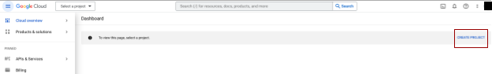

3.  Fill project Name: XSOAR\_VertexAI or any name, then click on Create

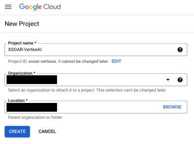

4.  Select the new created project
5.  Go to marketplace

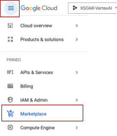

6.  Search & Select Vertex AI API

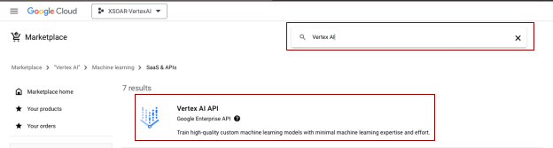

7.  Click Enable

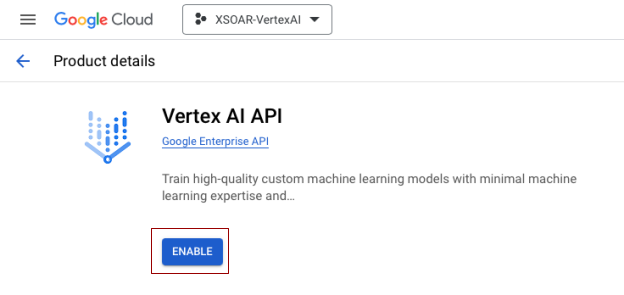

## Step 2: Configure Consent Page

1.  Click on Configure Consent Screen

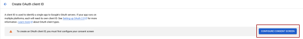

2.  Select Internal as User Type and Click on Create; It is recommended to limit the access to your project scope to Internal users in your organization as later as planned you can build your own Model and fine tune in a confidential environment that is shared publicly

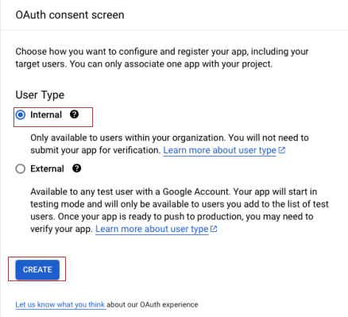

3.  Fill the App information (Fill only the mandatory fields as below, rest are optional) - Click on Save and Continue

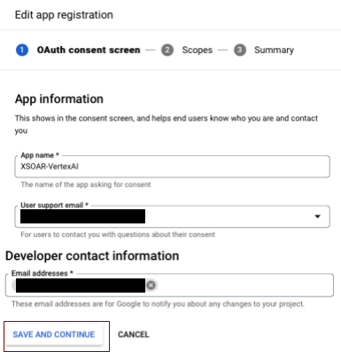

4.  Click Add or Remove Scopes; We will add Vertex AI API as part of the project scope; NOTE: Don’t add unnecessary scope as this might reveal other data in the project using the created credential

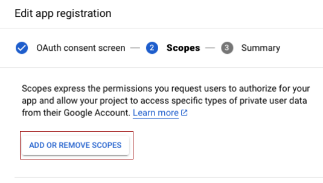

5.  In current version of this integration, it is only require read only permission in the Scope; Then Click Update

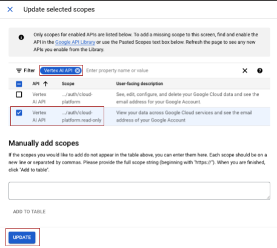

After added, it will looks like this screenshot

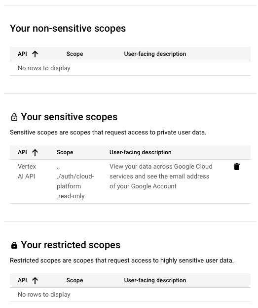

6.  Click Save and Continue; Now Step 3

## Step 3: Create OAuth Client ID

1.  Go to APIs & Services > Credentials

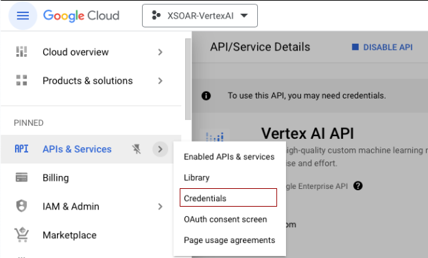

2.  Click Create Credentials

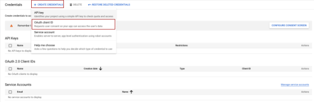

3.  Fill your Credential Information as following

Application Type: Web application

Name: XSOAR-VertexAI

In Authorized redirect URIs: https://oproxy.demisto.ninja/authcode

This one will be easy as a user experience to generate the auth code; Please see Step 4

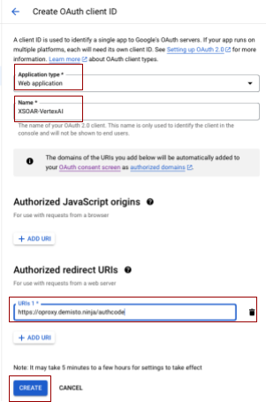

4.  Copy Client ID & Client secret, we will use them during XSOAR’s instance configurations; Then Click OK

Note: the screenshot contain deleted credential please don’t use it as it will not work in your instance configuration

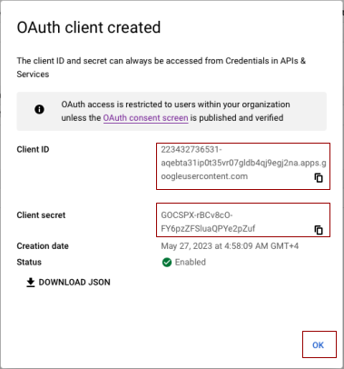

## Step 4: Generate Authentication Code (OAuth Code)

In this step, we will use the created client ID & secret to generate OAuth Code so, the integration can generate access token for authentication & authorization to Google APIs. For more information about Tokens: please check the following URL from Google:

https://developers.google.com/identity/protocols/oauth2

https://cloud.google.com/docs/authentication/token-types

1.  There are two ways to generate the required URL, you can create an instance of the integration and add all information except for auth code as still we don’t have it

First get the project id by clicking on the project name from top left then it will looks as following:

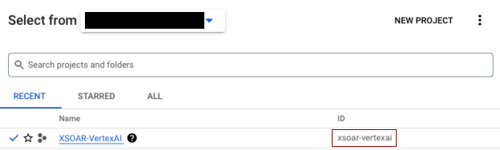

2.  Fill the instance information on XSOAR as following:

  
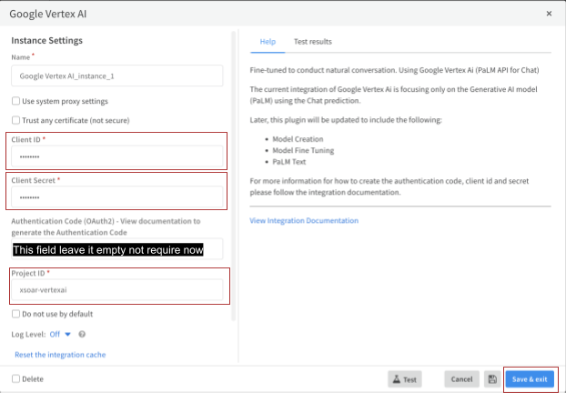

3.  In XSOAR’s CLI, execute the following command:

!google-vertex-ai-generate-auth-url

4.  Copy the generated authorization url to your browser and go to step 6

5.  You can skip previous configuration and use the following URL after filling the required parameters

URL Format:

https://accounts.google.com/o/oauth2/auth/oauthchooseaccount?scope=https://www.googleapis.com/auth/cloud-platform&access_type=offline&prompt=consent&response_type=code&state=state_parameter_passthrough_value&redirect_uri={REDIRECT_URI}&client_id={CLIENT_ID}

{REDIRECT\_URI) replace it with: https://oproxy.demisto.ninja/authcode

{CLIENT\_ID} replace it with: You Client ID that is generated in step 3

So, final URL should like that:

https://accounts.google.com/o/oauth2/auth/oauthchooseaccount?scope=https://www.googleapis.com/auth/cloud-platform&access_type=offline&prompt=consent&response_type=code&state=state_parameter_passthrough_value&redirect_uri=https://oproxy.demisto.ninja/authcode&client_id=223432736531-aqebta31ip0t35vr07gldb4qj9egj2na.apps.googleusercontent.com

6.  Choose your account or Sign in

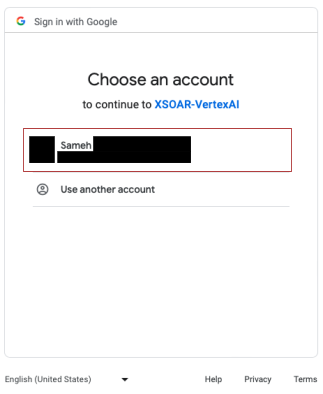

7.  Click on Allow

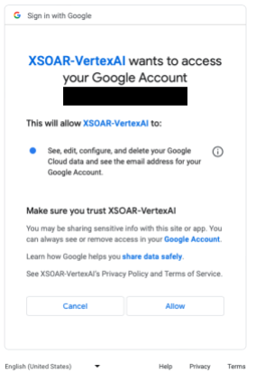

8.  It will redirect you to the REDIRECT\_URI domain

https://oproxy.demisto.ninja/authcode

The beauty of using the OProxy is to make it easier for users to copy paste the code instead of using manual way from Browser Address bar in case of using localhost as a redirect uri.

For more information about OProxy from Palo Alto Networks; check the following link:

https://xsoar.pan.dev/docs/reference/articles/o-proxy

9.  Copy the auth code to your configured XSOAR instance; the final look for XSOAR Instance should look like Step 5

## Step 5: Setup XSOAR Instance

This is the final look for how your XSOAR instance will looks like

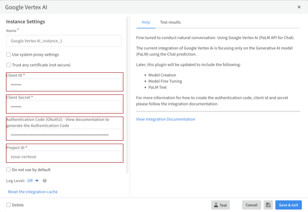

## Step 7: Testing (Instance Test button doesn’t work with OAuth2 method)

Now it is time to put the integration in test.

1.  Execute the following command:

!google-vertex-PaLM-chat prompt="Any message"

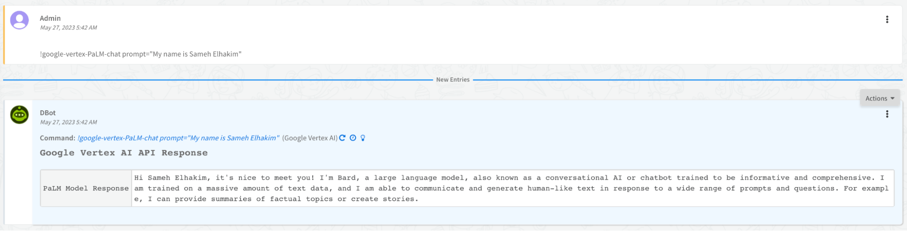

***
## Troubleshooting

In case of any failure it will be related to authentication code expired or reset somehow. In that case, you will need to repeat steps of generating a new auth code and adding it to XSOAR. BUT before that most important to reset the cache to the integration as following:

1.  In the instance, click reset integration cache
2.  Save & Exit (Important)

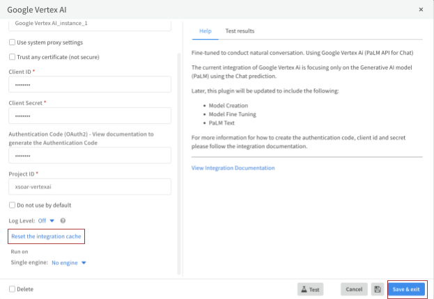

3.  Repeat from step 4 to 7 to generate a new authentication code and configure your instance then test
