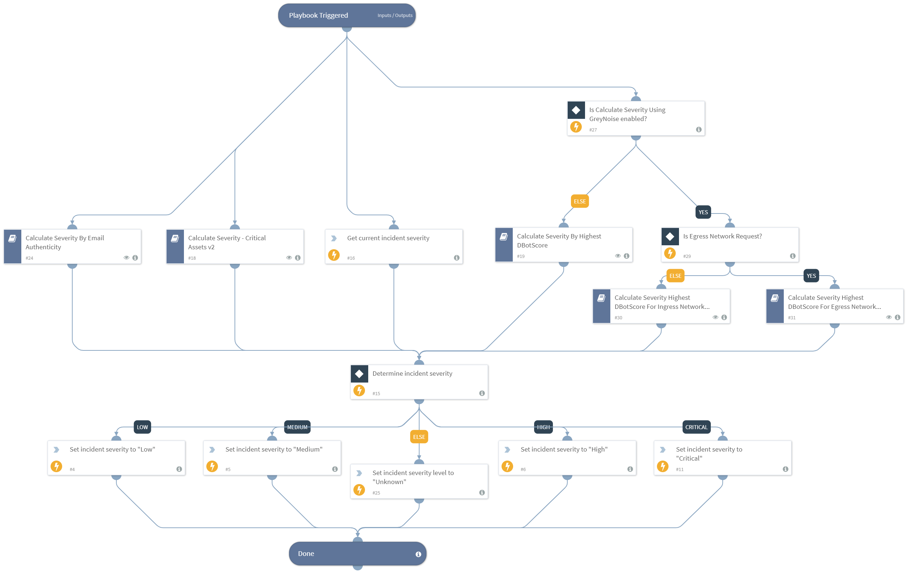

Calculate and assign the incident severity based on the highest returned severity level from the following calculations:

- DBotScores of indicators
- Critical assets
- Email authenticity
- Current incident severity
Supported Cortex XSOAR versions: 5.0.0 and later.

## Dependencies
This playbook uses the following sub-playbooks, integrations, and scripts.

### Sub-playbooks
* Calculate Severity - Critical Assets v2
* Calculate Severity For Egress Network Request By  Highest DBotScore - GreyNoise
* Calculate Severity By Email Authenticity
* Calculate Severity For Ingress Network Request By  Highest DBotScore - GreyNoise
* Calculate Severity By Highest DBotScore

### Integrations
This playbook does not use any integrations.

### Scripts
* Set

### Commands
* setIncident

## Playbook Inputs
---

| **Name** | **Description** | **Default Value** | **Required** |
| --- | --- | --- | --- |
| DBotScore | Array of all indicators associated with the incident.  | DBotScore.None | Optional |
| CriticalUsers | CSV of usernames of critical users. | admin,administrator | Optional |
| CriticalEndpoints | CSV of hostnames of critical endpoints. | admin | Optional |
| CriticalGroups | CSV of DN names of critical AD groups. | admins,administrators | Optional |
| Account | User accounts to check against the critical lists. | Account.None | Optional |
| Endpoint | Endpoints to check against the CriticalEndpoints list. | Endpoint.None | Optional |
| EmailAuthenticityCheck | Indicates the email authenticity resulting from the EmailAuthenticityCheck script. Possible values are: Pass, Fail, Suspicious, and Undetermined. | Email.AuthenticityCheck | Optional |
| CalcualteSeverityUsingGreyNoise | Flag to enable/disable GreyNoise Calculate severity playbook. | false | Optional |
| NetworkTrafficDirection | The direction of network traffic event associated with the Incident\(Egress/Ingress\). If not supplied, Ingress is considered. | Ingress | Optional |

## Playbook Outputs
---

| **Path** | **Description** | **Type** |
| --- | --- | --- |
| CriticalAssets | All critical assets involved in the incident. | unknown |
| CriticalAssets.CriticalEndpoints | Critical endpoints involved in the incident. | unknown |
| CriticalAssets.CriticalEndpointGroups | Critical endpoint-groups involved in the incident. | unknown |
| CriticalAssets.CriticalUsers | Critical users involved in the incident. | unknown |
| CriticalAssets.CriticalUserGroups | Critical user-groups involved in the incident. | unknown |

## Playbook Image
---
