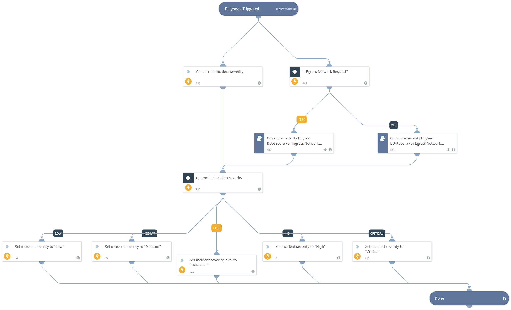

Calculate and assign the incident severity based on the highest returned severity level from the following calculations:

- DBotScores of indicators
- Current incident severity

## Dependencies

This playbook uses the following sub-playbooks, integrations, and scripts.

### Sub-playbooks

- Calculate Severity Highest DBotScore For Ingress Network Traffic - GreyNoise
- Calculate Severity Highest DBotScore For Egress Network Traffic - GreyNoise

### Integrations

This playbook does not use any integrations.

### Scripts

- Set

### Commands

- setIncident

## Playbook Inputs

---

| **Name** | **Description** | **Default Value** | **Required** |
| --- | --- | --- | --- |
| DBotScore | Array of all indicators associated with the incident.  | DBotScore | Optional |
| NetworkTrafficDirection | The direction of network traffic event associated with the Incident\(Egress/Ingress\). If not supplied, Ingress is considered. | Egress | Optional |

## Playbook Outputs

---

| **Path** | **Description** | **Type** |
| --- | --- | --- |
| CriticalAssets | All critical assets involved in the incident. | unknown |
| CriticalAssets.CriticalEndpoints | Critical endpoints involved in the incident. | unknown |
| CriticalAssets.CriticalEndpointGroups | Critical endpoint-groups involved in the incident. | unknown |
| CriticalAssets.CriticalUsers | Critical users involved in the incident. | unknown |
| CriticalAssets.CriticalUserGroups | Critical user-groups involved in the incident. | unknown |

## Playbook Image

---
