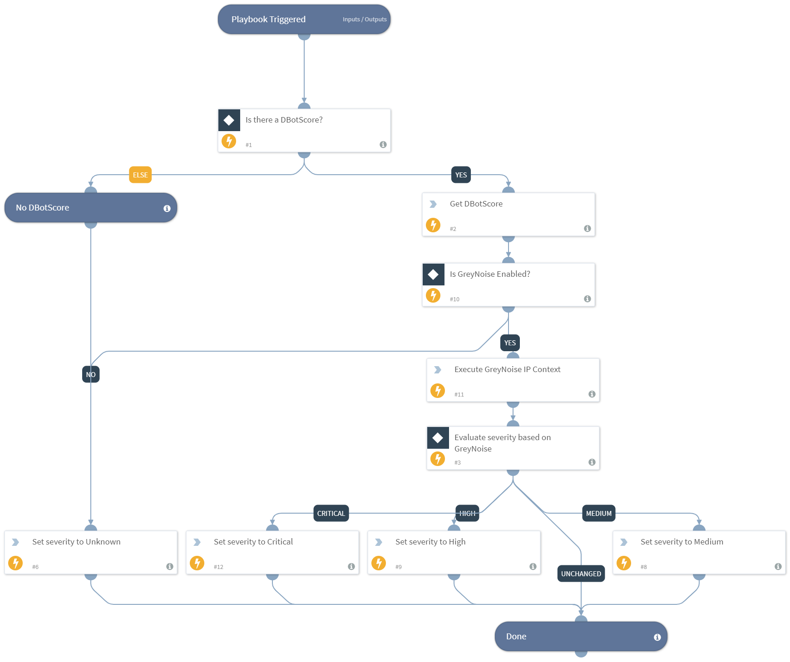

Playbook to calculate the severity based on GreyNoise

## Dependencies
This playbook uses the following sub-playbooks, integrations, and scripts.

### Sub-playbooks
This playbook does not use any sub-playbooks.

### Integrations
* GreyNoise

### Scripts
* IsIntegrationAvailable
* Set

### Commands
* greynoise-ip-context

## Playbook Inputs
---

| **Name** | **Description** | **Default Value** | **Required** |
| --- | --- | --- | --- |
| DBotScore | Array of all indicators associated with the incident. | DBotScore.None | Optional |

## Playbook Outputs
---

| **Path** | **Description** | **Type** |
| --- | --- | --- |
| Severities.DBotScoreSeverity | The severity level of the incident identified and set in the Calculate Severity By GreyNoise Highest DBotScore playbook. | unknown |

## Playbook Image
---
