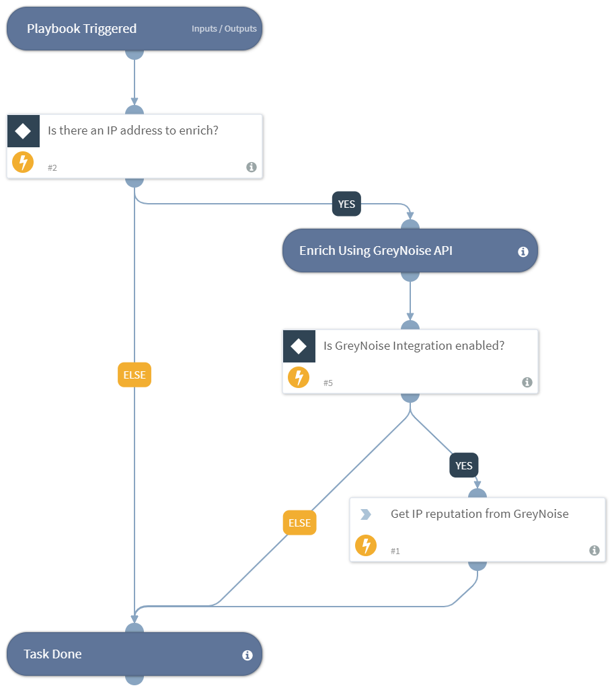

Playbook for the ip reputation command
Supported Cortex XSOAR versions: 5.0.0 and later.

## Dependencies

This playbook uses the following sub-playbooks, integrations, and scripts.

### Sub-playbooks

This playbook does not use any sub-playbooks.

### Integrations

* GreyNoise

### Scripts

This playbook does not use any scripts.

### Commands

* ip

## Playbook Inputs

---

| **Name** | **Description** | **Default Value** | **Required** |
| --- | --- | --- | --- |
| IP | The IP address to get reputation of. | IP.Address | Required |

## Playbook Outputs

---

| **Path** | **Description** | **Type** |
| --- | --- | --- |
| GreyNoise.IP.address | The IP address of the scanning device IP. | unknown |

## Playbook Image

---
