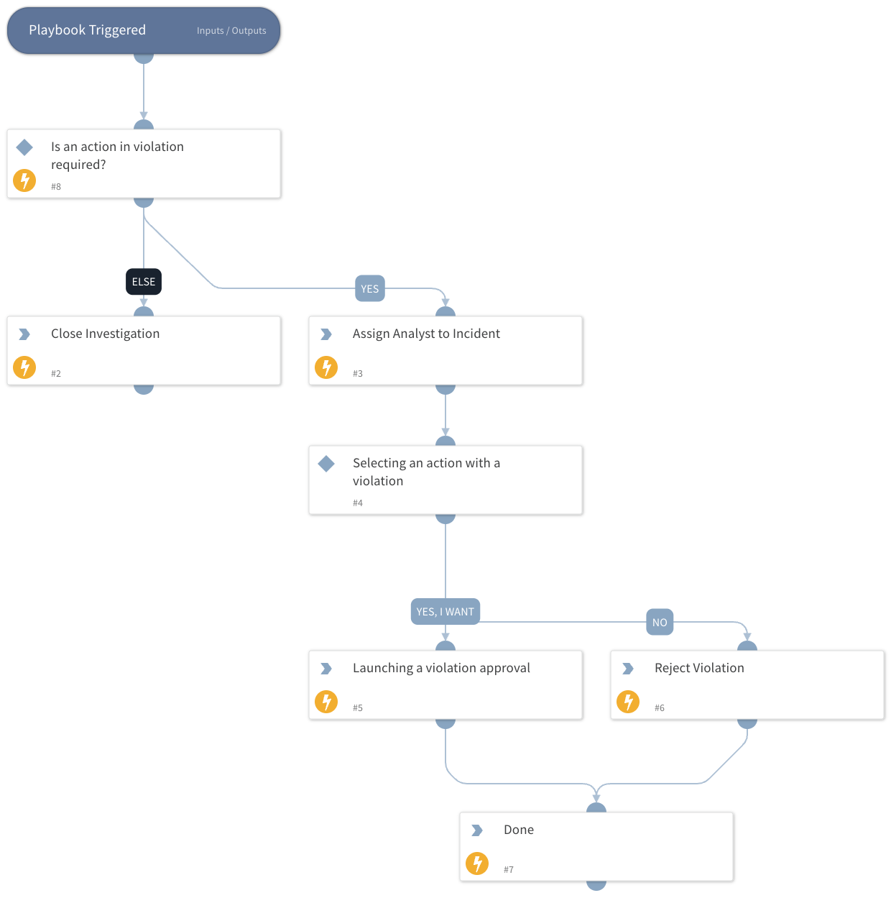

Handles postprocessing of violation incidents detected by Group-IB Digital Risk Protection.

A violation incident is closed when the work on the violation is over: as *Resolved* when Group-IB DRP reports the violation as `resolved` (taken down; older API versions spell it `solved`) or `legal` (handed to legal), and as *False Positive* when DRP found it false (`false_status`) or the customer rejected it. Approving a violation does not close the incident - it only settles the customer's decision, and the take-down carries on afterwards - unless the instance has **Close the incident when a violation is approved** enabled, in which case `GIBDRPResolveViolation` closes it with the approval.

Incidents whose violation ends later are closed by the `GIBDRPIncidentUpdate` pre-processing rule, which sees the change arrive on the next fetch. The playbook's first two conditions cover a violation that is already over when its incident is created; the fetch does not create incidents for such violations, so this is a safeguard for incidents created another way.

When the incident's **GIB DRP Indicator Wanted** field is set - the fetch sets it for the violation types selected in **Create indicators from Violations** on the instance - the playbook runs `GIBDRPCreateViolationIndicator`, which creates the indicator from the violation URI, linked to the incident and with Group-IB Digital Risk Protection as its source.

While Group-IB DRP is waiting for the customer - status `detected` and approve state `under_review` - the playbook assigns a random analyst and asks whether to approve the violation. *Yes* and *No* send the decision to Group-IB DRP through `GIBDRPResolveViolation`, to the instance that fetched the incident (`${incident.sourceInstance}`); *Later* ends the playbook without touching the violation, leaving the decision to the incident's Approve Violation and Reject Violation buttons.

## Dependencies

This playbook uses the following sub-playbooks, integrations, and scripts.

### Sub-playbooks

This playbook does not use any sub-playbooks.

### Integrations

* GroupIBDigitalRiskProtection

### Scripts

* AssignAnalystToIncident
* GIBDRPCreateViolationIndicator
* GIBDRPResolveViolation
* IsIntegrationAvailable

### Commands

* closeInvestigation

## Playbook Inputs

---
There are no inputs for this playbook.

## Playbook Outputs

---
There are no outputs for this playbook.

## Playbook Image

---

