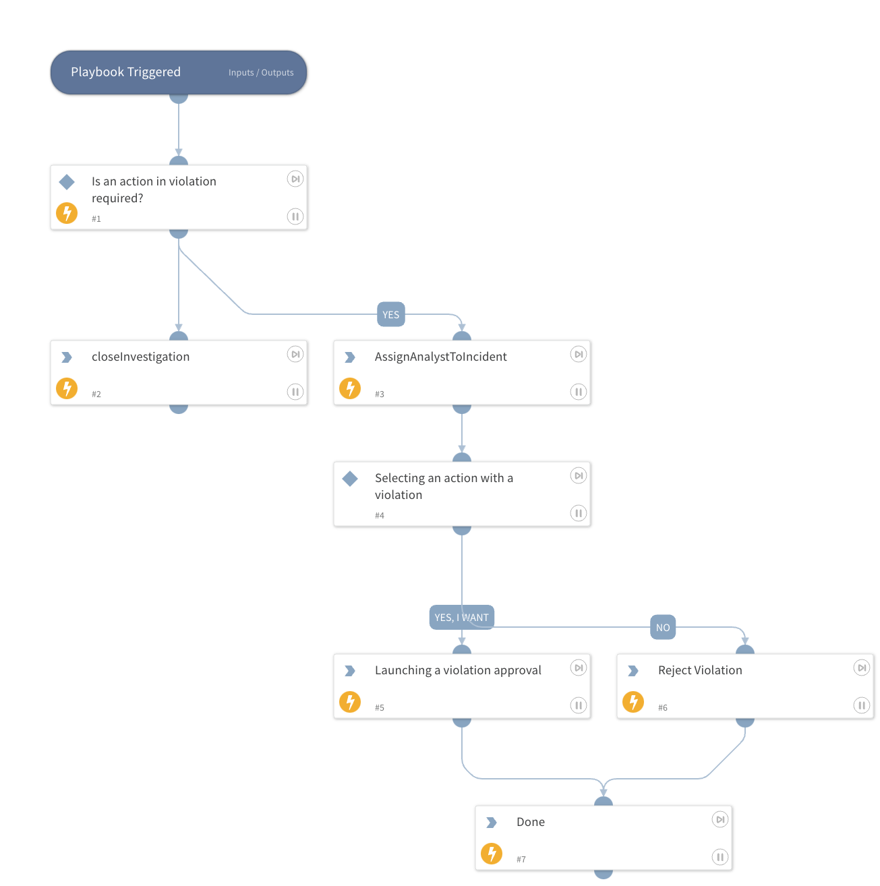

Determine if the violation requires any actions, if it does, then bind a random analyst and ask for a decision from him and when the decision is received we perform actions in accordance with it.

## Dependencies

This playbook uses the following sub-playbooks, integrations, and scripts.

### Sub-playbooks

This playbook does not use any sub-playbooks.

### Integrations

* Group-IB Digital Risk Protection

### Scripts

This playbook does not use any scripts.

### Commands

* gibdrp-change-violation-status

## Playbook Inputs

---
There are no inputs for this playbook.

## Playbook Outputs

---
There are no outputs for this playbook.

## Playbook Image

---

