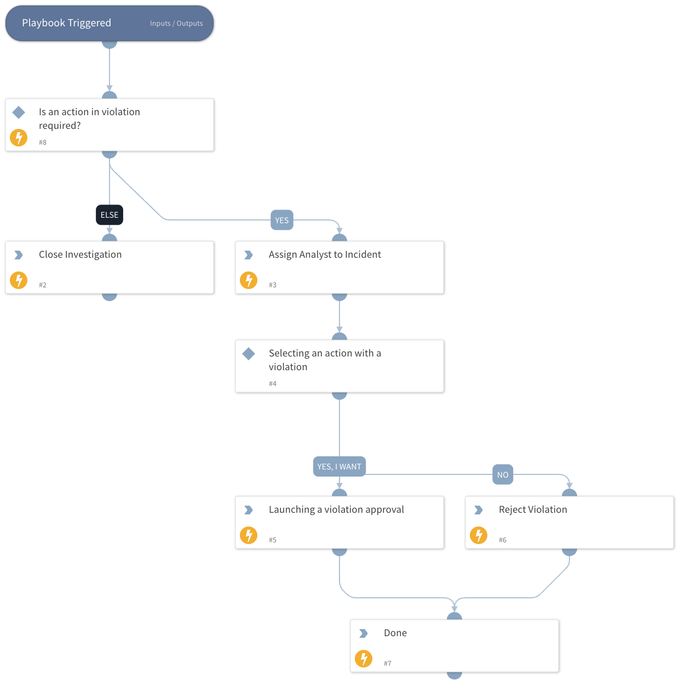

## What does this pack do?

* Receives violations from Group-IB Digital Risk Protection.
* Allows manual investigation using Group-IB data through the Cortex XSOAR interface.

This pack includes an incident type, a classifier and mapper, and a dedicated layout. It also provides the following automations:

* **GIBDRPIncidentUpdate** updates the existing incident of a violation instead of creating a duplicate, and closes it once the violation is over.
* **GIBDRPResolveViolation** sends the decision to Group-IB DRP through the instance that fetched the incident. It runs behind the layout's **Approve Violation** and **Reject Violation** buttons.
* **GIBDRPCreateViolationIndicator** creates the violation's indicator from the incident.

The buttons appear only while Group-IB DRP is waiting for your decision. A violation incident is closed as Resolved once Group-IB DRP has resolved the violation, and as False Positive once the violation was rejected or found false. A playbook is also provided to help you respond to violations more efficiently.

