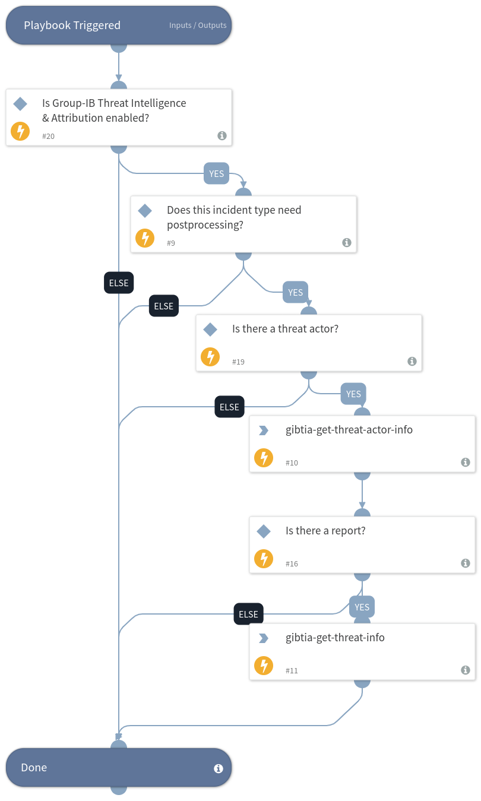

Nowadays businesses in any sphere may have problems with their cybersecurity: from simple phishing to professional cybercriminals, so it is very important to respond to incidents quickly.

Group-IB Threat Intelligence Pack can help you with managing your incident and indicators from Group-IB within the SOAR system.

### What does this pack do?
* Receive incidents and attribute them to adversaries.
* Enrich security system with IOCs.
* Provide possibilities for manual investigation through Group-IB data via Cortex XSOAR interface.

As part of this pack, you will also get incident types, fields, and layouts; indicator types, fields, and layouts; the classifier and mapper for properly delivering data to these types and fields. Also, you will get a playbook, that enriches incidents, upcoming from Group-IB with threat reports and threat actor information.

