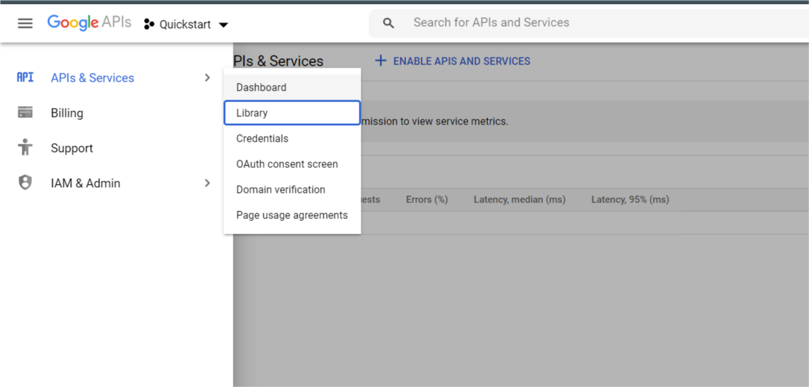
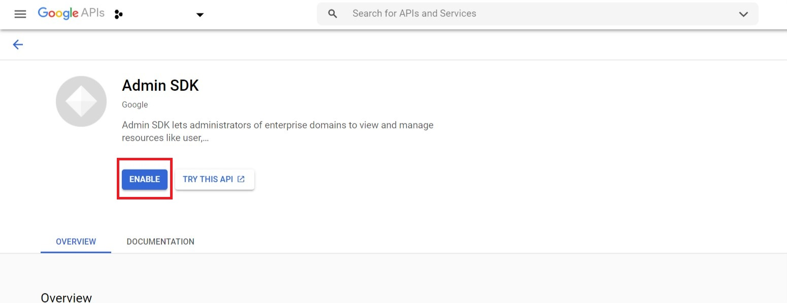

G Suite Auditor is an integration to receive Audit logs from  G Suite different applications - admin,drive,calendar and more.

###For more information about the integrations arguments-
* [Command arguments documentation](https://developers.google.com/admin-sdk/reports/reference/rest/v1/activities/list?apix_params=%7B%22userKey%22%3A%22all%22%2C%22applicationName%22%3A%22admin%22%2C%22eventName%22%3A%22DELETE_USER%22%2C%22filters%22%3A%22USER_EMAIL%3D%3Dxsoar11%40demistodev.com%22%7D#query-parameters) in Google's API.
* [Application to event names table](https://developers.google.com/admin-sdk/reports/reference/rest/v1/activities/list#applicationname) by Google's API.

##Google's lag time information
This integration relies on Google's audit logs which are prone to some data delays. Please note that some results may be partial as data has yet to arrive due to lag times. Lag time changes depending on the used audit log (between near real-time up to 3 days).
for more information - https://support.google.com/a/answer/7061566?hl=en

## Configure Service Account for G Suite Auditor

1. Go to [https://console.developers.google.com](https://console.developers.google.com).

2. Select or create a project:

    


3. Enable the Admin SDK API:
    
    1. Under the main menu, select **APIs & Services > Library**:
        
    
    2. Enable *Admin SDK*:
        
    
    3. Select the project and click **OPEN**:
            

4. Create a service account with the correct restricted permissions:

    1. Under the main menu, select **IAM & Admin > Service Accounts**:
        
    
    2. In the top bar, select **CREATE SERVICE ACCOUNT**:
        
    
    3. Under the main menu, select **IAM & Admin > Service Accounts** and open the account you just created.
    
    4. Generate new credentials:
        1. On the Service account details page, under Keys, click **ADD KEY** and select **Create new key**:
            
        
        2. Under Key type, select **JSON**, and click **CREATE**. Save the credentials in a secure location. You will need the generated ``credentials.json`` file when you configure the instance in Cortex XSOAR:
               


## Add Scopes in G Suite Admin

1. Go to [https://admin.google.com](https://admin.google.com)

2. Click **Menu** and select **Security > API Controls**:
    

3. Under the **Domain wide delegation** tab, click **MANAGE DOMAIN WIDE DELEGATION**:
    

4. Click  **Add new** and enter the Client ID from your *credentials.json* file and required scopes from the integration tips.
               

5. Click **AUTHORIZE**.

## Configure GsuiteAuditor on Cortex XSOAR

1. Navigate to **Settings** > **Integrations** > **Servers & Services**.
2. Search for GsuiteAuditor.
3. Click **Add instance** to create and configure a new integration instance.

    | **Parameter** | **Required** |
    | --- | --- |
    | User's Service Account JSON | True |
    | Admin Email | False |
    | Trust any certificate (not secure) | False |
    | Use system proxy settings | False |

4. Click **Test** to validate the URLs, token, and connection.
## Commands
You can execute these commands from the Cortex XSOAR CLI, as part of an automation, or in a playbook.
After you successfully execute a command, a DBot message appears in the War Room with the command details.
### gsuite-activity-search
***
Retrieves a list of activities for a specific customer's account and application


#### Base Command

`gsuite-activity-search`
#### Input

| **Argument Name** | **Description** | **Required** |
| --- | --- | --- |
| user_key | Profile ID or the user email for which the data should be filtered. Can be 'all' for all information, or 'userKey' for a user's unique Google Workspace profile ID or their primary email address. | Optional | 
| application_name | Application name for which the events are to be retrieved. Possible values are: access_transparency, admin, calendar, chat, drive, gcp, gplus, groups, groups_enterprise, jamboard, login, meet, mobile, rules, saml, token, user_accounts, context_aware_access, chrome, data_studio, keep. | Required | 
| event_name | The name of the event being queried. | Optional | 
| filters | a comma-separated list composed of event parameters and relational operators. | Optional | 
| org_unit_id | ID of the organizational unit to report on. | Optional | 
| group_id | Comma separated group ids on which user activities are filtered. | Optional | 
| actor_ip_address | IP Address of host where the event was performed. | Optional | 
| start_time | Sets the beginning of the range of time shown in the report. example - 2010-10-28T10:26:35.000Z. Possible values are: . | Optional | 
| end_time | Sets the end of the range of time shown in the report. example - 2010-10-28T10:26:35.000Z. Possible values are: . | Optional | 
| max_results | Maximum number of results to return. . Default is 1000. | Optional | 
| page_token | The token to specify next page. | Optional | 
| admin_email | Email ID of the G Suite domain admin acts on behalf of an end-user. | Optional | 


#### Context Output

| **Path** | **Type** | **Description** |
| --- | --- | --- |
| GSuite.ActivitySearch.items.id.time | Date | Time of occurrence of the activity | 
| GSuite.ActivitySearch.items.id.uniqueQualifier | String | Unique qualifier if multiple events have the same time. | 
| GSuite.ActivitySearch.items.id.applicationName | String | Application name to which the event belongs | 
| GSuite.ActivitySearch.items.id.customerId | String | The unique identifier for a Google Workspace account. | 
| GSuite.ActivitySearch.items.actor.callerType | String | The type of actor. | 
| GSuite.ActivitySearch.items.actor.key | String | Can be the consumer_key of the requestor for OAuth 2LO API requests or an identifier for robot accounts. | 
| GSuite.ActivitySearch.items.events.type | String | Type of event. | 
| GSuite.ActivitySearch.items.events.name | String | Name of the event | 
| GSuite.ActivitySearch.items.events.parameters.name | String | The name of the parameter. | 
| GSuite.ActivitySearch.items.events.parameters.value | String | String value of the parameter. | 
| GSuite.ActivitySearch.items.actor.email | String | The primary email address of the actor. | 
| GSuite.ActivitySearch.items.actor.profileId | String | The unique Google Workspace profile ID of the actor. | 
| GSuite.ActivitySearch.items.ipAddress | String | IP address of the user doing the action. | 
| GSuite.ActivitySearch.items.events.parameters.boolValue | Boolean | Boolean value of the parameter. | 
| GSuite.ActivitySearch.items.events.parameters.multiValue | String | String values of the parameter. | 
| GSuite.PageToken.ActivitySearch.nextPageToken | String | Token to specify the next page in the list. | 


#### Command Example
```!gsuite-activity-search application_name=admin max_results=2```

#### Context Example
```json
{
    "GSuite": {
        "ActivitySearch": [
            {
                "actor": {
                    "callerType": "KEY",
                    "key": "SYSTEM"
                },
                "events": [
                    {
                        "name": "USER_LICENSE_REVOKE",
                        "parameters": [
                            {
                                "name": "USER_EMAIL",
                                "value": "user@email.com"
                            },
                            {
                                "name": "PRODUCT_NAME",
                                "value": "Google Workspace"
                            },
                            {
                                "name": "OLD_VALUE",
                                "value": "G Suite Business"
                            }
                        ],
                        "type": "LICENSES_SETTINGS"
                    }
                ],
                "id": {
                    "applicationName": "admin",
                    "customerId": "11111",
                    "time": "2021-07-27T02:47:20.894Z",
                    "uniqueQualifier": "-7168880636905757919"
                }
            },
            {
                "actor": {
                    "callerType": "USER",
                    "email": "admin@email.com",
                    "profileId": "103020731686044834269"
                },
                "events": [
                    {
                        "name": "DELETE_USER",
                        "parameters": [
                            {
                                "name": "USER_EMAIL",
                                "value": "user@email.com"
                            }
                        ],
                        "type": "USER_SETTINGS"
                    }
                ],
                "id": {
                    "applicationName": "admin",
                    "customerId": "1111",
                    "time": "2021-07-27T01:47:40.585Z",
                    "uniqueQualifier": "-4797090398870165525"
                },
                "ipAddress": " "
            }
        ],
        "PageToken": {
            "ActivitySearch": {
                "nextPageToken": "A:1627350460585000:-4797090398870165525:207535951991:C02f0zfqw"
            }
        }
    }
}
```

#### Human Readable Output

>### Next Page Token: A:1627350460585000:-4797090398870165525:207535951991:C02f0zfqw
>### Total Retrieved Activities: 2
>|Time|Application Name|Email|ProfileId|IpAddress|Events|
>|---|---|---|---|---|---|
>| 2021-07-27T02:47:20.894Z | admin |  |  |  | {'type': 'LICENSES_SETTINGS', 'name': 'USER_LICENSE_REVOKE', 'parameters': [{'name': 'USER_EMAIL', 'value': 'user@email.com'}, {'name': 'PRODUCT_NAME', 'value': 'Google Workspace'}, {'name': 'OLD_VALUE', 'value': 'G Suite Business'}]} |
>| 2021-07-27T01:47:40.585Z | admin | admin@email.com | 103020731686044834269 | - | {'type': 'USER_SETTINGS', 'name': 'DELETE_USER', 'parameters': [{'name': 'USER_EMAIL', 'value': 'user@email.com'}]} |

