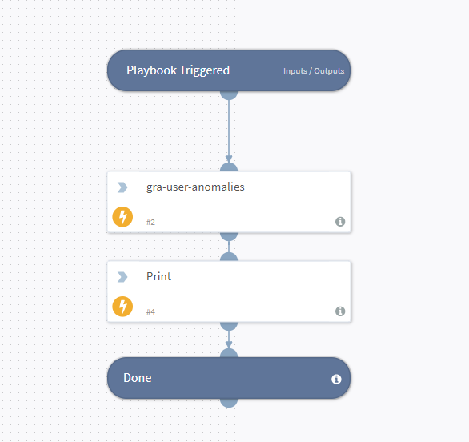

This Playbook used for printing anomalies for cases.

## Dependencies
This playbook uses the following integrations,commands and scripts.

### Integrations
* Gurucul

### Commands
* gra-user-anomalies
* print

## Playbook Inputs
---

| **Name** | **Description** | **Default Value** | **Source** | **Required** |
| --- | --- | --- | --- | --- |
| employee_id | High Risk user employee_id. |  | Incident | Required |
| page | Page No | 1 |  | Optional |
| max | Record count per page no | 25 |  | Optional |

## Playbook Outputs
---

| **Path** | **Description** | **Type** |
| --- | --- | --- |
| Gra.Anomalies.anomaly_name | Anomaly Name. |  String|

