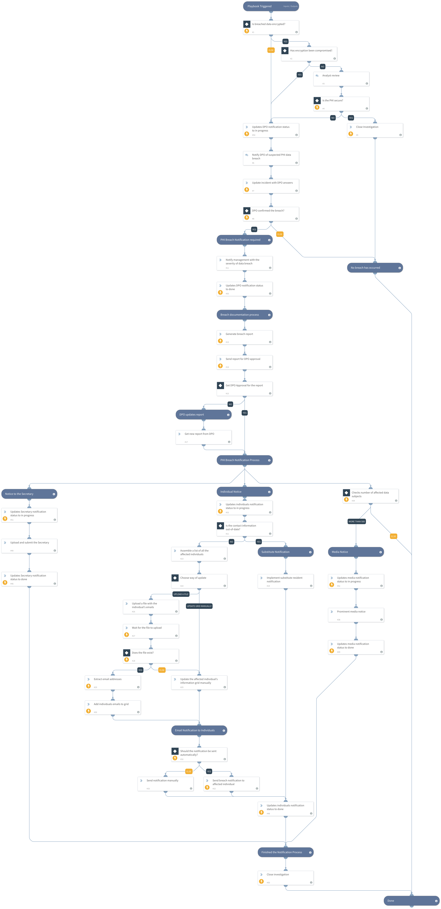

HIPAA (Health Insurance Portability and Accountability Act) is a binding regulation for organizations operating in the USA. The HIPAA Breach Notification Rule, 45 CFR §§ 164.400-414, requires HIPAA covered entities and their business associates to provide notification following a breach of unsecured protected health information. Similar breach notification provisions implemented and enforced by the Federal Trade Commission (FTC), apply to vendors of personal health records and their third-party service providers, pursuant to section 13407 of the HITECH Act.
This HIPAA Breach Notification content pack includes a playbook that helps to determine if the breached data meets the criteria for breach notification, and, if necessary, follows through with the notification procedures in case of PHI breach according to HIPAA requirements.
With this package, helps you streamline and automate the repetitive tasks associated with HIPAA breach notifications incidents.  
##### What does this pack do?
The playbook helps you understand whether a breach occurred and whether notifications are required:
- Checks whether the breached data was encrypted or if the encryption key was compromised.
- Asks the DPO (Data Protection Officer) to confirm the breached.
- In case the notification is required, the pack will help with the notification process, to send an breach notification to the following: Affected individuals, the Secretary of HHS, Consumer Reporting Agencies and Media notice 
As part of this pack, you will also get out-of-the-box HIPAA breach notification incident views, and a full layout. All of these are easily customizable to suit the needs of your organization.

_For more information, visit our [Cortex XSOAR Developer Docs](https://xsoar.pan.dev/docs/reference/playbooks/hipaa---breach-notification)_

