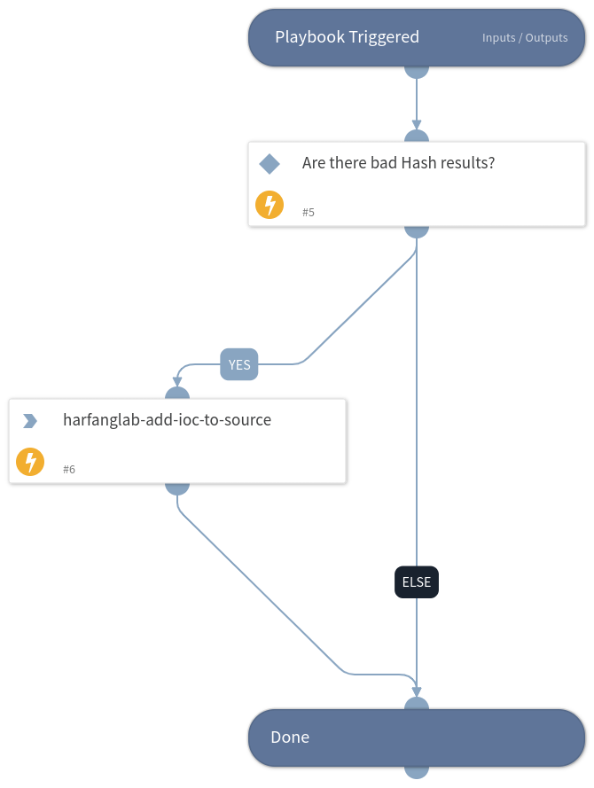

This playbook add indicators to a HarfangLab EDR IOC source list for detection and/or blocking.

## Dependencies
This playbook uses the following sub-playbooks, integrations, and scripts.

### Sub-playbooks
This playbook does not use any sub-playbooks.

### Integrations
* Hurukai

### Scripts
This playbook does not use any scripts.

### Commands
* harfanglab-add-ioc-to-source

## Playbook Inputs
---

| **Name** | **Description** | **Default Value** | **Required** |
| --- | --- | --- | --- |
| Indicator Query | Indicators matching the indicator query will be used as playbook input | type:file -tags:pending_review and (tags:to_edr_blocklist or tags:approved_white or tags:approved_watchlist) and expirationStatus:active | Optional |

## Playbook Outputs
---
There are no outputs for this playbook.

## Playbook Image
---

