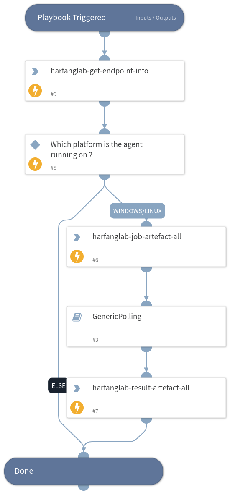

Build a global archive with:
- MFT (Windows)
- Hives (Windows)
- USN logs (Windows)
- Prefetch files (Windows)
- EVT/EVTX files (Windows)
- Log files (Linux)
- Filesystem content (Linux)

## Dependencies
This playbook uses the following sub-playbooks, integrations, and scripts.

### Sub-playbooks
* GenericPolling

### Integrations
* Hurukai

### Scripts
This playbook does not use any scripts.

### Commands
* harfanglab-result-artifact-all
* harfanglab-job-artifact-all
* harfanglab-get-endpoint-info

## Playbook Inputs
---

| **Name** | **Description** | **Default Value** | **Required** |
| --- | --- | --- | --- |
| agentid |  |  | Required |

## Playbook Outputs
---
There are no outputs for this playbook.

## Playbook Image
---

