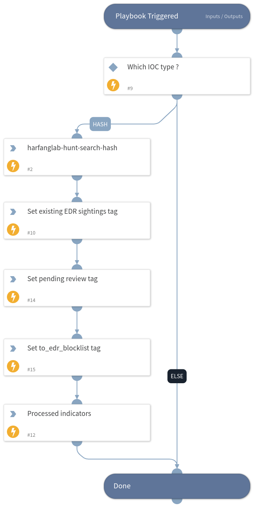

This playbook allows is triggered by the Hurukai - Process Indicators - Manual Review playbook. It allows to search for IOC sightings in the HarfangLab EDR and tag sighted IOCs accordingly for manual review. All IOCs are tagged in order to be further inserted into a HarfangLab EDR IOC source.

## Dependencies
This playbook uses the following sub-playbooks, integrations, and scripts.

### Sub-playbooks
This playbook does not use any sub-playbooks.

### Integrations
* Hurukai

### Scripts
* SetAndHandleEmpty

### Commands
* appendIndicatorField
* harfanglab-hunt-search-hash

## Playbook Inputs
---

| **Name** | **Description** | **Default Value** | **Required** |
| --- | --- | --- | --- |
| Indicator Query | Indicators matching the indicator query will be used as playbook input |  | Optional |

## Playbook Outputs
---

| **Path** | **Description** | **Type** |
| --- | --- | --- |
| ProcessedIndicators | Indicators that are associated to EDR sightings and need reviewing. | unknown |

## Playbook Image
---

