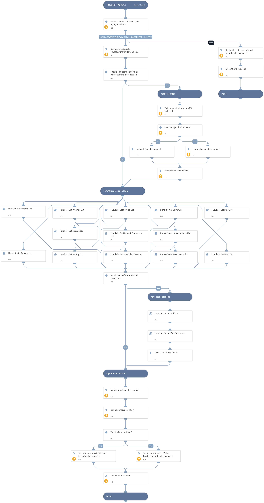

## Dependencies
This playbook uses the following sub-playbooks, integrations, and scripts.

### Sub-playbooks
* Hurukai - Get Pipe List
* Hurukai - Get Runkey List
* Hurukai - Get All Artifacts
* Hurukai - Get Persistence List
* Hurukai - Get Scheduled Task List
* Hurukai - Get Network Share List
* Hurukai - Get Artifact RAM Dump
* Hurukai - Get Session List
* Hurukai - Get Network Connection List
* Hurukai - Get Prefetch List
* Hurukai - Get WMI List
* Hurukai - Get Driver List
* Hurukai - Get Service List
* Hurukai - Get Process List
* Hurukai - Get Startup List

### Integrations
* Hurukai

### Scripts
This playbook does not use any scripts.

### Commands
* setIncident
* harfanglab-deisolate-endpoint
* harfanglab-isolate-endpoint
* harfanglab-change-security-event-status
* harfanglab-get-endpoint-info

## Playbook Inputs
---
There are no inputs for this playbook.

## Playbook Outputs
---
There are no outputs for this playbook.

## Playbook Image
---

