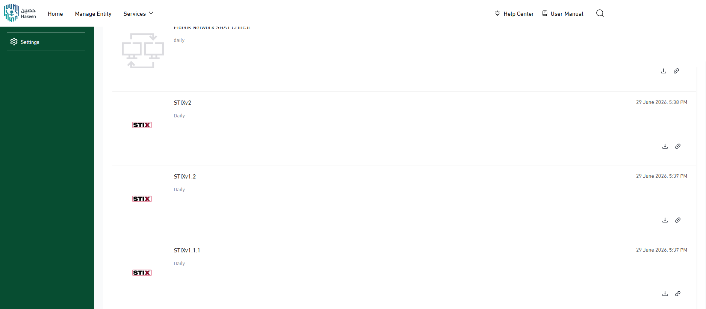
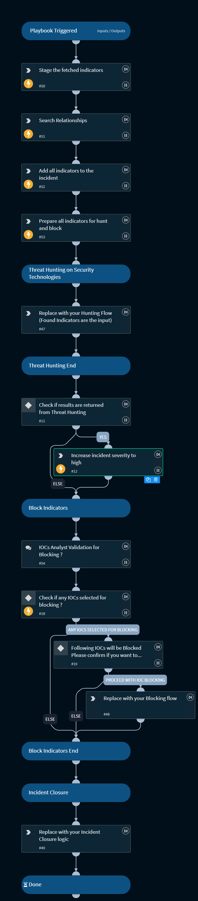

# Haseen Threat Intelligence Integration for Cortex XSOAR

This pack ingests threat intelligence from **Haseen**, the Kingdom of Saudi Arabia's national cyber threat intelligence sharing platform, into Cortex XSOAR as actionable indicators and relationships.

## What does this pack do?

- Fetches IOCs (IPv4/IPv6, domains, URLs, FQDNs, MD5/SHA1/SHA256 hashes) from the Haseen STIX 2.x feed on a configurable schedule.
- Parses STIX `indicator` and `relationship` objects into Cortex XSOAR indicators and indicator relationships.
- Deduplicates indicators across fetches so each IOC is emitted once.
- Applies severity, reputation, reliability, TLP, and tags to ingested indicators.
- Ships a delta-in-feed playbook that stages newly-fetched indicators, gathers their relationships, associates them to the incident, walks an analyst through hunt → manual-block-validation → closure, and escalates severity on hunt hits.

## Use Cases

- Automatically ingest national threat intelligence into Cortex XSOAR for detection, threat hunting, and incident response.
- Replace manual IOC downloads/uploads with an automated, authenticated feed pipeline.
- Run a delta-in-feed playbook that operationalizes each new batch of indicators through a hunt and optional IOC-blocking flow.

## Supported Indicator Types

- **Network** — IPv4, IPv6, domains, URLs, FQDNs.
- **File** — MD5, SHA1, SHA256.
- **Threat context** — malware references, campaign information, threat attribution, and intelligence metadata surfaced as relationships.

## Configuration

| Parameter | Required | Description |
| --- | --- | --- |
| Server URL | Yes | The full STIX export URL, including the export ID. Example: `https://share.haseen.gov.sa/api/v1/threat-intelligence/export/1234`. Do not append `?token=...` — provide the token in the API Token field. |
| API Token | Yes | The Haseen API token (settings page). Sent as a `token` query parameter on every request — not a Bearer header. |
| Basic Auth Credentials | No | For exports that also require Basic authentication. Username = account email, password = API token. |
| First Fetch Time | No | How far back to look on the first fetch (e.g. `7 days`). |
| Indicator Reputation / Source Reliability / TLP | No | Standard feed output controls. |
| Trust any certificate | No | Disable TLS verification (not recommended for production). |
| Use system proxy settings | No | Route requests through the configured system proxy. |

## Playbooks

- **Haseen - Delta Feed - Generic** — triggered by the feed fetch (delta-in-feed job). Stages newly-fetched indicators and their relationships, associates them to the incident, prompts an analyst to select IOCs for blocking, then escalates severity and closes the incident. The playbook is a template: replace the hunt, blocking, and closure placeholder tasks with your own flows. See the playbook README for the detailed flow.

## Feed Behavior

- **Full-dump endpoint** — Haseen returns the entire STIX bundle on every request (no server-side `modified_after` delta). The integration deduplicates against its own seen-indicator watermark so each indicator is emitted once.
- **Relationship-aware** — STIX `relationship` objects are parsed into Cortex XSOAR indicator relationships in addition to the indicators themselves.
- **Rate limit** — Haseen permits 2 requests per hour per export. Configure the fetch interval to 60 minutes or higher.
- **24-hour delta window** — the bundled playbook searches the last 24 hours (`sourcetimestamp`/`lastSeen`) because Haseen updates its bundle roughly once per day; adjust the window to match your environment.

## Commands

This integration is feed-only. It does not expose any CLI commands; indicators are fetched automatically on the configured fetch interval after you mark **Fetch indicators** and save the instance.

---

## Screenshots

---

## About Haseen

### What is Haseen?

**Haseen (حصين)** is the National Cybersecurity Authority (NCA) cyber threat intelligence sharing platform. It allows participating organizations to receive national threat intelligence, access actionable IOCs, share cyber threat information, consume intelligence in machine-readable formats, and improve cyber resilience through collective defense.

Haseen distributes intelligence through both a web-based portal and machine-to-machine (M2M) services that allow direct integration with security products such as SIEM, TIP, SOAR, and XDR platforms.

### What is DOI?

**DOI (Digital Operations Integration)** is the mechanism Haseen uses to enable automated M2M sharing of threat intelligence. Instead of manually downloading intelligence files from the portal, organizations consume feeds directly from designated endpoints using authenticated API access, enabling automated IOC collection, near real-time synchronization, and reduced operational overhead.

### Haseen Machine-to-Machine Service

The Haseen M2M service provides authenticated access to threat intelligence feeds through export endpoints. Supported export formats observed during implementation include STIX v2 (primary), STIX v1.2, and STIX v1.1.1 (legacy).

### Requirements to Obtain Access

**Organizational:**

- Active Haseen membership and at least one active account under the organization to generate the API token.
- Organization public IPs registered in two places in the Haseen Portal:
  - **Risk → Public IP Addresses**
  - **Entity Management → Entity's IP addresses** (required so Cortex XSOAR requests to the Haseen URL are allowed)

**Technical:**

- Authentication token
- STIX v2 feed URL(s)
- Polling interval
