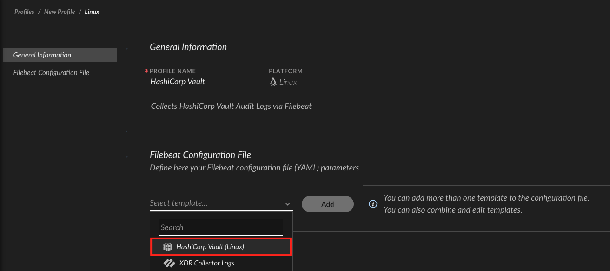

<~XSIAM>

## What does this pack do?

In addition to the [HasiCorp Vault Integration](https://xsoar.pan.dev/docs/reference/integrations/hashi-corp-vault) for managing secrets and credentials on HashiCorp Vault, this pack includes *Cortex Data Modeling (XDM) Rules* and *Parsing Rules* for ingesting and normalizing [HashiCorp Vault Audit Logs](https://support.hashicorp.com/hc/en-us/articles/360001722947-Audit-Device-Notes). 

## Configuration 
Follow the steps below to configure ingestion of Hashicorp Vault audit logs into Cortex XSIAM.

### Configuration on HashiCorp Vault 
 
Run the [audit enable](https://developer.hashicorp.com/vault/docs/commands/audit/enable#audit-enable) command from the Vault server CLI for enabling a [File audit device](https://developer.hashicorp.com/vault/docs/audit/file) to write JSON audit log records to a file. For example: 
```bash
$ vault audit enable file file_path=/var/log/vault_audit.log
```
See also: 
- [Log file rotation](https://developer.hashicorp.com/vault/docs/audit/file#log-file-rotation).
- [Audit Devices](https://developer.hashicorp.com/vault/docs/audit).
- [Blocked audit devices](https://developer.hashicorp.com/vault/tutorials/monitoring/blocked-audit-devices).

### Configuration on Cortex XSIAM 
  
1. Install the HashiCorp Vault content pack from Cortex XSIAM Marketplace. 
2. Configure an [XDR Collector](https://docs-cortex.paloaltonetworks.com/r/Cortex-XSIAM/Cortex-XSIAM-Documentation/Manage-XDR-Collectors):
   1. Create an XDR Collector installation package as described [here](https://docs-cortex.paloaltonetworks.com/r/Cortex-XSIAM/Cortex-XSIAM-Documentation/Create-an-XDR-Collector-installation-package).
   2. Install the XDR Collector created installation package on the HashiCorp Vault server: 
      - For a *Windows* server see [Install the XDR Collector installation package for Windows](https://docs-cortex.paloaltonetworks.com/r/Cortex-XSIAM/Cortex-XSIAM-Documentation/Install-the-XDR-Collector-installation-package-for-Windows).
      - For a *Linux* server see [Install the XDR Collector installation package for Linux](https://docs-cortex.paloaltonetworks.com/r/Cortex-XSIAM/Cortex-XSIAM-Documentation/Install-the-XDR-Collector-installation-package-for-Linux). 
   3. Configure an [XDR Collector Filebeat profile](https://docs-cortex.paloaltonetworks.com/r/Cortex-XSIAM/Cortex-XSIAM-Documentation/XDR-Collector-profiles):
      - For a *Windows* server see [Add an XDR Collector profile for Windows](https://docs-cortex.pawloaltonetworks.com/r/Cortex-XSIAM/Cortex-XSIAM-Documentation/Add-an-XDR-Collector-profile-for-Windows).
      - For a *Linux* server see [Add an XDR Collector profile for Linux](https://docs-cortex.paloaltonetworks.com/r/Cortex-XSIAM/Cortex-XSIAM-Documentation/Add-an-XDR-Collector-profile-for-Linux).  
      - When configuring the Filebeat YAML Configuration File, use the HashiCorp Vault template as a reference:
      
      - Customize the *[paths](https://www.elastic.co/guide/en/beats/filebeat/current/filebeat-input-filestream.html#filestream-input-paths)* parameter in accordance to the path configured for the enabled [File audit device](https://developer.hashicorp.com/vault/docs/audit/file) on the HashiCorp Vault server: 
           ```yaml
            filebeat.inputs:
            - type: filestream
              enabled: true
              id: hashicorp-vault
              paths:       
                - /var/log/vault_audit.log    # customize path as needed 
              processors: 
                - add_fields:       
                    fields:             
                      vendor: hashicorp
                      product: vault
           ```
   4. Apply the configured Filebeat profile to the target HashiCorp Vault server by attaching it to a policy as described on [Apply profiles to collection machine policies](https://docs-cortex.paloaltonetworks.com/r/Cortex-XSIAM/Cortex-XSIAM-Documentation/Apply-profiles-to-collection-machine-policies).
3. After the Cortex XSIAM Collector starts ingesting logs from the configured path on the HashiCorp Vault server, you could query the collected audit logs under the *`hashicorp_vault_raw`* dataset. 
   - Sample [XQL](https://docs-cortex.paloaltonetworks.com/r/Cortex-XSIAM/Cortex-XSIAM-XQL-Language-Reference/Get-Started-with-XQL) query over the normalized [XDM schema](https://docs-cortex.paloaltonetworks.com/r/Cortex-XSIAM/Cortex-Data-Model-Schema-Guide/Introduction): 
   ```XQL
   datamodel dataset = hashicorp_vault_raw | fields hashicorp_vault_raw._raw_log, _time, xdm.event.id, xdm.event.type, xdm.event.original_event_type, xdm.event.operation_sub_type, xdm.event.outcome, xdm.event.outcome_reason, xdm.source.ipv4, xdm.source.host.ipv4_public_addresses, xdm.source.port, xdm.auth.auth_method, xdm.source.user.identifier, xdm.source.user.groups, xdm.target.resource.id, xdm.target.resource.name, xdm.target.resource.type, xdm.target.resource.sub_type, xdm.target.user.identifier, xdm.target.user.username, xdm.network.rule, xdm.network.session_id, xdm.observer.version
   ```
   
</~XSIAM>
