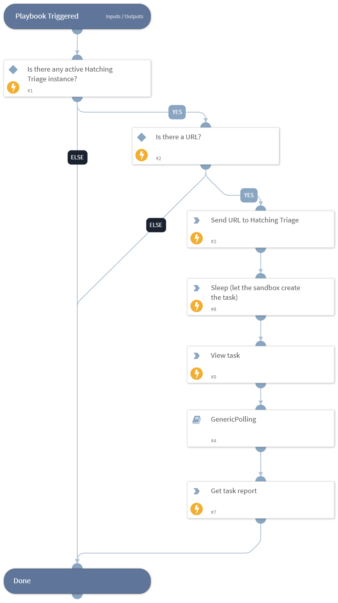

Detonating URL with Hatching Triage

## Dependencies

This playbook uses the following sub-playbooks, integrations, and scripts.

### Sub-playbooks

GenericPolling

### Integrations

Hatching Triage

### Scripts

Sleep

### Commands

- triage-get-sample-summary
- triage-submit-sample

## Playbook Inputs

---

| **Name** | **Description**                                       | **Default Value** | **Required** |
| -------- | ----------------------------------------------------- | ----------------- | ------------ |
| URL      | URL to detonate.                                      | URL.Data          | Optional     |
| interval | How often to poll for results.                        | 1                 | Optional     |
| timeout  | How long to wait before giving up waiting for results.| 10                | Optional     |

## Playbook Outputs

---

| **Path**                          | **Description**                            | **Type** |
| --------------------------------- | ------------------------------------------ | -------- |
| Triage.sample-summaries.completed | Date the sample analysis was completed.    | unknown  |
| Triage.sample-summaries.created   | Date the analysis report was created.      | unknown  |
| Triage.sample-summaries.custom    | Custom sample.                             | unknown  |
| Triage.sample-summaries.owner     | Owner of the sample analysis.              | unknown  |
| Triage.sample-summaries.sample    | Unique identifier of the sample.           | unknown  |
| Triage.sample-summaries.score     | Score of the sample on a scale of 0 to 10. | unknown  |
| Triage.sample-summaries.sha256    | SHA256 hash of the sample.                 | unknown  |
| Triage.sample-summaries.status    | Status of the analysis.                    | unknown  |
| Triage.sample-summaries.target    | Target for the analysis.                   | unknown  |
| Triage.sample-summaries.tasks     | Tasks performed in the analysis.           | unknown  |

## Playbook Image

---

