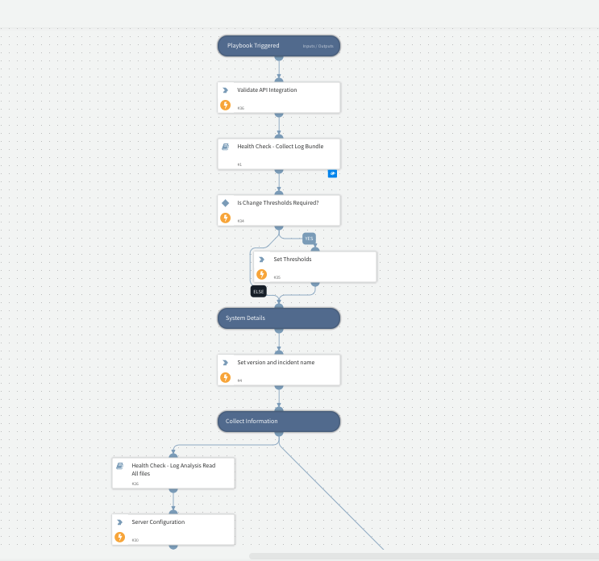

New version for HealthCheck main playbook

## Dependencies

This playbook uses the following sub-playbooks, integrations, and scripts.

### Sub-playbooks

* Health Check - Log Analysis Read All files
* Health Check - Collect Log Bundle

### Integrations

This playbook does not use any integrations.

### Scripts

* HealthCheckContainersStatus
* DemistoVersion
* HealthCheckFields
* HealthCheckPlaybookAnalysis
* HealthCheckCPU
* Set
* HealthCheckNumberOfDroppedIncidents
* HealthCheckInstalledPacks
* HealthCheckWorkers
* HealthCheckAPIvalidation
* HealthCheckAnalyzeLargeInvestigations
* HealthCheckCommonIndicators
* HealthCheckSystemDiagnostics
* SetGridField
* HealthCheckGetLargestInputsAndOutputsInIncidents
* HealthCheckServerConfiguration
* HealthCheckIntegrations
* HealthCheckDiskUsage

### Commands

This playbook does not use any commands.

## Playbook Inputs

---

| **Name** | **Description** | **Default Value** | **Required** |
| --- | --- | --- | --- |
| ChangeThresholdsRequired |  | false | Optional |

## Playbook Outputs

---
There are no outputs for this playbook.

## Playbook Image

---
