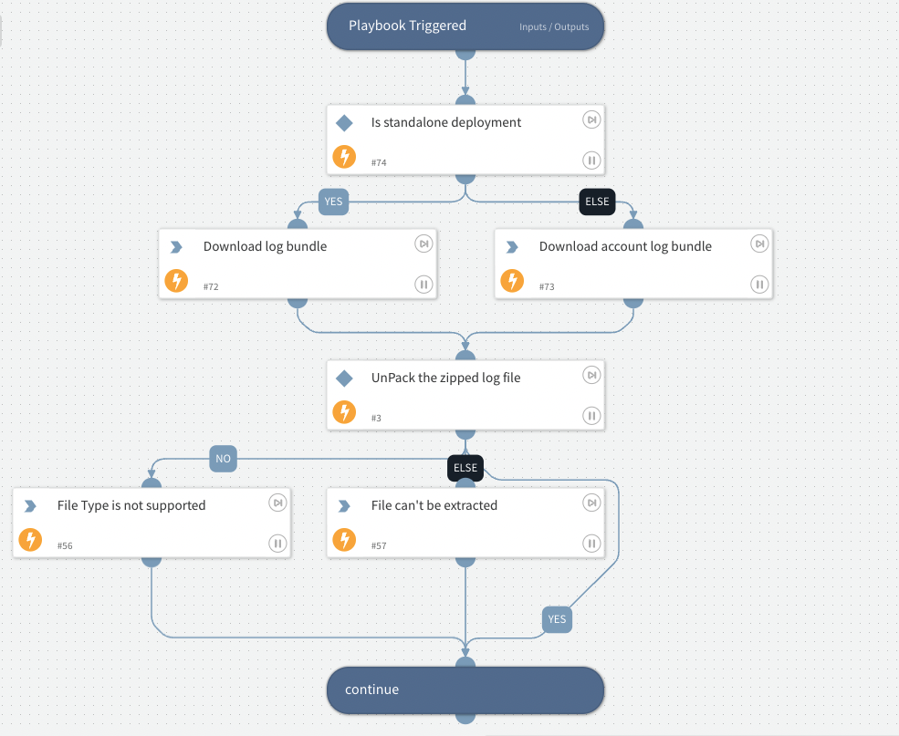

Collect Log bundle and parse data

Holding the default Thresholds:
{
	"LargeInvestigations": {
		"numberofincidentswithmorethan500entries": 300,
		"numberofincidentsbiggerthan10mb": 1,
		"numberofincidentsbiggerthan1mb": 300
	},
	"LargeInputsOutputs": {
		"numberofincidentsIObiggerthan10mb": 1,
		"numberofincidentsIObiggerthan1mb": 10
	},
	"Indicators": {
		"relatedIndicatorCount": 100
	},
	"CPU": {
		"CPUHighUsage": 90,
		"CPULowUsage": 30,
		"CPUMediumUsage": 70
	},
	"Disk": {
		"DiskUsageHigh": 90,
		"DiskUsageMedium": 80,
		"DiskUsageLow": 70,
		"DiskUsageDailyIncrease": 2
	},
	"Docker": {
		"DockerContainerCPUUsage": 10,
		"DockerContainerRAMUsage": 10
	},
	"DB": {
		"FSPartitionsMedium": 12,
		"FSPartitionsLow": 6
	},
	"Playbooks": {
		"CustomPlaybookLength": 30,
		"CustomPlaybookSetIncidentCount": 4,
		"CustomPlaybookDeprecatedScriptIds": [
			"Sleep",
			"EmailAskUser"
		]
	},
	"Incidents": {
		"NumberOfDroppedIncidents": 2000
	}
}

## Dependencies
This playbook uses the following sub-playbooks, integrations, and scripts.

### Sub-playbooks
This playbook does not use any sub-playbooks.

### Integrations
This playbook does not use any integrations.

### Scripts
* PrintErrorEntry
* HealthCheckUnpack

### Commands
* demisto-api-download

## Playbook Inputs
---
There are no inputs for this playbook.

## Playbook Outputs
---
There are no outputs for this playbook.

## Playbook Image
---

/Users/tzimmer/Documents/GitHub/content/Packs/HealthCheck/doc_files/HealthCheck-CollectLogBundle-pb.png