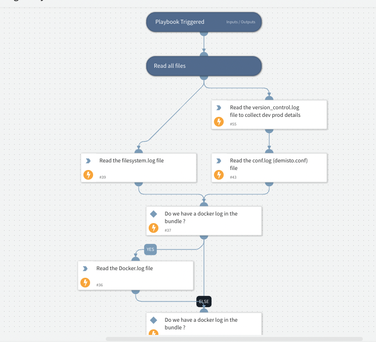

Parse files from log bundle output

## Dependencies
This playbook uses the following sub-playbooks, integrations, and scripts.

### Sub-playbooks
This playbook does not use any sub-playbooks.

### Integrations
This playbook does not use any integrations.

### Scripts
* HealthCheckPanicLog
* HealthCheckFileSystem
* HealthCheckReadVC
* HealthCheckReadConf
* HealthCheckDockerLog
* HealthCheckServerLog
* HealthCheckLicenseData
* HealthCheckReadTemeletryLog

### Commands
This playbook does not use any commands.

## Playbook Inputs
---

| **Name** | **Description** | **Default Value** | **Required** |
| --- | --- | --- | --- |
| LogFiles | Log bundle files |  | Optional |
| Health Check Thresholds |  | ${Health Check Thresholds} | Optional |

## Playbook Outputs
---

| **Path** | **Description** | **Type** |
| --- | --- | --- |
| HealthCheck.ActionableItems | Data read from war room file | unknown |

## Playbook Image
---
