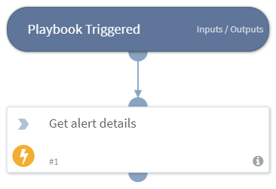

This is playbook that will handle the alerts coming from Hello World service

## Dependencies
This playbook uses the following sub-playbooks, integrations, and scripts.

### Sub-playbooks
This playbook does not use any sub-playbooks.

### Integrations
* HelloWorld

### Scripts
This playbook does not use any scripts.

### Commands
* helloworld-get-alert

## Playbook Inputs
---

| **Name** | **Description** | **Default Value** | **Source** | **Required** |
| --- | --- | --- | --- | --- |
| AlertID | Alert ID to retrieve details for. By default retrieves from the HelloWorld ID custom field in the HelloWorld incident type | ${incident.helloworldid} |  | Optional |

## Playbook Outputs
---
There are no outputs for this playbook.

