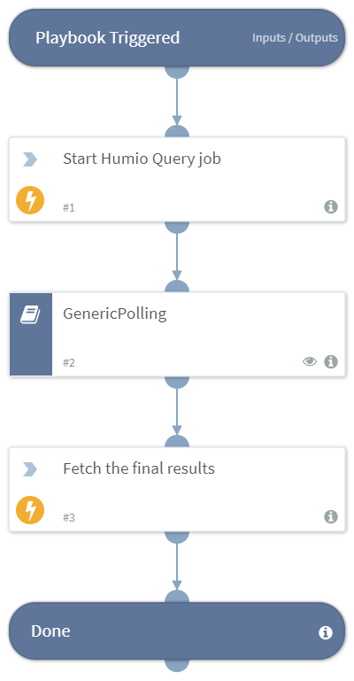

Run and poll a Humio Query Job

## Dependencies
This playbook uses the following sub-playbooks, integrations, and scripts.

### Sub-playbooks
* GenericPolling

### Integrations
* Humio

### Scripts
This playbook does not use any scripts.

### Commands
* humio-query-job
* humio-poll

## Playbook Inputs
---

| **Name** | **Description** | **Default Value** | **Required** |
| --- | --- | --- | --- |
| Query | The Humio Query to run |  | Required |
| Interval | The interval in minutes to poll the query job | 1 | Required |
| Timeout | The number of minutes before timing out | 10 | Required |
| Repository | The repository to query |  | Required |
| Start | The beginning of the interval to query | 24h | Optional |
| End | The end of the interval to query | now | Optional |
| timeZoneOffsetMinutes | The timezone offset in minutes between the XSOAR and Humio server \(usually 0\) | 0 | Optional |

## Playbook Outputs
---

| **Path** | **Description** | **Type** |
| --- | --- | --- |
| Humio.Result.cancelled | If it was cancelled | unknown |
| Humio.Result.events | Events in the poll | unknown |
| Humio.Result.done | If its done | unknown |
| Humio.Result.metaData | MetaData from the poll | unknown |
| Humio.Result.job_id | Humio Job id the results came from | unknown |

