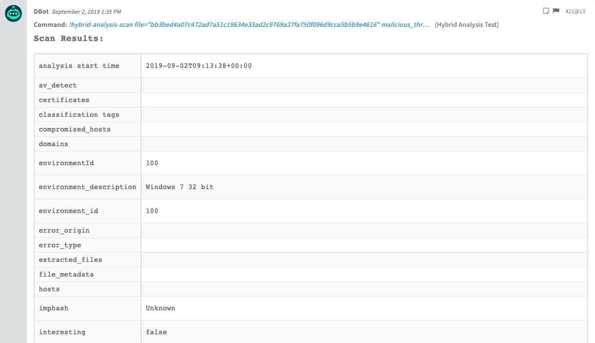
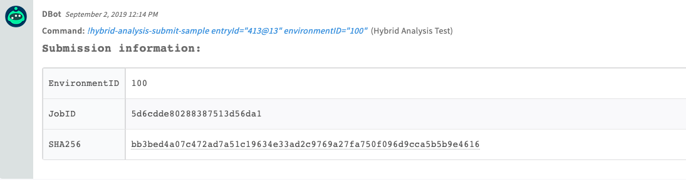
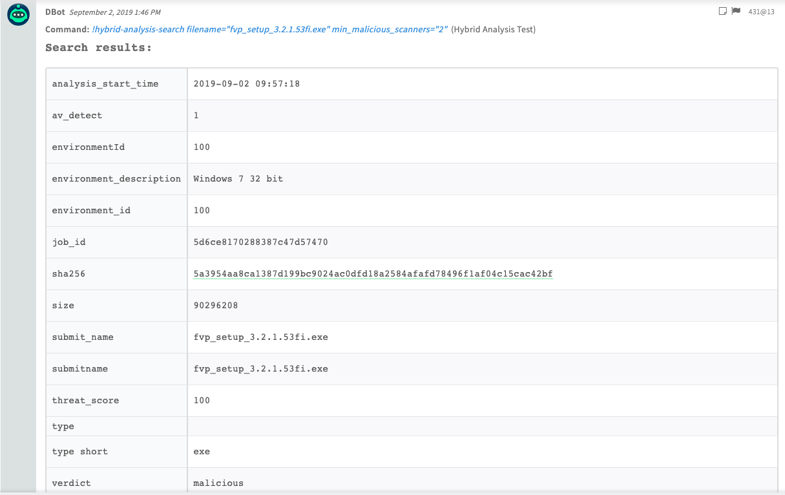
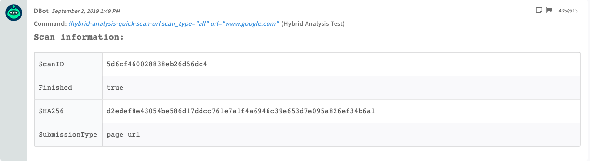
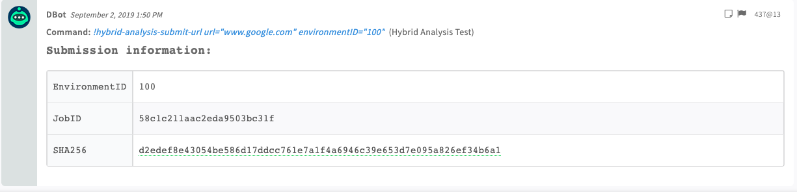
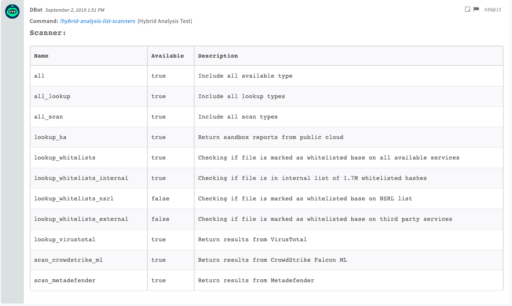
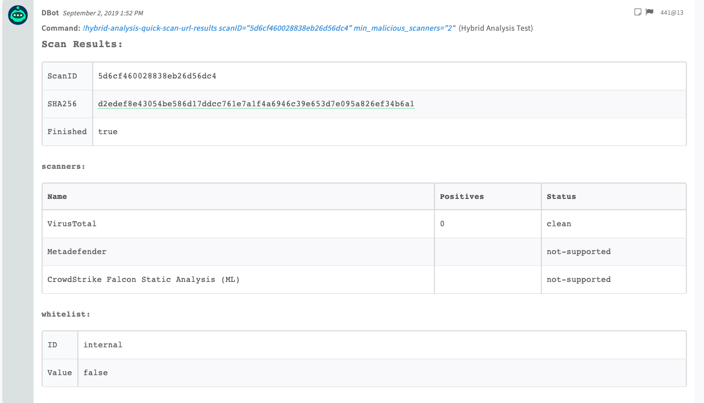

<!-- HTML_DOC -->

Deprecated. Use the CrowdStrike Falcon Sandbox v2 integration instead.

<h4>Supported File Types</h4>

The maximum file upload size is 100 MB.

<ul>
<li>PE (.exe, .scr, .pif, .dll, .com, .cpl, and so on)</li>
<li>Microsoft Word (.doc, .docx, .ppt, .pps, .pptx, .ppsx, .xls, .xlsx, .rtf, .pub)</li>
<li>PDF</li>
<li>APK</li>
<li>JAR executables</li>
<li>Windows Script Component (.sct)</li>
<li>Windows Shortcut (.lnk)</li>
<li>Windows Help (.chm)</li>
<li>HTML Application (.hta)</li>
<li>Windows Script File (*.wsf)</li>
<li>Javascript (.js)</li>
<li>Visual Basic (*.vbs, *.vbe)</li>
<li>Shockwave Flash (.swf)</li>
<li>Perl (.pl)</li>
<li>PowerShell (.ps1, .psd1, .psm1)</li>
<li>Scalable Vector Graphics (.svg)</li>
<li>Python scripts (.py)</li>
<li>Perl scripts (.pl)</li>
<li>Linux ELF executables</li>
<li>MIME RFC 822 (*.eml)</li>
<li>Outlook (*.msg files)</li>
</ul>
<h2>Configure the Hybrid Analysis Integration on Cortex XSOAR</h2>
<ol>
<li>Navigate to <strong>Settings</strong> &gt; <strong>Integrations</strong> &gt; <strong>Servers &amp; Services</strong>.</li>
<li>Search for Hybrid Analysis.</li>
<li>Click <strong>Add instance</strong> to create and configure a new integration instance. 
<ul>
<li>
<strong>Name</strong>: a textual name for the integration instance.</li>
<li>
<strong>Server URI</strong>: for example, <a href="https://216.128.82">https://216.128.82</a>
</li>
<li>
<strong>API Key</strong>: Cortex XSOAR creates an API key, <strong>do not</strong> populate this field.</li>
<li><strong>Secret Key (applicable for v1)</strong></li>
<li>
<strong>Do not validate server certificate</strong> (insecure)</li>
<li><strong>Use system proxy settings</strong></li>
</ul>
</li>
<li>Click <strong>Test</strong> to validate the URLs and token.</li>
</ol>
<h2>Use Cases</h2>
<ul>
<li>Submit sample files for analysis.</li>
<li>Get result data of sample files.</li>
<li>Search the Hybrid Analysis database.</li>
</ul>
<h2>Commands</h2>

You can execute these commands from the Cortex XSOAR CLI, as part of an automation, or in a playbook. After you successfully execute a command, a DBot message appears in the War Room with the command details.

<ol>
<li><a href="#h_c4334626-ced3-4767-9f87-cca1e07d9ac2" target="_self">Scan a file hash: hybrid-analysis-scan</a></li>
<li><a href="#h_b63c2c7b-06fb-4a46-bfdc-4061401623d0" target="_self">Submit a sample file: hybrid-analysis-submit-sample</a></li>
<li><a href="#h_45553fb5-7f23-4905-839d-fa242e830d28" target="_self">Search Hybrid Analysis: hybrid-analysis-search</a></li>
<li><a href="#h_325260ec-f4db-47f6-b291-4782f6f65ee8" target="_self">Detonate a file: hybrid-analysis-detonate-file</a></li>
<li><a href="#h_e627e260-765d-4440-a3e8-7ce54a366bd9" target="_self">Get the status of a file submission: hybrid-analysis-get-report-status</a></li>
<li><a href="#h_c99b2ecc-0e33-486e-810b-994ca2748cc6" target="_self">Submit a website or file URL for quick analysis: hybrid-analysis-quick-scan-url</a></li>
<li><a href="#h_074ce04d-a33f-4a8e-8d7b-70938f697c38" target="_self">Submit a website or file URL for analysis: hybrid-analysis-submit-url</a></li>
<li><a href="#h_f0b380e9-7a7a-45d4-8f38-6ea34f8a0dc5" target="_self">Get a list of scanners: hybrid-analysis-list-scanners</a></li>
<li><a href="#h_06b5e260-5d28-46ed-a407-2a3984deafc6" target="_self">Get scan results: hybrid-analysis-quick-scan-url-results</a></li>
</ol>
<h3 id="h_c4334626-ced3-4767-9f87-cca1e07d9ac2">1. Scan a file hash</h3>

Returns summary information for a given MD5, SHA1 or SHA256 hash, and all reports generated for any environment ID.

<h5>Base Command</h5>

<code>hybrid-analysis-scan</code>

<h5>Input</h5>
<table style="width: 748px;" border="2" cellpadding="6">
<thead>
<tr>
<th style="width: 173px;"><strong>Argument Name</strong></th>
<th style="width: 461px;"><strong>Description</strong></th>
<th style="width: 74px;"><strong>Required</strong></th>
</tr>
</thead>
<tbody>
<tr>
<td style="width: 173px;">file</td>
<td style="width: 461px;">The MD5, SHA1, or SHA256 hash of the file.</td>
<td style="width: 74px;">Required</td>
</tr>
<tr>
<td style="width: 173px;">malicious_threat_levels</td>
<td style="width: 461px;">Threat level values, which will determine if the file is malicious.</td>
<td style="width: 74px;">Optional</td>
</tr>
</tbody>
</table>

 

<h5>Context Output</h5>
<table style="width: 748px;" border="2" cellpadding="6">
<thead>
<tr>
<th style="width: 223px;"><strong>Path</strong></th>
<th style="width: 51px;"><strong>Type</strong></th>
<th style="width: 434px;"><strong>Description</strong></th>
</tr>
</thead>
<tbody>
<tr>
<td style="width: 223px;">File.SHA256</td>
<td style="width: 51px;">string</td>
<td style="width: 434px;">SHA256 hash of the file.</td>
</tr>
<tr>
<td style="width: 223px;">File.SHA1</td>
<td style="width: 51px;">string</td>
<td style="width: 434px;">SHA1 hash of the file.</td>
</tr>
<tr>
<td style="width: 223px;">File.MD5</td>
<td style="width: 51px;">string</td>
<td style="width: 434px;">MD5 hash of the file.</td>
</tr>
<tr>
<td style="width: 223px;">File.environmentId</td>
<td style="width: 51px;">string</td>
<td style="width: 434px;">The environment ID of the file.</td>
</tr>
<tr>
<td style="width: 223px;">File.analysis_start_time</td>
<td style="width: 51px;">string</td>
<td style="width: 434px;">The start time of the file analysis.</td>
</tr>
<tr>
<td style="width: 223px;">File.submitname</td>
<td style="width: 51px;">string</td>
<td style="width: 434px;">The submission name of the file.</td>
</tr>
<tr>
<td style="width: 223px;">File.classification_tags</td>
<td style="width: 51px;">string</td>
<td style="width: 434px;">A list of classification tags of the file.</td>
</tr>
<tr>
<td style="width: 223px;">File.vxfamily</td>
<td style="width: 51px;">string</td>
<td style="width: 434px;">The family classification of the file.</td>
</tr>
<tr>
<td style="width: 223px;">File.total_network_connections</td>
<td style="width: 51px;">string</td>
<td style="width: 434px;">The total number of network connections of the file.</td>
</tr>
<tr>
<td style="width: 223px;">File.total_processes</td>
<td style="width: 51px;">string</td>
<td style="width: 434px;">The total processes count of the file.</td>
</tr>
<tr>
<td style="width: 223px;">File.total_signatures</td>
<td style="width: 51px;">string</td>
<td style="width: 434px;">The total signatures count of the file.</td>
</tr>
<tr>
<td style="width: 223px;">File.hosts</td>
<td style="width: 51px;">string</td>
<td style="width: 434px;">A list of hosts of the file.</td>
</tr>
<tr>
<td style="width: 223px;">File.isinteresting</td>
<td style="width: 51px;">string</td>
<td style="width: 434px;">Whether the server found the file interesting.</td>
</tr>
<tr>
<td style="width: 223px;">File.domains</td>
<td style="width: 51px;">string</td>
<td style="width: 434px;">A list of domains related to the file.</td>
</tr>
<tr>
<td style="width: 223px;">File.isurlanalysis</td>
<td style="width: 51px;">string</td>
<td style="width: 434px;">Whether the file was analyzed by a URL.</td>
</tr>
<tr>
<td style="width: 223px;">File.Malicious.Vendor</td>
<td style="width: 51px;">string</td>
<td style="width: 434px;">For malicious files, the vendor that made the decision.</td>
</tr>
<tr>
<td style="width: 223px;">File.Malicious.Description</td>
<td style="width: 51px;">string</td>
<td style="width: 434px;">For malicious files, the reason that the vendor made the decision.</td>
</tr>
<tr>
<td style="width: 223px;">DBotScore.Indicator</td>
<td style="width: 51px;">string</td>
<td style="width: 434px;">The indicator.</td>
</tr>
<tr>
<td style="width: 223px;">DBotScore.Type</td>
<td style="width: 51px;">string</td>
<td style="width: 434px;">The indicator type.</td>
</tr>
<tr>
<td style="width: 223px;">DBotScore.Vendor</td>
<td style="width: 51px;">string</td>
<td style="width: 434px;">The DBot score vendor.</td>
</tr>
<tr>
<td style="width: 223px;">DBotScore.Score</td>
<td style="width: 51px;">number</td>
<td style="width: 434px;">The DBot score.</td>
</tr>
</tbody>
</table>

 

<h5>Command Example</h5>
<pre> !hybrid-analysis-scan file=bb3bed4a07c472ad7a51c19634e33ad2c9769a27fa750f096d9cca5b5b9e4616</pre>
<h5>Human Readable Output</h5>

<h3 id="h_b63c2c7b-06fb-4a46-bfdc-4061401623d0">2. Submit a file sample</h3>

Submits a file from the investigation to the analysis server. The minimum required authorization is "default".

<h5>Base Command</h5>

<code>hybrid-analysis-submit-sample</code>

<h5>Input</h5>
<table style="width: 748px;" border="2" cellpadding="6">
<thead>
<tr>
<th style="width: 140px;"><strong>Argument Name</strong></th>
<th style="width: 497px;"><strong>Description</strong></th>
<th style="width: 71px;"><strong>Required</strong></th>
</tr>
</thead>
<tbody>
<tr>
<td style="width: 140px;">entryId</td>
<td style="width: 497px;">The War Room entry ID of the sample file.</td>
<td style="width: 71px;">Required</td>
</tr>
<tr>
<td style="width: 140px;">environmentID</td>
<td style="width: 497px;">The environment ID to which to submit the file. Run the vx-get-environments command to get all environment IDs.</td>
<td style="width: 71px;">Required</td>
</tr>
</tbody>
</table>

 

<h5>Context Output</h5>
<table style="width: 748px;" border="2" cellpadding="6">
<thead>
<tr>
<th style="width: 330px;"><strong>Path</strong></th>
<th style="width: 45px;"><strong>Type</strong></th>
<th style="width: 333px;"><strong>Description</strong></th>
</tr>
</thead>
<tbody>
<tr>
<td style="width: 330px;">HybridAnalysis.Submit.JobID</td>
<td style="width: 45px;">string</td>
<td style="width: 333px;">JobID of the submission.</td>
</tr>
<tr>
<td style="width: 330px;">HybridAnalysis.Submit.SHA256</td>
<td style="width: 45px;">string</td>
<td style="width: 333px;">The SHA256 hash of the submission.</td>
</tr>
<tr>
<td style="width: 330px;">HybridAnalysis.Submit.EnvironmentID</td>
<td style="width: 45px;">string</td>
<td style="width: 333px;">The environment ID of the submission.</td>
</tr>
</tbody>
</table>

 

<h5>Command Example</h5>
<pre> !hybrid-analysis-submit-sample entryId=413@13 environmentID=100</pre>
<h5>Human Readable Output</h5>

 

<h3 id="h_45553fb5-7f23-4905-839d-fa242e830d28">3. Search Hybrid Analysis</h3>

Performs a search on the database using the Hybrid Analysis search syntax.

<h5>Base Command</h5>

<code>hybrid-analysis-search</code>

<h5>Input</h5>
<table style="width: 748px;" border="2" cellpadding="6">
<thead>
<tr>
<th style="width: 174px;"><strong>Argument Name</strong></th>
<th style="width: 463px;"><strong>Description</strong></th>
<th style="width: 71px;"><strong>Required</strong></th>
</tr>
</thead>
<tbody>
<tr>
<td style="width: 174px;">query</td>
<td style="width: 463px;">The query to run, in the Hybrid Analysis query syntax. For more information, see `/faq#advanced-search-options`. For example: url:google, host:95.181.53.78.</td>
<td style="width: 71px;">Optional</td>
</tr>
<tr>
<td style="width: 174px;">filename</td>
<td style="width: 463px;">The full file name, including the file extension.</td>
<td style="width: 71px;">Optional</td>
</tr>
<tr>
<td style="width: 174px;">filetype</td>
<td style="width: 463px;">Filetype e.g. docx</td>
<td style="width: 71px;">Optional</td>
</tr>
<tr>
<td style="width: 174px;">filetype_desc</td>
<td style="width: 463px;">A description of the file type, for example, PE32 executable.</td>
<td style="width: 71px;">Optional</td>
</tr>
<tr>
<td style="width: 174px;">env_id</td>
<td style="width: 463px;">The environment ID.</td>
<td style="width: 71px;">Optional</td>
</tr>
<tr>
<td style="width: 174px;">country</td>
<td style="width: 463px;">The ISO code of the country by which to filter results, for example: swe.</td>
<td style="width: 71px;">Optional</td>
</tr>
<tr>
<td style="width: 174px;">verdict</td>
<td style="width: 463px;">The verdict by which to filter results. Can be "1- whitelisted", "2- no verdict", "3- "no specific threat", "4- suspicious", or "5- malicious".</td>
<td style="width: 71px;">Optional</td>
</tr>
<tr>
<td style="width: 174px;">av_detect</td>
<td style="width: 463px;">The AV multi-scan range (0-100) by which to filter results, for example: "50-70".</td>
<td style="width: 71px;">Optional</td>
</tr>
<tr>
<td style="width: 174px;">vx_family</td>
<td style="width: 463px;">The AV family substring by which to filter results, for example: "nemucod".</td>
<td style="width: 71px;">Optional</td>
</tr>
<tr>
<td style="width: 174px;">tag</td>
<td style="width: 463px;">The hashtag by which to filter results, for example: "ransomware".</td>
<td style="width: 71px;">Optional</td>
</tr>
<tr>
<td style="width: 174px;">port</td>
<td style="width: 463px;">The port by which to filter results.</td>
<td style="width: 71px;">Optional</td>
</tr>
<tr>
<td style="width: 174px;">host</td>
<td style="width: 463px;">The host (IP address) by which to filter results.</td>
<td style="width: 71px;">Optional</td>
</tr>
<tr>
<td style="width: 174px;">domain</td>
<td style="width: 463px;">The domain by which to filter results.</td>
<td style="width: 71px;">Optional</td>
</tr>
<tr>
<td style="width: 174px;">url</td>
<td style="width: 463px;">The HTTP request substring by which to filter results.</td>
<td style="width: 71px;">Optional</td>
</tr>
<tr>
<td style="width: 174px;">similar_to</td>
<td style="width: 463px;">Similar samples, for example: .</td>
<td style="width: 71px;">Optional</td>
</tr>
<tr>
<td style="width: 174px;">context</td>
<td style="width: 463px;">Sample context, for example: .</td>
<td style="width: 71px;">Optional</td>
</tr>
<tr>
<td style="width: 174px;">imp_hash</td>
<td style="width: 463px;">The import hash.</td>
<td style="width: 71px;">Optional</td>
</tr>
<tr>
<td style="width: 174px;">ssdeep</td>
<td style="width: 463px;">The ssdeep hash.</td>
<td style="width: 71px;">Optional</td>
</tr>
<tr>
<td style="width: 174px;">authentihash</td>
<td style="width: 463px;">The authentication hash.</td>
<td style="width: 71px;">Optional</td>
</tr>
<tr>
<td style="width: 174px;">min_malicious_scanners</td>
<td style="width: 463px;">The number of scanners that report the file as malicious to determine whether the file is malicious. Default is "2".</td>
<td style="width: 71px;">Optional</td>
</tr>
</tbody>
</table>

 

<h5>Context Output</h5>
<table style="width: 748px;" border="2" cellpadding="6">
<thead>
<tr>
<th style="width: 333px;"><strong>Path</strong></th>
<th style="width: 61px;"><strong>Type</strong></th>
<th style="width: 314px;"><strong>Description</strong></th>
</tr>
</thead>
<tbody>
<tr>
<td style="width: 333px;">HybridAnalysis.Search.SHA256</td>
<td style="width: 61px;">string</td>
<td style="width: 314px;">The SHA256 hash of the search result.</td>
</tr>
<tr>
<td style="width: 333px;">HybridAnalysis.Search.SHA1</td>
<td style="width: 61px;">string</td>
<td style="width: 314px;">The SHA1 hash of the search result.</td>
</tr>
<tr>
<td style="width: 333px;">HybridAnalysis.Search.MD5</td>
<td style="width: 61px;">string</td>
<td style="width: 314px;">The MD5 hash of the search result.</td>
</tr>
<tr>
<td style="width: 333px;">HybridAnalysis.Search.environmentId</td>
<td style="width: 61px;">string</td>
<td style="width: 314px;">The environment ID of the search result.</td>
</tr>
<tr>
<td style="width: 333px;">HybridAnalysis.Search.start_time</td>
<td style="width: 61px;">date</td>
<td style="width: 314px;">The start time of the search result.</td>
</tr>
<tr>
<td style="width: 333px;">HybridAnalysis.Search.threatscore</td>
<td style="width: 61px;">string</td>
<td style="width: 314px;">The threat score of the search result, by server.</td>
</tr>
<tr>
<td style="width: 333px;">HybridAnalysis.Search.verdict</td>
<td style="width: 61px;">string</td>
<td style="width: 314px;">The verdict of the search result.</td>
</tr>
<tr>
<td style="width: 333px;">HybridAnalysis.Search.environmentDescription</td>
<td style="width: 61px;">string</td>
<td style="width: 314px;">The environment description of search result.</td>
</tr>
<tr>
<td style="width: 333px;">HybridAnalysis.Search.submitname</td>
<td style="width: 61px;">string</td>
<td style="width: 314px;">The submission name of the search result.</td>
</tr>
<tr>
<td style="width: 333px;">HybridAnalysis.Search.vxfamily</td>
<td style="width: 61px;">string</td>
<td style="width: 314px;">The family of search result.</td>
</tr>
<tr>
<td style="width: 333px;">HybridAnalysis.Search.threatscore</td>
<td style="width: 61px;">string</td>
<td style="width: 314px;">The threat score of the search result.</td>
</tr>
<tr>
<td style="width: 333px;">HybridAnalysis.Search.type_short</td>
<td style="width: 61px;">string</td>
<td style="width: 314px;">The type of search result, for example: "url" or "host".</td>
</tr>
<tr>
<td style="width: 333px;">HybridAnalysis.Search.size</td>
<td style="width: 61px;">number</td>
<td style="width: 314px;">The size of the search result.</td>
</tr>
<tr>
<td style="width: 333px;">File.Malicious.Vendor</td>
<td style="width: 61px;">string</td>
<td style="width: 314px;">For malicious files, the vendor that made the decision.</td>
</tr>
<tr>
<td style="width: 333px;">File.Malicious.Description</td>
<td style="width: 61px;">string</td>
<td style="width: 314px;">For malicious files, the reason that the vendor made the decision.</td>
</tr>
<tr>
<td style="width: 333px;">DBotScore.Indicator</td>
<td style="width: 61px;">unknown</td>
<td style="width: 314px;">The indicator.</td>
</tr>
<tr>
<td style="width: 333px;">DBotScore.Type</td>
<td style="width: 61px;">unknown</td>
<td style="width: 314px;">The indicator type.</td>
</tr>
<tr>
<td style="width: 333px;">DBotScore.Vendor</td>
<td style="width: 61px;">unknown</td>
<td style="width: 314px;">The DBotScore vendor.</td>
</tr>
<tr>
<td style="width: 333px;">DBotScore.Score</td>
<td style="width: 61px;">unknown</td>
<td style="width: 314px;">The DBot score.</td>
</tr>
</tbody>
</table>

 

<h5>Command Example</h5>
<pre> !hybrid-analysis-search filename=fvp_setup_3.2.1.53fi.exe min_malicious_scanners=2</pre>
<h5>Human Readable Output</h5>

<h3 id="h_325260ec-f4db-47f6-b291-4782f6f65ee8">4. Detonate a file</h3>

Submits a file for detonation in Hybrid Analysis.

<h5>Base Command</h5>

<code>hybrid-analysis-detonate-file</code>

<h5>Input</h5>
<table style="width: 748px;" border="2" cellpadding="6">
<thead>
<tr>
<th style="width: 143px;"><strong>Argument Name</strong></th>
<th style="width: 494px;"><strong>Description</strong></th>
<th style="width: 71px;"><strong>Required</strong></th>
</tr>
</thead>
<tbody>
<tr>
<td style="width: 143px;">entryId</td>
<td style="width: 494px;">The War Room entry ID of the sample file you want to detonate.</td>
<td style="width: 71px;">Required</td>
</tr>
<tr>
<td style="width: 143px;">environmentID</td>
<td style="width: 494px;">The environment ID to which to submit the file for detonation. Run the vx-get-environments command to get all environment IDs. Default is 100, or other WINDOWS ID.</td>
<td style="width: 71px;">Optional</td>
</tr>
<tr>
<td style="width: 143px;">delay</td>
<td style="width: 494px;">The amount of time (in seconds) to wait between calls. Default is "3".</td>
<td style="width: 71px;">Optional</td>
</tr>
<tr>
<td style="width: 143px;">timeout</td>
<td style="width: 494px;">The total wait time (in seconds) before timeout. Default is "60".</td>
<td style="width: 71px;">Optional</td>
</tr>
<tr>
<td style="width: 143px;">malicious_threat_levels</td>
<td style="width: 494px;">A comma separated list of threat level values. Files that have a threat level  specified in the list will be considered malicious.</td>
<td style="width: 71px;">Optional</td>
</tr>
</tbody>
</table>

 

<h5>Context Output</h5>
<table style="width: 748px;" border="2" cellpadding="6">
<tbody>
<tr>
<th style="width: 274px;"><strong>Path</strong></th>
<th style="width: 58px;"><strong>Type</strong></th>
<th style="width: 376px;"><strong>Description</strong></th>
</tr>
<tr>
<td style="width: 274px;">File.SHA256</td>
<td style="width: 58px;">string</td>
<td style="width: 376px;">The SHA256 hash of the file.</td>
</tr>
<tr>
<td style="width: 274px;">File.SHA1</td>
<td style="width: 58px;">string</td>
<td style="width: 376px;">The SHA1 hash of the file.</td>
</tr>
<tr>
<td style="width: 274px;">File.MD5</td>
<td style="width: 58px;">string</td>
<td style="width: 376px;">The MD5 of the file.</td>
</tr>
<tr>
<td style="width: 274px;">File.environmentalId</td>
<td style="width: 58px;">string</td>
<td style="width: 376px;">The environmental ID of the file.</td>
</tr>
<tr>
<td style="width: 274px;">
 File.analysis_start_time
</td>
<td style="width: 58px;">string</td>
<td style="width: 376px;">The start time of the file.</td>
</tr>
<tr>
<td style="width: 274px;">File.submitname</td>
<td style="width: 58px;">string</td>
<td style="width: 376px;">The submission name of the file.</td>
</tr>
<tr>
<td style="width: 274px;">File.classification_tags</td>
<td style="width: 58px;">string</td>
<td style="width: 376px;">A list of classification tags of the file.</td>
</tr>
<tr>
<td style="width: 274px;"> File.vxfamily</td>
<td style="width: 58px;">string</td>
<td style="width: 376px;">The family classification of the file.</td>
</tr>
<tr>
<td style="width: 274px;">File.total_network_connections</td>
<td style="width: 58px;">string</td>
<td style="width: 376px;">The total number of network connections of the file.</td>
</tr>
<tr>
<td style="width: 274px;"> File.total_processes</td>
<td style="width: 58px;">string</td>
<td style="width: 376px;">The total processes count of the file.</td>
</tr>
<tr>
<td style="width: 274px;"> File.total_signatures</td>
<td style="width: 58px;">string</td>
<td style="width: 376px;">The total signatures count of the file.</td>
</tr>
<tr>
<td style="width: 274px;">File.hosts</td>
<td style="width: 58px;">string</td>
<td style="width: 376px;">A list of hosts of the file.</td>
</tr>
<tr>
<td style="width: 274px;">File.isinteresting</td>
<td style="width: 58px;">string</td>
<td style="width: 376px;">Whether the server found the file interesting.</td>
</tr>
<tr>
<td style="width: 274px;">File.domains</td>
<td style="width: 58px;">string</td>
<td style="width: 376px;">A list of domains related to the file.</td>
</tr>
<tr>
<td style="width: 274px;">File.isurlanalysis</td>
<td style="width: 58px;">string</td>
<td style="width: 376px;"> Whether the file was analyzed by a URL.</td>
</tr>
<tr>
<td style="width: 274px;">File.Malicious.Vendor</td>
<td style="width: 58px;">string</td>
<td style="width: 376px;">For malicious files, the vendor that made the decision.</td>
</tr>
<tr>
<td style="width: 274px;">File.Malicious.Description</td>
<td style="width: 58px;">string</td>
<td style="width: 376px;">For malicious files, the reason that the vendor made the decision.</td>
</tr>
<tr>
<td style="width: 274px;">DBotScore.Indicator</td>
<td style="width: 58px;">string</td>
<td style="width: 376px;">The indicator.</td>
</tr>
<tr>
<td style="width: 274px;">DBotScore.Type</td>
<td style="width: 58px;">string</td>
<td style="width: 376px;">The indicator type.</td>
</tr>
<tr>
<td style="width: 274px;"> DBotScore.Vendor</td>
<td style="width: 58px;">string</td>
<td style="width: 376px;">The DBot score vendor.</td>
</tr>
<tr>
<td style="width: 274px;">DBotScore.Score</td>
<td style="width: 58px;">number</td>
<td style="width: 376px;">The DBot score.</td>
</tr>
</tbody>
</table>

 

<h3 id="h_e627e260-765d-4440-a3e8-7ce54a366bd9">5. Get the status of a file submission</h3>

Returns the state of the file submission.

<h5>Base Command</h5>

<code>hybrid-analysis-get-report-status</code>

<h5>Input</h5>
<table style="width: 748px;" border="2" cellpadding="6">
<tbody>
<tr>
<th style="width: 143px;"><strong>Argument Name</strong></th>
<th style="width: 494px;"><strong>Description</strong></th>
<th style="width: 71px;"><strong>Required</strong></th>
</tr>
<tr>
<td style="width: 143px;">jobID</td>
<td style="width: 494px;">The job ID of the submission.</td>
<td style="width: 71px;">Optional</td>
</tr>
<tr>
<td style="width: 143px;">sha256</td>
<td style="width: 494px;">The submission SHA256.</td>
<td style="width: 71px;">Optional</td>
</tr>
<tr>
<td style="width: 143px;">environmentID</td>
<td style="width: 494px;">The environment ID of the submission.</td>
<td style="width: 71px;">Optional</td>
</tr>
</tbody>
</table>
<h5> </h5>
<h5>Context Output</h5>
<table style="width: 748px;" border="2" cellpadding="6">
<thead>
<tr>
<th style="width: 320px;"><strong>Path</strong></th>
<th style="width: 55px;"><strong>Type</strong></th>
<th style="width: 333px;"><strong>Description</strong></th>
</tr>
</thead>
<tbody>
<tr>
<td style="width: 320px;">HybridAnalysis.Submit.State</td>
<td style="width: 55px;">string</td>
<td style="width: 333px;">The state of the process.</td>
</tr>
<tr>
<td style="width: 320px;">HybridAnalysis.Submit.SHA256</td>
<td style="width: 55px;">string</td>
<td style="width: 333px;">The SHA256 hash of the submission.</td>
</tr>
<tr>
<td style="width: 320px;">HybridAnalysis.Submit.JobID</td>
<td style="width: 55px;">string</td>
<td style="width: 333px;">The job ID of the submission.</td>
</tr>
<tr>
<td style="width: 320px;">HybridAnalysis.Submit.EnvironmentID</td>
<td style="width: 55px;">string</td>
<td style="width: 333px;">The environment ID of the submission.</td>
</tr>
</tbody>
</table>

 

<h3 id="h_c99b2ecc-0e33-486e-810b-994ca2748cc6">6. Submit a website or file URL for quick analysis</h3>

Submits the URL of a website, or the URL that contains the file, for analysis.

<h5>Base Command</h5>

<code>hybrid-analysis-quick-scan-url</code>

<h5>Input</h5>
<table style="width: 746px;" border="2" cellpadding="6">
<thead>
<tr>
<th style="width: 134px;"><strong>Argument Name</strong></th>
<th style="width: 503px;"><strong>Description</strong></th>
<th style="width: 71px;"><strong>Required</strong></th>
</tr>
</thead>
<tbody>
<tr>
<td style="width: 134px;">scan_type</td>
<td style="width: 503px;">The type of scan. Run the hybrid-analysis-list-scanners command to view available scanners.</td>
<td style="width: 71px;">Optional</td>
</tr>
<tr>
<td style="width: 134px;">url</td>
<td style="width: 503px;">The website URL, or the URL that contains the file to submit.</td>
<td style="width: 71px;">Required</td>
</tr>
</tbody>
</table>

 

<h5>Context Output</h5>
<table style="width: 748px;" border="2" cellpadding="6">
<thead>
<tr>
<th style="width: 274px;"><strong>Path</strong></th>
<th style="width: 58px;"><strong>Type</strong></th>
<th style="width: 376px;"><strong>Description</strong></th>
</tr>
</thead>
<tbody>
<tr>
<td style="width: 274px;">HybridAnalysis.URL.Data</td>
<td style="width: 58px;">string</td>
<td style="width: 376px;">The URL.</td>
</tr>
<tr>
<td style="width: 274px;">HybridAnalysis.URL.ScanID</td>
<td style="width: 58px;">string</td>
<td style="width: 376px;">The scan ID.</td>
</tr>
<tr>
<td style="width: 274px;">HybridAnalysis.URL.SHA256</td>
<td style="width: 58px;">string</td>
<td style="width: 376px;">The SHA256 hash of the URL.</td>
</tr>
<tr>
<td style="width: 274px;">HybridAnalysis.URL.Finished</td>
<td style="width: 58px;">boolean</td>
<td style="width: 376px;">Whether the scan completed.</td>
</tr>
<tr>
<td style="width: 274px;">File.Name</td>
<td style="width: 58px;">string</td>
<td style="width: 376px;">The URL.</td>
</tr>
<tr>
<td style="width: 274px;">File.SHA256</td>
<td style="width: 58px;">string</td>
<td style="width: 376px;">The SHA256 hash of the file.</td>
</tr>
<tr>
<td style="width: 274px;">HybridAnalysis.URL.SubmissionType</td>
<td style="width: 58px;">string</td>
<td style="width: 376px;">The type of the submission. Can be "file" or "url".</td>
</tr>
</tbody>
</table>

 

<h5>Command Example</h5>
<pre> !hybrid-analysis-quick-scan-url url=www.google.com</pre>
<h5>Human Readable Output</h5>

<h3 id="h_074ce04d-a33f-4a8e-8d7b-70938f697c38">7. Submit a website or file URL for analysis</h3>

Submits the URL of a website or the URL that contains the file, for analysis.

<h5>Base Command</h5>

<code>hybrid-analysis-submit-url</code>

<h5>Input</h5>
<table style="width: 748px;" border="2" cellpadding="6">
<thead>
<tr>
<th style="width: 143px;"><strong>Argument Name</strong></th>
<th style="width: 494px;"><strong>Description</strong></th>
<th style="width: 71px;"><strong>Required</strong></th>
</tr>
</thead>
<tbody>
<tr>
<td style="width: 143px;">url</td>
<td style="width: 494px;">The URL of the file to submit.</td>
<td style="width: 71px;">Required</td>
</tr>
<tr>
<td style="width: 143px;">environmentID</td>
<td style="width: 494px;">The environment ID to which to submit the file. Run the vx-get-environments command to get all environment IDs.</td>
<td style="width: 71px;">Required</td>
</tr>
</tbody>
</table>

 

<h5>Context Output</h5>
<table style="width: 748px;" border="2" cellpadding="6">
<thead>
<tr>
<th style="width: 297px;"><strong>Path</strong></th>
<th style="width: 47px;"><strong>Type</strong></th>
<th style="width: 364px;"><strong>Description</strong></th>
</tr>
</thead>
<tbody>
<tr>
<td style="width: 297px;">HybridAnalysis.Submit.JobID</td>
<td style="width: 47px;">string</td>
<td style="width: 364px;">The job ID of the submission.</td>
</tr>
<tr>
<td style="width: 297px;">HybridAnalysis.Submit.SHA256</td>
<td style="width: 47px;">string</td>
<td style="width: 364px;">The SHA256 of the submission.</td>
</tr>
<tr>
<td style="width: 297px;">HybridAnalysis.Submit.EnvironmentID</td>
<td style="width: 47px;">number</td>
<td style="width: 364px;">The environment ID of the submission.</td>
</tr>
<tr>
<td style="width: 297px;">HybridAnalysis.Submit.SubmissionType</td>
<td style="width: 47px;">string</td>
<td style="width: 364px;">The type of the submission. Can be "file" or "url".</td>
</tr>
</tbody>
</table>

 

<h5>Command Example</h5>
<pre>!hybrid-analysis-submit-url environmentID=100 url=www.google.com</pre>
<h5>Human Readable Output</h5>

<h3 id="h_f0b380e9-7a7a-45d4-8f38-6ea34f8a0dc5">8. Get a list of scanners</h3>

Returns a list of available scanners.

<h5>Base Command</h5>

<code>hybrid-analysis-list-scanners</code>

<h5>Input</h5>

 There are no input arguments for this command.

<h5>Context Output</h5>
<table style="width: 748px;" border="2" cellpadding="6">
<thead>
<tr>
<th style="width: 324px;"><strong>Path</strong></th>
<th style="width: 79px;"><strong>Type</strong></th>
<th style="width: 305px;"><strong>Description</strong></th>
</tr>
</thead>
<tbody>
<tr>
<td style="width: 324px;">HybridAnalysis.Scanner.Available</td>
<td style="width: 79px;">unknown</td>
<td style="width: 305px;">Whether the scanner is available.</td>
</tr>
<tr>
<td style="width: 324px;">HybridAnalysis.Scanner.Name</td>
<td style="width: 79px;">unknown</td>
<td style="width: 305px;">The scanner name.</td>
</tr>
<tr>
<td style="width: 324px;">HybridAnalysis.Scanner.Description</td>
<td style="width: 79px;">unknown</td>
<td style="width: 305px;">The scanner description.</td>
</tr>
</tbody>
</table>

 

<h5>Command Example</h5>
<pre> !hybrid-analysis-list-scanners</pre>
<h5>Human Readable Output</h5>

<h3 id="h_06b5e260-5d28-46ed-a407-2a3984deafc6">9. Get scan results</h3>

Returns the scan results of the given URL ID.

<h5>Base Command</h5>

<code>hybrid-analysis-quick-scan-url-results</code>

<h5>Input</h5>
<table style="width: 748px;" border="2" cellpadding="6">
<thead>
<tr>
<th style="width: 177px;"><strong>Argument Name</strong></th>
<th style="width: 460px;"><strong>Description</strong></th>
<th style="width: 71px;"><strong>Required</strong></th>
</tr>
</thead>
<tbody>
<tr>
<td style="width: 177px;">scanID</td>
<td style="width: 460px;">The scan ID of the scanned URL.</td>
<td style="width: 71px;">Required</td>
</tr>
<tr>
<td style="width: 177px;">min_malicious_scanners</td>
<td style="width: 460px;">The number of scanners that report the file as malicious to determine whether the file is malicious. Default is "2".</td>
<td style="width: 71px;">Optional</td>
</tr>
</tbody>
</table>

 

<h5>Context Output</h5>
<table style="width: 748px;" border="2" cellpadding="6">
<thead>
<tr>
<th style="width: 311px;"><strong>Path</strong></th>
<th style="width: 61px;"><strong>Type</strong></th>
<th style="width: 336px;"><strong>Description</strong></th>
</tr>
</thead>
<tbody>
<tr>
<td style="width: 311px;">HybridAnalysis.URL.ScanID</td>
<td style="width: 61px;">string</td>
<td style="width: 336px;">The scan ID.</td>
</tr>
<tr>
<td style="width: 311px;">HybridAnalysis.URL.SHA256</td>
<td style="width: 61px;">string</td>
<td style="width: 336px;">The SHA256 hash of the indicator.</td>
</tr>
<tr>
<td style="width: 311px;">HybridAnalysis.URL.Finished</td>
<td style="width: 61px;">boolean</td>
<td style="width: 336px;">Whether the process completed.</td>
</tr>
<tr>
<td style="width: 311px;">HybridAnalysis.URL.Scanner.Name</td>
<td style="width: 61px;">string</td>
<td style="width: 336px;">The scanner name.</td>
</tr>
<tr>
<td style="width: 311px;">HybridAnalysis.URL.Scanner.Positives</td>
<td style="width: 61px;">number</td>
<td style="width: 336px;">The number of positive results.</td>
</tr>
<tr>
<td style="width: 311px;">HybridAnalysis.URL.Scanner.Status</td>
<td style="width: 61px;">string</td>
<td style="width: 336px;">The status of the file.</td>
</tr>
<tr>
<td style="width: 311px;">HybridAnalysis.URL.Whitelist.ID</td>
<td style="width: 61px;">string</td>
<td style="width: 336px;">The type of ID.</td>
</tr>
<tr>
<td style="width: 311px;">HybridAnalysis.URL.Whitelist.Value</td>
<td style="width: 61px;">boolean</td>
<td style="width: 336px;">Whether the indicator is on the allow list.</td>
</tr>
<tr>
<td style="width: 311px;">File.SHA256</td>
<td style="width: 61px;">string</td>
<td style="width: 336px;">The SHA256 hash of the file.</td>
</tr>
</tbody>
</table>

 

<h5>Command Example</h5>
<pre>!hybrid-analysis-quick-scan-url-results scanID=5d6cf460028838eb26d56dc4</pre>
<h5>Human Readable Output</h5>

