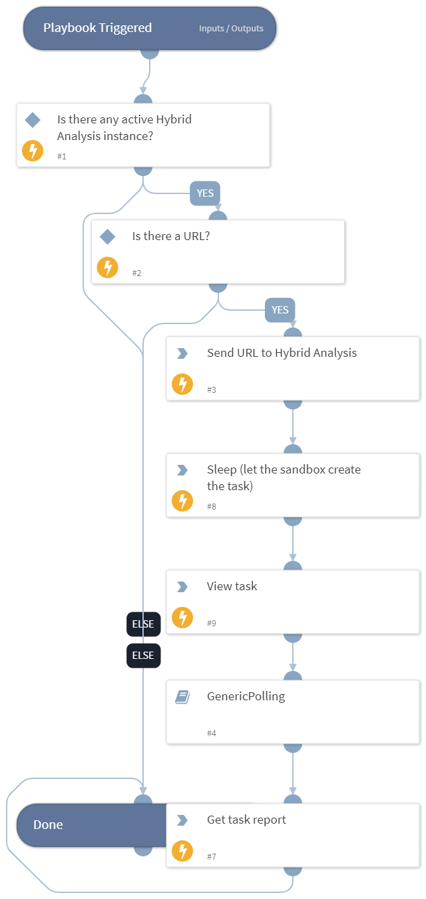

Deprecated. Use cs-falcon-sandbox-submit-url with polling=true instead.

Detonating URL with Hybrid Analysis

## Dependencies

This playbook uses the following sub-playbooks, integrations, and scripts.

### Sub-playbooks

GenericPolling

### Integrations

Hybrid Analysis

### Scripts

Sleep

### Commands

- hybrid-analysis-quick-scan-url
- hybrid-analysis-quick-scan-url-results

## Playbook Inputs

---

| **Name** | **Description**                                        | **Default Value** | **Required** |
| -------- | ------------------------------------------------------ | ----------------- | ------------ |
| URL      | URL to detonate .                                      | URL.Data          | Optional     |
| interval | How often to poll for results.                         | 1                 | Optional     |
| timeout  | How long to wait before giving up waiting for results. | 10                | Optional     |

## Playbook Outputs

---

| **Path**                             | **Description**                | **Type** |
| ------------------------------------ | ------------------------------ | -------- |
| HybridAnalysis.URL.Scanner.Name      | The URL scanner name.          | unknown  |
| HybridAnalysis.URL.Scanner.Positives | Number of positive scanners.   | unknown  |
| HybridAnalysis.URL.Scanner.Status    | Status of the scanning.        | unknown  |
| HybridAnalysis.URL.Scanner           | Placeholder for scanner data.  | unknown  |

## Playbook Image

---

