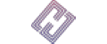

# Hydden - Blast Radius

Runs when a Cortex issue flags an account. Takes the account ID from the issue and calls `hydden-blast-radius`.

Requires a **Hydden Control** integration instance.

## What it does

1. Reads the account ID from `alert.username`, then `incident.username` if the alert field is empty.
2. Calls `hydden-blast-radius` with that value as `account_id`.
3. Writes `Hydden.Identity.blast_radius` (string). If Hydden returns an error, the playbook fails.

## Inputs

| Name | Description |
| --- | --- |
| AccountId | Cortex account ID from the issue (defaults to `alert.username`) |
| AccountIdFallback | Incident username if the alert field is empty |

## Outputs

| Path | Description |
| --- | --- |
| Hydden.Identity.blast_radius | Blast radius information from Hydden Control |
