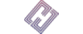

# Hydden - Deprovision Account

Runs when a Cortex issue indicates a compromised or otherwise high-risk account. Takes the account ID from the issue and calls `hydden-deprovision-account`.

Requires a **Hydden Control** integration instance.

## What it does

1. Reads the account ID from `alert.username`, then `incident.username` if the alert field is empty.
2. Calls `hydden-deprovision-account` with that value as `account_id` (`POST /account-actions/deprovision`).
3. Writes `Hydden.Identity.deprovisioned` (`true` on success). If Hydden returns an error, the playbook fails.

This command is potentially harmful. Point an automation rule at this playbook only for issues you intend to deprovision.

## Inputs

| Name | Description |
| --- | --- |
| AccountId | Cortex account ID from the issue (defaults to `alert.username`) |
| AccountIdFallback | Incident username if the alert field is empty |

## Outputs

| Path | Description |
| --- | --- |
| Hydden.Identity.deprovisioned | Whether deprovisioning succeeded |
