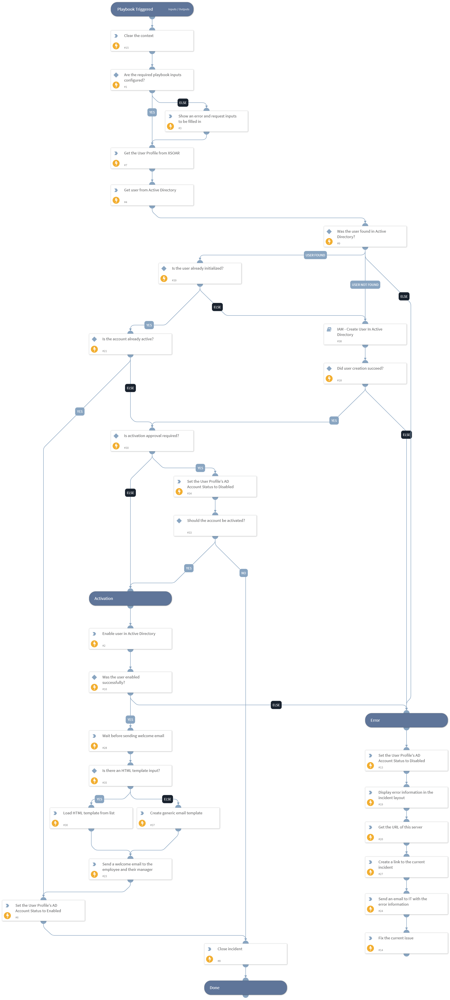

This playbook activates users in Active Directory. It generates a password, sets the account with the new password, and enables the account. Additionally, it sends out an email to the email provided in the “ServiceDeskEmail” input which includes the new user’s temporary password for preparing new hires’ environments.

## Dependencies
This playbook uses the following sub-playbooks, integrations, and scripts.

### Sub-playbooks
* IAM - Create User In Active Directory

### Integrations
* Active Directory Query v2

### Scripts
* PrintErrorEntry
* Sleep
* SetAndHandleEmpty
* DeleteContext
* CreateEmailHtmlBody
* Set
* GetServerURL

### Commands
* send-mail
* iam-update-user
* setIndicator
* iam-get-user
* setIncident
* findIndicators
* closeInvestigation

## Playbook Inputs
---

| **Name** | **Description** | **Default Value** | **Required** |
| --- | --- | --- | --- |
| ServiceDeskEmail | Email to send the domain user password \(from Active directory\) of new users, so that their equipment can be prepared by IT when they're being hired. |  | Required |
| PasswordGenerationScriptName | The name of the automation script that will be used to generate a random password for newly created Active Directory users. The default script used for this is IAMGeneratePassword, but depending on your password complexity policy, you may or may not want to use it. | IAMGeneratePassword | Required |
| ITNotificationEmail | Email to notify about errors in the provisioning process. |  | Required |
| SecondsToWaitBeforeWelcomeEmail | Determines how many seconds to wait before sending the welcome email to the user and their manager after activation. | 0 | Required |
| ManuallyApprovePastHireDates | Whether to ask the user to manually approve activations for users who have past hire dates \(hire date is 1 day or more before the current date\). Can be True or False. | True | Optional |
| WelcomeEmailHTMLList | Optional - the name of an XSOAR list that contains an HTML template for new hire welcome emails. If no list is specified, an email with a  generic structure will be sent. |  | Optional |

## Playbook Outputs
---
There are no outputs for this playbook.

## Playbook Image
---
