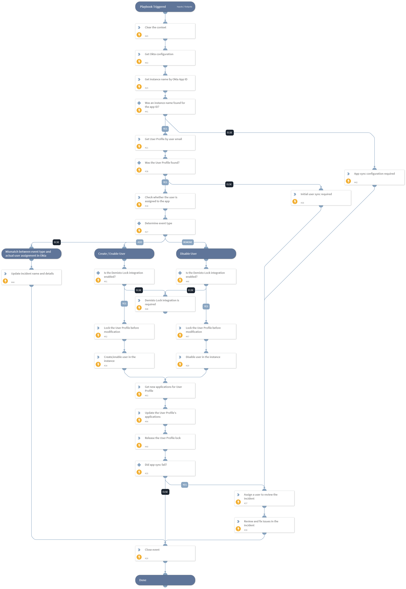

Syncs users to apps from which the user was added or removed. The playbook utilizes the "IAM Configuration" incident type to determine which integration instance the command needs to execute in. It creates or disables the user according to the fetched event type, tracks errors if there are any, and assigns an analyst to review the incident when needed.

## Dependencies
This playbook uses the following sub-playbooks, integrations, and scripts.

### Sub-playbooks
This playbook does not use any sub-playbooks.

### Integrations
This playbook does not use any integrations.

### Scripts
* PrintErrorEntry
* IAMUpdateApplicationsField
* SetAndHandleEmpty
* IsIntegrationAvailable
* DeleteContext
* AssignAnalystToIncident

### Commands
* setIncident
* okta-iam-get-configuration
* setIndicator
* findIndicators
* demisto-lock-get
* okta-get-app-user-assignment
* iam-update-user
* demisto-lock-release
* closeInvestigation
* iam-disable-user

## Playbook Inputs
---

| **Name** | **Description** | **Default Value** | **Required** |
| --- | --- | --- | --- |
| UserRoleToAssignForFailures | The Cortex XSOAR role from which to assign users to the incident when a CRUD operation fails. This can be left empty to assign users from all roles. |  | Optional |
| UserAssignmentMethod | Determines the way in which user assignments will be decided in Cortex XSOAR for the failed incidents. Can be one of the following: "random", "machine-learning", "top-user", "less-busy-user", "online", "current". If left empty, users will be assigned randomly. |  | Optional |
| AssignOnlyOnCall | Determines whether to assign only users that are currently on a shift to failed incidents. Set to "true" to assign only users that are currently working, or set to "false" or leave empty to assign any user. |  | Optional |

## Playbook Outputs
---
There are no outputs for this playbook.

## Playbook Image
---

