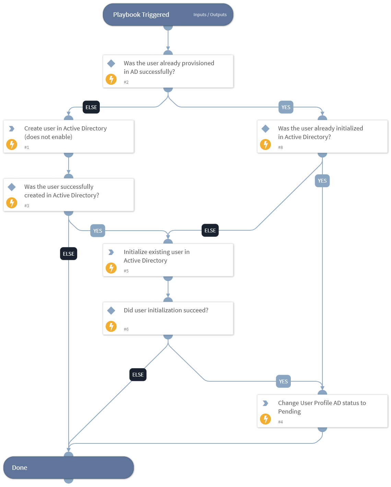

This playbook creates and initializes new users in Active Directory.

## Dependencies
This playbook uses the following sub-playbooks, integrations, and scripts.

### Sub-playbooks
This playbook does not use any sub-playbooks.

### Integrations
* Active Directory Query v2

### Scripts
* IAMInitADUser

### Commands
* setIndicator
* iam-create-user

## Playbook Inputs
---

| **Name** | **Description** | **Default Value** | **Required** |
| --- | --- | --- | --- |
| ManagerEmailHTMLList | Optional - the name of an XSOAR list that contains an HTML template for emails that are sent to user managers when a new Active Directory user is created. If no list is specified, an email with a  generic structure will be sent \(generated inside the IAMInitADUser script\). | email-template-new-hire-manager | Optional |
| ServiceDeskEmailHTMLList | Optional - the name of an XSOAR list that contains an HTML template for emails that are sent to ServiceDesk, to prepare user laptops, when a new Active Directory user is created. If no list is specified, an email with a  generic structure will be sent \(generated inside the IAMInitADUser script\). |  | Optional |
| ADNotificationEmails | A comma-separated list of email addresses that will be notified when a user in initialized in Active Directory. |  | Required |
| PasswordGenerationScriptName | The name of the automation script that will be used to generate a random password for newly created Active Directory users. The default script used for this is IAMGeneratePassword, but depending on your password complexity policy, you may or may not want to use it. | IAMGeneratePassword | Required |
| ServiceDeskEmail | Email to send the domain user password \(from Active directory\) of new users, so that their equipment can be prepared by IT when they're being hired. |  | Optional |
| CreatedIndicator | The created User Profile indicator, if created previously in the IAM - Sync User playbook. | CreatedIndicator.None | Optional |
| indicator | The User Profile indicator, if found during a previous search. | indicator.None | Optional |
| SuccessfulVendors | Vendors where provisioning was successful. This input is used to ensure that on playbook reruns, provisioning will be retried only with vendors that previously failed. | inputs.SuccessfulVendors.None | Optional |
| sAMAccountName | The sAMAccountName of the user if it was already provisioned successfully in Active Directory. | inputs.SuccessfulVendors.details | Optional |

## Playbook Outputs
---

| **Path** | **Description** | **Type** |
| --- | --- | --- |
| IAM | IAM object. | unknown |

## Playbook Image
---
